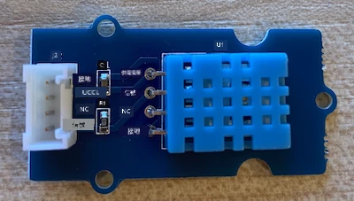
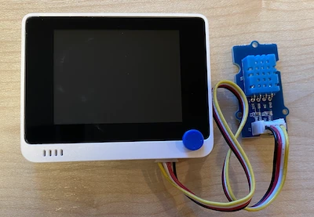

# 測量溫度 - Wio Terminal

在本課程中，你將為 Wio Terminal 添加一個溫度感應器，並從中讀取溫度值。

## 硬件

Wio Terminal 需要一個溫度感應器。

你將使用的感應器是 [DHT11 濕度和溫度感應器](https://www.seeedstudio.com/Grove-Temperature-Humidity-Sensor-DHT11.html)，它將兩個感應器結合在一個封裝中。這是一款相當流行的感應器，市面上有許多商業化的感應器結合了溫度、濕度，有時還包括大氣壓力。溫度感應器部分是一個負溫度係數（NTC）熱敏電阻，這是一種電阻隨溫度升高而減少的熱敏電阻。

這是一個數字感應器，因此內置了 ADC（模數轉換器），可以生成包含溫度和濕度數據的數字信號，供微控制器讀取。

### 連接溫度感應器

Grove 溫度感應器可以連接到 Wio Terminal 的數字端口。

#### 任務 - 連接溫度感應器

連接溫度感應器。



1. 將 Grove 電纜的一端插入濕度和溫度感應器上的插座。它只能以一種方式插入。

1. 在 Wio Terminal 未連接到電腦或其他電源的情況下，將 Grove 電纜的另一端連接到 Wio Terminal 屏幕右側的 Grove 插座。這是距離電源按鈕最遠的插座。



## 編程溫度感應器

現在可以為 Wio Terminal 編程以使用已連接的溫度感應器。

### 任務 - 編程溫度感應器

編程設備。

1. 使用 PlatformIO 創建一個全新的 Wio Terminal 項目。將此項目命名為 `temperature-sensor`。在 `setup` 函數中添加代碼以配置串口。

    > ⚠️ 如果需要，可以參考 [項目 1，課程 1 中創建 PlatformIO 項目的指導](../../../1-getting-started/lessons/1-introduction-to-iot/wio-terminal.md#create-a-platformio-project)。

1. 在項目的 `platformio.ini` 文件中添加 Seeed Grove 濕度和溫度感應器庫的依賴：

    ```ini
    lib_deps =
        seeed-studio/Grove Temperature And Humidity Sensor @ 1.0.1
    ```

    > ⚠️ 如果需要，可以參考 [項目 1，課程 4 中向 PlatformIO 項目添加庫的指導](../../../1-getting-started/lessons/4-connect-internet/wio-terminal-mqtt.md#install-the-wifi-and-mqtt-arduino-libraries)。

1. 在文件頂部的現有 `#include <Arduino.h>` 下添加以下 `#include` 指令：

    ```cpp
    #include <DHT.h>
    #include <SPI.h>
    ```

    這些指令導入了與感應器交互所需的文件。`DHT.h` 標頭文件包含感應器本身的代碼，而添加 `SPI.h` 標頭確保在應用程序編譯時鏈接到與感應器通信所需的代碼。

1. 在 `setup` 函數之前，聲明 DHT 感應器：

    ```cpp
    DHT dht(D0, DHT11);
    ```

    這聲明了一個 `DHT` 類的實例，用於管理**數字濕度和溫度感應器**。它連接到 Wio Terminal 的 `D0` 端口，即右側的 Grove 插座。第二個參數告訴代碼使用的是 *DHT11* 感應器——你使用的庫支持此感應器的其他變體。

1. 在 `setup` 函數中添加代碼以設置串行連接：

    ```cpp
    void setup()
    {
        Serial.begin(9600);
    
        while (!Serial)
            ; // Wait for Serial to be ready
    
        delay(1000);
    }
    ```

1. 在 `setup` 函數的最後一個 `delay` 之後，添加啟動 DHT 感應器的調用：

    ```cpp
    dht.begin();
    ```

1. 在 `loop` 函數中添加代碼以調用感應器並將溫度打印到串口：

    ```cpp
    void loop()
    {
        float temp_hum_val[2] = {0};
        dht.readTempAndHumidity(temp_hum_val);
        Serial.print("Temperature: ");
        Serial.print(temp_hum_val[1]);
        Serial.println ("°C");
    
        delay(10000);
    }
    ```

    此代碼聲明了一個包含 2 個浮點數的空數組，並將其傳遞給 `DHT` 實例上的 `readTempAndHumidity` 調用。此調用將數組填充為 2 個值——濕度存儲在數組的第 0 個項目中（請記住，在 C++ 中，數組是從 0 開始的，因此第 0 個項目是數組的“第一”項目），溫度存儲在第 1 個項目中。

    溫度從數組的第 1 個項目中讀取，並打印到串口。

    > 🇺🇸 溫度以攝氏度讀取。對於美國人，若要將攝氏度轉換為華氏度，請將讀取的攝氏值除以 5，然後乘以 9，再加上 32。例如，20°C 的溫度讀數轉換為 ((20/5)*9) + 32 = 68°F。

1. 編譯並上傳代碼到 Wio Terminal。

    > ⚠️ 如果需要，可以參考 [項目 1，課程 1 中創建 PlatformIO 項目的指導](../../../1-getting-started/lessons/1-introduction-to-iot/wio-terminal.md#write-the-hello-world-app)。

1. 上傳完成後，可以使用串口監視器監控溫度：

    ```output
    > Executing task: platformio device monitor <
    
    --- Available filters and text transformations: colorize, debug, default, direct, hexlify, log2file, nocontrol, printable, send_on_enter, time
    --- More details at http://bit.ly/pio-monitor-filters
    --- Miniterm on /dev/cu.usbmodem1201  9600,8,N,1 ---
    --- Quit: Ctrl+C | Menu: Ctrl+T | Help: Ctrl+T followed by Ctrl+H ---
    Temperature: 25.00°C
    Temperature: 25.00°C
    Temperature: 25.00°C
    Temperature: 24.00°C
    ```

> 💁 你可以在 [code-temperature/wio-terminal](../../../../../2-farm/lessons/1-predict-plant-growth/code-temperature/wio-terminal) 文件夾中找到此代碼。

😀 你的溫度感應器程式成功了！

---

**免責聲明**：  
本文件已使用人工智能翻譯服務 [Co-op Translator](https://github.com/Azure/co-op-translator) 進行翻譯。儘管我們致力於提供準確的翻譯，但請注意，自動翻譯可能包含錯誤或不準確之處。原始語言的文件應被視為權威來源。對於重要信息，建議使用專業人工翻譯。我們對因使用此翻譯而引起的任何誤解或錯誤解釋概不負責。