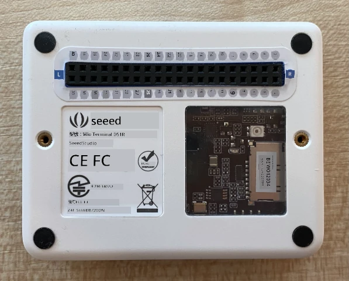
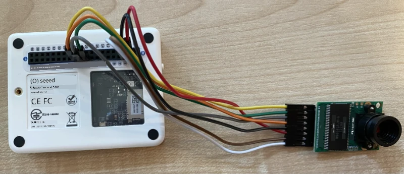
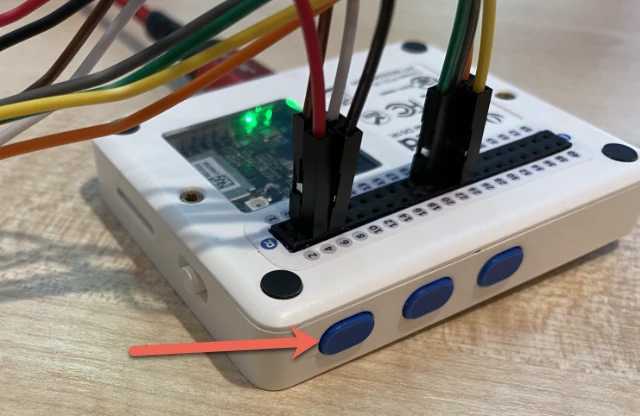

# 捕捉影像 - Wio Terminal

在這部分課程中，你將為 Wio Terminal 添加一個相機，並從中捕捉影像。

## 硬件

Wio Terminal 需要一個相機。

你將使用的相機是 [ArduCam Mini 2MP Plus](https://www.arducam.com/product/arducam-2mp-spi-camera-b0067-arduino/)。這是一個基於 OV2640 圖像傳感器的 2 百萬像素相機。它通過 SPI 接口進行通信以捕捉影像，並使用 I²C 配置傳感器。

## 連接相機

ArduCam 沒有 Grove 插槽，而是通過 Wio Terminal 的 GPIO 引腳連接到 SPI 和 I²C 線路。

### 任務 - 連接相機

連接相機。


1. ArduCam 底部的引腳需要連接到 Wio Terminal 的 GPIO 引腳。為了更容易找到正確的引腳，將隨 Wio Terminal 附帶的 GPIO 引腳貼紙貼在引腳周圍：

    

1. 使用跳線進行以下連接：

    | ArduCAM 引腳 | Wio Terminal 引腳 | 描述                                     |
    | ------------ | ----------------- | ---------------------------------------- |
    | CS           | 24 (SPI_CS)       | SPI 芯片選擇                             |
    | MOSI         | 19 (SPI_MOSI)     | SPI 控制器輸出，外設輸入                 |
    | MISO         | 21 (SPI_MISO)     | SPI 控制器輸入，外設輸出                 |
    | SCK          | 23 (SPI_SCLK)     | SPI 串行時鐘                             |
    | GND          | 6 (GND)           | 地線 - 0V                                |
    | VCC          | 4 (5V)            | 5V 電源供應                              |
    | SDA          | 3 (I2C1_SDA)      | I²C 串行數據                             |
    | SCL          | 5 (I2C1_SCL)      | I²C 串行時鐘                             |

    

    GND 和 VCC 連接為 ArduCam 提供 5V 電源。它以 5V 運行，不同於以 3V 運行的 Grove 傳感器。這個電源直接來自為設備供電的 USB-C 連接。

    > 💁 對於 SPI 連接，ArduCam 上的引腳標籤和 Wio Terminal 中代碼使用的引腳名稱仍然使用舊的命名約定。本課程中的說明將使用新的命名約定，除非代碼中使用了引腳名稱。

1. 現在可以將 Wio Terminal 連接到你的電腦。

## 編程設備以連接相機

現在可以為 Wio Terminal 編程以使用連接的 ArduCAM 相機。

### 任務 - 編程設備以連接相機

1. 使用 PlatformIO 創建一個全新的 Wio Terminal 項目。將此項目命名為 `fruit-quality-detector`。在 `setup` 函數中添加代碼以配置串行端口。

1. 添加代碼以連接 WiFi，將你的 WiFi 憑據放在名為 `config.h` 的文件中。不要忘記將所需的庫添加到 `platformio.ini` 文件中。

1. ArduCam 庫無法作為 Arduino 庫從 `platformio.ini` 文件中安裝。相反，需要從其 GitHub 頁面安裝源代碼。你可以通過以下方式獲取：

    * 從 [https://github.com/ArduCAM/Arduino.git](https://github.com/ArduCAM/Arduino.git) 克隆倉庫
    * 前往 GitHub 上的倉庫 [github.com/ArduCAM/Arduino](https://github.com/ArduCAM/Arduino) 並從 **Code** 按鈕下載壓縮包

1. 你只需要代碼中的 `ArduCAM` 文件夾。將整個文件夾複製到項目的 `lib` 文件夾中。

    > ⚠️ 必須複製整個文件夾，因此代碼位於 `lib/ArduCam` 中。不要僅將 `ArduCam` 文件夾的內容複製到 `lib` 文件夾中，而是將整個文件夾複製過去。

1. ArduCam 庫代碼適用於多種類型的相機。你想要使用的相機類型是通過編譯器標誌配置的——這樣可以通過刪除未使用相機的代碼來使構建的庫盡可能小。要將庫配置為 OV2640 相機，請在 `platformio.ini` 文件末尾添加以下內容：

    ```ini
    build_flags =
        -DARDUCAM_SHIELD_V2
        -DOV2640_CAM
    ```

    這設置了兩個編譯器標誌：

      * `ARDUCAM_SHIELD_V2` 告訴庫相機位於 Arduino 板上，稱為 shield。
      * `OV2640_CAM` 告訴庫僅包含 OV2640 相機的代碼。

1. 在 `src` 文件夾中添加一個名為 `camera.h` 的頭文件。這將包含與相機通信的代碼。將以下代碼添加到此文件中：

    ```cpp
    #pragma once
    
    #include <ArduCAM.h>
    #include <Wire.h>
    
    class Camera
    {
    public:
        Camera(int format, int image_size) : _arducam(OV2640, PIN_SPI_SS)
        {
            _format = format;
            _image_size = image_size;
        }
    
        bool init()
        {
            // Reset the CPLD
            _arducam.write_reg(0x07, 0x80);
            delay(100);
    
            _arducam.write_reg(0x07, 0x00);
            delay(100);
    
            // Check if the ArduCAM SPI bus is OK
            _arducam.write_reg(ARDUCHIP_TEST1, 0x55);
            if (_arducam.read_reg(ARDUCHIP_TEST1) != 0x55)
            {
                return false;
            }
                
            // Change MCU mode
            _arducam.set_mode(MCU2LCD_MODE);
    
            uint8_t vid, pid;
    
            // Check if the camera module type is OV2640
            _arducam.wrSensorReg8_8(0xff, 0x01);
            _arducam.rdSensorReg8_8(OV2640_CHIPID_HIGH, &vid);
            _arducam.rdSensorReg8_8(OV2640_CHIPID_LOW, &pid);
            if ((vid != 0x26) && ((pid != 0x41) || (pid != 0x42)))
            {
                return false;
            }
            
            _arducam.set_format(_format);
            _arducam.InitCAM();
            _arducam.OV2640_set_JPEG_size(_image_size);
            _arducam.OV2640_set_Light_Mode(Auto);
            _arducam.OV2640_set_Special_effects(Normal);
            delay(1000);
    
            return true;
        }
    
        void startCapture()
        {
            _arducam.flush_fifo();
            _arducam.clear_fifo_flag();
            _arducam.start_capture();
        }
    
        bool captureReady()
        {
            return _arducam.get_bit(ARDUCHIP_TRIG, CAP_DONE_MASK);
        }
    
        bool readImageToBuffer(byte **buffer, uint32_t &buffer_length)
        {
            if (!captureReady()) return false;
    
            // Get the image file length
            uint32_t length = _arducam.read_fifo_length();
            buffer_length = length;
    
            if (length >= MAX_FIFO_SIZE)
            {
                return false;
            }
            if (length == 0)
            {
                return false;
            }
    
            // create the buffer
            byte *buf = new byte[length];
    
            uint8_t temp = 0, temp_last = 0;
            int i = 0;
            uint32_t buffer_pos = 0;
            bool is_header = false;
    
            _arducam.CS_LOW();
            _arducam.set_fifo_burst();
            
            while (length--)
            {
                temp_last = temp;
                temp = SPI.transfer(0x00);
                //Read JPEG data from FIFO
                if ((temp == 0xD9) && (temp_last == 0xFF)) //If find the end ,break while,
                {
                    buf[buffer_pos] = temp;
    
                    buffer_pos++;
                    i++;
                    
                    _arducam.CS_HIGH();
                }
                if (is_header == true)
                {
                    //Write image data to buffer if not full
                    if (i < 256)
                    {
                        buf[buffer_pos] = temp;
                        buffer_pos++;
                        i++;
                    }
                    else
                    {
                        _arducam.CS_HIGH();
    
                        i = 0;
                        buf[buffer_pos] = temp;
    
                        buffer_pos++;
                        i++;
    
                        _arducam.CS_LOW();
                        _arducam.set_fifo_burst();
                    }
                }
                else if ((temp == 0xD8) & (temp_last == 0xFF))
                {
                    is_header = true;
    
                    buf[buffer_pos] = temp_last;
                    buffer_pos++;
                    i++;
    
                    buf[buffer_pos] = temp;
                    buffer_pos++;
                    i++;
                }
            }
            
            _arducam.clear_fifo_flag();
    
            _arducam.set_format(_format);
            _arducam.InitCAM();
            _arducam.OV2640_set_JPEG_size(_image_size);
    
            // return the buffer
            *buffer = buf;
        }
    
    private:
        ArduCAM _arducam;
        int _format;
        int _image_size;
    };
    ```

    這是使用 ArduCam 庫配置相機並在需要時通過 SPI 線路提取影像的底層代碼。這段代碼非常特定於 ArduCam，因此你目前不需要擔心它的工作原理。

1. 在 `main.cpp` 中，在其他 `include` 語句下方添加以下代碼以包含此新文件並創建相機類的實例：

    ```cpp
    #include "camera.h"

    Camera camera = Camera(JPEG, OV2640_640x480);
    ```

    這創建了一個 `Camera`，將影像保存為 640x480 分辨率的 JPEG。雖然支持更高的分辨率（最高 3280x2464），但影像分類器處理的影像尺寸要小得多（227x227），因此無需捕捉和傳輸更大的影像。

1. 在此下方添加以下代碼以定義一個設置相機的函數：

    ```cpp
    void setupCamera()
    {
        pinMode(PIN_SPI_SS, OUTPUT);
        digitalWrite(PIN_SPI_SS, HIGH);
    
        Wire.begin();
        SPI.begin();
    
        if (!camera.init())
        {
            Serial.println("Error setting up the camera!");
        }
    }
    ```

    這個 `setupCamera` 函數首先將 SPI 芯片選擇引腳（`PIN_SPI_SS`）配置為高電平，使 Wio Terminal 成為 SPI 控制器。然後啟動 I²C 和 SPI 線路。最後，它初始化相機類，配置相機傳感器設置並確保所有連接正確。

1. 在 `setup` 函數的末尾調用此函數：

    ```cpp
    setupCamera();
    ```

1. 構建並上傳此代碼，並檢查串行監視器的輸出。如果你看到 `Error setting up the camera!`，請檢查接線，確保所有電纜正確連接 ArduCam 的引腳和 Wio Terminal 的 GPIO 引腳，並且所有跳線都正確插入。

## 捕捉影像

現在可以為 Wio Terminal 編程以在按下按鈕時捕捉影像。

### 任務 - 捕捉影像

1. 微控制器會不斷運行你的代碼，因此如果不響應傳感器，觸發拍照並不容易。Wio Terminal 有按鈕，因此可以設置相機由其中一個按鈕觸發。將以下代碼添加到 `setup` 函數的末尾，以配置 C 按鈕（頂部的三個按鈕之一，最靠近電源開關的那個）。

    

    ```cpp
    pinMode(WIO_KEY_C, INPUT_PULLUP);
    ```

    `INPUT_PULLUP` 模式本質上反轉了一個輸入。例如，通常按鈕在未按下時會發送低信號，按下時發送高信號。設置為 `INPUT_PULLUP` 時，未按下時發送高信號，按下時發送低信號。

1. 在 `loop` 函數之前添加一個空函數以響應按鈕按下：

    ```cpp
    void buttonPressed()
    {
        
    }
    ```

1. 在按鈕被按下時，在 `loop` 方法中調用此函數：

    ```cpp
    void loop()
    {
        if (digitalRead(WIO_KEY_C) == LOW)
        {
            buttonPressed();
            delay(2000);
        }
    
        delay(200);
    }
    ```

    這段代碼檢查按鈕是否被按下。如果按下，則調用 `buttonPressed` 函數，並且循環延遲 2 秒。這是為了給按鈕釋放留出時間，以免長按被多次註冊。

    > 💁 Wio Terminal 上的按鈕設置為 `INPUT_PULLUP`，因此未按下時發送高信號，按下時發送低信號。

1. 將以下代碼添加到 `buttonPressed` 函數中：

    ```cpp
    camera.startCapture();
 
    while (!camera.captureReady())
        delay(100);

    Serial.println("Image captured");

    byte *buffer;
    uint32_t length;

    if (camera.readImageToBuffer(&buffer, length))
    {
        Serial.print("Image read to buffer with length ");
        Serial.println(length);

        delete(buffer);
    }
    ```

    這段代碼通過調用 `startCapture` 開始相機捕捉。相機硬件並不是在你請求數據時返回數據，而是你發送一個指令開始捕捉，相機會在後台工作以捕捉影像，將其轉換為 JPEG，並將其存儲在相機本地緩衝區中。然後，`captureReady` 調用檢查影像捕捉是否完成。

    一旦捕捉完成，影像數據會通過 `readImageToBuffer` 調用從相機的緩衝區複製到本地緩衝區（字節數組）。緩衝區的長度隨後被發送到串行監視器。

1. 構建並上傳此代碼，並檢查串行監視器的輸出。每次按下 C 按鈕時，將捕捉一張影像，並在串行監視器上看到影像大小。

    ```output
    Connecting to WiFi..
    Connected!
    Image captured
    Image read to buffer with length 9224
    Image captured
    Image read to buffer with length 11272
    ```

    不同的影像會有不同的大小。它們被壓縮為 JPEG，JPEG 文件的大小取決於影像內容。

> 💁 你可以在 [code-camera/wio-terminal](../../../../../4-manufacturing/lessons/2-check-fruit-from-device/code-camera/wio-terminal) 文件夾中找到此代碼。

😀 你已成功使用 Wio Terminal 捕捉影像。

## 可選 - 使用 SD 卡驗證相機影像

查看相機捕捉的影像最簡單的方法是將它們寫入 Wio Terminal 的 SD 卡，然後在電腦上查看。如果你有一張備用的 microSD 卡和電腦上的 microSD 卡插槽或適配器，可以完成此步驟。

Wio Terminal 僅支持最大 16GB 的 microSD 卡。如果你的 SD 卡更大，則無法使用。

### 任務 - 使用 SD 卡驗證相機影像

1. 使用電腦上的相關應用程序（macOS 的磁碟工具、Windows 的文件資源管理器或 Linux 的命令行工具）將 microSD 卡格式化為 FAT32 或 exFAT。

1. 將 microSD 卡插入電源開關下方的插槽。確保完全插入直到卡扣住並保持到位，你可能需要用指甲或細小工具推入。

1. 在 `main.cpp` 文件頂部添加以下 include 語句：

    ```cpp
    #include "SD/Seeed_SD.h"
    #include <Seeed_FS.h>
    ```

1. 在 `setup` 函數之前添加以下函數：

    ```cpp
    void setupSDCard()
    {
        while (!SD.begin(SDCARD_SS_PIN, SDCARD_SPI))
        {
            Serial.println("SD Card Error");
        }
    }
    ```

    這使用 SPI 線路配置 SD 卡。

1. 從 `setup` 函數調用此函數：

    ```cpp
    setupSDCard();
    ```

1. 在 `buttonPressed` 函數上方添加以下代碼：

    ```cpp
    int fileNum = 1;

    void saveToSDCard(byte *buffer, uint32_t length)
    {
        char buff[16];
        sprintf(buff, "%d.jpg", fileNum);
        fileNum++;
    
        File outFile = SD.open(buff, FILE_WRITE );
        outFile.write(buffer, length);
        outFile.close();

        Serial.print("Image written to file ");
        Serial.println(buff);
    }
    ```

    這定義了一個用於文件計數的全局變量。這用於影像文件名，因此可以捕捉多個影像並使用遞增的文件名 - `1.jpg`、`2.jpg` 等。

    然後定義了 `saveToSDCard` 函數，該函數接收一個字節數據緩衝區和緩衝區的長度。使用文件計數創建一個文件名，並遞增文件計數以準備下一個文件。然後將緩衝區中的二進制數據寫入文件。

1. 在 `buttonPressed` 函數中調用 `saveToSDCard` 函數。調用應該在刪除緩衝區 **之前**：

    ```cpp
    Serial.print("Image read to buffer with length ");
    Serial.println(length);

    saveToSDCard(buffer, length);
    
    delete(buffer);
    ```

1. 構建並上傳此代碼，並檢查串行監視器的輸出。每次按下 C 按鈕時，將捕捉一張影像並保存到 SD 卡。

    ```output
    Connecting to WiFi..
    Connected!
    Image captured
    Image read to buffer with length 16392
    Image written to file 1.jpg
    Image captured
    Image read to buffer with length 14344
    Image written to file 2.jpg
    ```

1. 關閉 microSD 卡電源，稍微推入並釋放以彈出卡片，你可能需要使用細小工具完成此操作。將 microSD 卡插入電腦以查看影像。

    
💁 相機的白平衡可能需要幾張圖片才能自我調整。您會根據拍攝的圖片顏色注意到這一點，前幾張可能顏色看起來不太對。您可以通過修改程式碼，在 `setup` 函數中拍攝幾張被忽略的圖片來解決這個問題。


---

**免責聲明**：  
本文件已使用人工智能翻譯服務 [Co-op Translator](https://github.com/Azure/co-op-translator) 進行翻譯。儘管我們致力於提供準確的翻譯，但請注意，自動翻譯可能包含錯誤或不準確之處。原始語言的文件應被視為權威來源。對於重要信息，建議使用專業人工翻譯。我們對因使用此翻譯而引起的任何誤解或錯誤解釋概不負責。