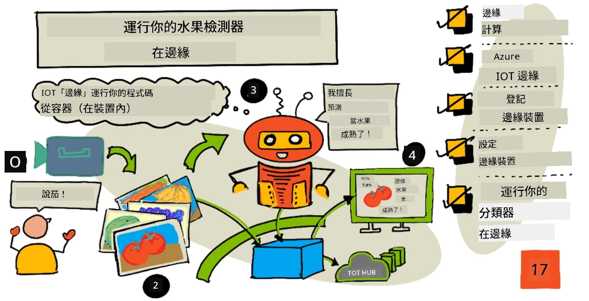
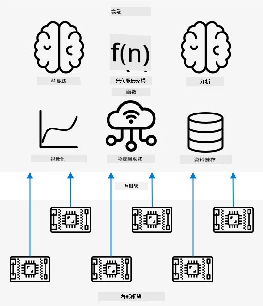
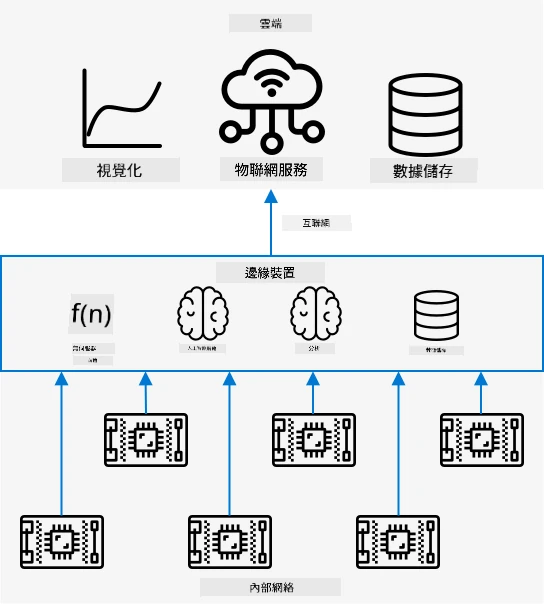
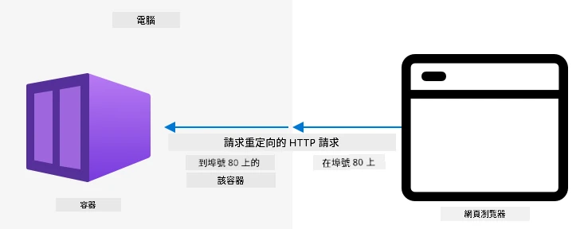
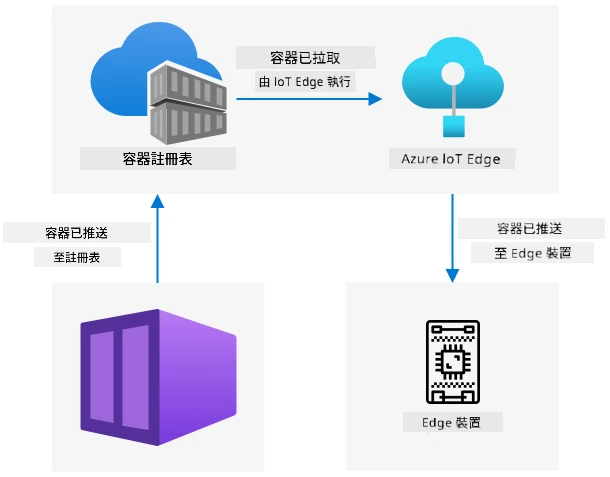

# 在邊緣設備上運行水果檢測器



> 手繪筆記由 [Nitya Narasimhan](https://github.com/nitya) 提供。點擊圖片查看更大版本。

這段視頻概述了如何在物聯網設備上運行圖像分類器，這是本課程的主題。

[](https://www.youtube.com/watch?v=_K5fqGLO8us)

## 課前測驗

[課前測驗](https://black-meadow-040d15503.1.azurestaticapps.net/quiz/33)

## 簡介

在上一課中，你使用了圖像分類器來區分成熟和未成熟的水果，並將物聯網設備上的相機捕捉的圖像通過互聯網發送到雲端服務。這些操作需要時間，花費金錢，而且根據你使用的圖像數據類型，可能會涉及隱私問題。

在本課中，你將學習如何在邊緣設備上運行機器學習（ML）模型——即在運行於你自己網絡上的物聯網設備上，而不是在雲端。你將了解邊緣計算相較於雲計算的優勢和劣勢，如何將AI模型部署到邊緣設備，以及如何從物聯網設備訪問它。

本課程將涵蓋以下內容：

* [邊緣計算](../../../../../4-manufacturing/lessons/3-run-fruit-detector-edge)
* [Azure IoT Edge](../../../../../4-manufacturing/lessons/3-run-fruit-detector-edge)
* [註冊物聯網邊緣設備](../../../../../4-manufacturing/lessons/3-run-fruit-detector-edge)
* [設置物聯網邊緣設備](../../../../../4-manufacturing/lessons/3-run-fruit-detector-edge)
* [導出你的模型](../../../../../4-manufacturing/lessons/3-run-fruit-detector-edge)
* [準備容器以進行部署](../../../../../4-manufacturing/lessons/3-run-fruit-detector-edge)
* [部署你的容器](../../../../../4-manufacturing/lessons/3-run-fruit-detector-edge)
* [使用你的物聯網邊緣設備](../../../../../4-manufacturing/lessons/3-run-fruit-detector-edge)

## 邊緣計算

邊緣計算指的是將處理物聯網數據的計算機儘可能靠近數據生成的地方。與其在雲端進行處理，邊緣計算將處理移至雲端的邊緣——你的內部網絡。



在之前的課程中，你的設備收集數據並將數據發送到雲端進行分析，運行無伺服器函數或AI模型。



邊緣計算將部分雲端服務移至與物聯網設備同一網絡上的計算機，僅在需要時與雲端通信。例如，你可以在邊緣設備上運行AI模型來分析水果的成熟度，僅將分析結果（如成熟水果與未成熟水果的數量）發送回雲端。

✅ 思考一下你迄今為止構建的物聯網應用程序。哪些部分可以移至邊緣？

### 優勢

邊緣計算的優勢包括：

1. **速度** - 邊緣計算非常適合時間敏感的數據，因為操作是在與設備同一網絡上完成的，而不是通過互聯網進行調用。這使得速度更快，因為內部網絡的運行速度通常比互聯網連接快得多，數據傳輸距離也更短。

    > 💁 儘管互聯網連接使用光纖電纜使數據以光速傳輸，但數據在全球範圍內傳輸到雲端提供商仍需要時間。例如，如果你從歐洲向美國的雲端服務發送數據，僅跨越大西洋的光纖電纜就需要至少28毫秒，這還不包括數據到達跨大西洋電纜的時間、電信號轉換為光信號以及另一端的反向轉換時間，然後再從光纖電纜到雲端提供商。

    邊緣計算還需要更少的網絡流量，降低了因互聯網連接有限帶寬的擁堵而導致數據減速的風險。

1. **遠程可訪問性** - 邊緣計算在連接有限或無連接的情況下仍然有效，或者連接成本過高而無法持續使用。例如，在基礎設施有限的人道主義災區或發展中國家工作時。

1. **成本更低** - 在邊緣設備上進行數據收集、存儲、分析和觸發操作可以減少雲端服務的使用，從而降低物聯網應用程序的總成本。最近出現了專為邊緣計算設計的設備，例如 [NVIDIA 的 Jetson Nano](https://developer.nvidia.com/embedded/jetson-nano-developer-kit)，這些設備可以使用GPU硬件運行AI工作負載，成本低於100美元。

1. **隱私和安全性** - 使用邊緣計算，數據保留在你的網絡中，不會上傳到雲端。這對於敏感和個人身份信息尤為重要，尤其是因為數據在分析後不需要存儲，這大大降低了數據洩漏的風險。例如醫療數據和安全攝像頭錄像。

1. **處理不安全設備** - 如果你有已知存在安全漏洞的設備，不希望直接連接到你的網絡或互聯網，你可以將它們連接到一個單獨的網絡，並通過一個網關物聯網邊緣設備進行管理。該邊緣設備可以連接到你的更廣泛的網絡或互聯網，並管理數據流的來回。

1. **支持不兼容設備** - 如果你有無法直接連接到物聯網中心的設備，例如只能使用HTTP連接或僅有藍牙連接的設備，你可以使用物聯網邊緣設備作為網關設備，將消息轉發到物聯網中心。

✅ 做一些研究：邊緣計算還有哪些其他優勢？

### 劣勢

邊緣計算也有劣勢，某些情況下雲端可能是更好的選擇：

1. **規模和靈活性** - 雲計算可以通過添加或減少服務器和其他資源來實時調整網絡和數據需求。增加更多邊緣計算機需要手動添加更多設備。

1. **可靠性和韌性** - 雲計算通常提供多個位置的多個服務器以實現冗餘和災難恢復。在邊緣上實現相同級別的冗餘需要大量投資和配置工作。

1. **維護** - 雲服務提供商提供系統維護和更新。

✅ 做一些研究：邊緣計算還有哪些其他劣勢？

這些劣勢基本上是使用雲端的優勢的反面——你需要自己構建和管理這些設備，而不是依賴雲服務提供商的專業知識和規模。

某些風險可以通過邊緣計算的特性來減輕。例如，如果你有一個邊緣設備在工廠中運行，收集機器的數據，你不需要考慮某些災難恢復場景。如果工廠停電，那麼你不需要備份邊緣設備，因為生成數據的機器也會停電。

對於物聯網系統，你通常需要雲端和邊緣計算的混合使用，根據系統、客戶和維護者的需求來利用每種服務。

## Azure IoT Edge


Azure IoT Edge 是一項服務，可以幫助你將工作負載從雲端移至邊緣。你可以將設備設置為邊緣設備，並從雲端向該邊緣設備部署代碼。這使得你可以混合使用雲端和邊緣的功能。

> 🎓 *工作負載* 是指任何執行某種工作的服務，例如AI模型、應用程序或無伺服器函數。

例如，你可以在雲端訓練一個圖像分類器，然後從雲端將其部署到邊緣設備。你的物聯網設備隨後將圖像發送到邊緣設備進行分類，而不是通過互聯網發送圖像。如果需要部署模型的新版本，你可以在雲端訓練它，並使用IoT Edge將新版本更新到邊緣設備。

> 🎓 部署到IoT Edge的軟件被稱為 *模塊*。默認情況下，IoT Edge運行與IoT Hub通信的模塊，例如 `edgeAgent` 和 `edgeHub` 模塊。當你部署圖像分類器時，它會作為額外的模塊進行部署。

IoT Edge 集成在 IoT Hub 中，因此你可以使用管理物聯網設備的同一服務來管理邊緣設備，並具有相同的安全級別。

IoT Edge 從 *容器* 中運行代碼——容器是獨立運行的應用程序，與計算機上的其他應用程序隔離。當你運行容器時，它就像在你的計算機內部運行的獨立計算機，擁有自己的軟件、服務和應用程序。大多數情況下，容器無法訪問計算機上的任何內容，除非你選擇與容器共享某些內容，例如文件夾。容器通過開放端口暴露服務，你可以連接到該端口或將其暴露到網絡。



例如，你可以有一個容器在端口80上運行網站，這是默認的HTTP端口，然後你可以將其暴露在你的計算機上，也是在端口80。

✅ 做一些研究：了解容器和Docker或Moby等服務。

你可以使用Custom Vision下載圖像分類器並將其作為容器部署，直接運行在設備上或通過IoT Edge進行部署。一旦它們在容器中運行，你可以使用與雲端版本相同的REST API進行訪問，但端點指向運行容器的邊緣設備。

## 註冊物聯網邊緣設備

要使用物聯網邊緣設備，必須在IoT Hub中註冊。

### 任務 - 註冊物聯網邊緣設備

1. 在 `fruit-quality-detector` 資源組中創建一個IoT Hub。給它一個基於 `fruit-quality-detector` 的唯一名稱。

1. 在你的IoT Hub中註冊一個名為 `fruit-quality-detector-edge` 的物聯網邊緣設備。執行此操作的命令與註冊非邊緣設備的命令類似，只需添加 `--edge-enabled` 標誌。

    ```sh
    az iot hub device-identity create --edge-enabled \
                                      --device-id fruit-quality-detector-edge \
                                      --hub-name <hub_name>
    ```

    將 `<hub_name>` 替換為你的IoT Hub的名稱。

1. 使用以下命令獲取設備的連接字符串：

    ```sh
    az iot hub device-identity connection-string show --device-id fruit-quality-detector-edge \
                                                      --output table \
                                                      --hub-name <hub_name>
    ```

    將 `<hub_name>` 替換為你的IoT Hub的名稱。

    複製輸出中顯示的連接字符串。

## 設置物聯網邊緣設備

在你的IoT Hub中創建邊緣設備註冊後，你可以設置邊緣設備。

### 任務 - 安裝並啟動IoT Edge運行時

**IoT Edge運行時僅運行Linux容器。** 它可以在Linux上運行，也可以在Windows上通過Linux虛擬機運行。

* 如果你使用Raspberry Pi作為物聯網設備，它運行支持的Linux版本，可以托管IoT Edge運行時。按照[Microsoft文檔上的Linux版Azure IoT Edge安裝指南](https://docs.microsoft.com/azure/iot-edge/how-to-install-iot-edge?WT.mc_id=academic-17441-jabenn)安裝IoT Edge並設置連接字符串。

    > 💁 請記住，Raspberry Pi OS是Debian Linux的一個變體。

* 如果你沒有使用Raspberry Pi，但有一台Linux計算機，你可以運行IoT Edge運行時。按照[Microsoft文檔上的Linux版Azure IoT Edge安裝指南](https://docs.microsoft.com/azure/iot-edge/how-to-install-iot-edge?WT.mc_id=academic-17441-jabenn)安裝IoT Edge並設置連接字符串。

* 如果你使用Windows，你可以在Linux虛擬機中安裝IoT Edge運行時，按照[Microsoft文檔上的在Windows設備上部署首個IoT Edge模塊快速入門的安裝和啟動IoT Edge運行時部分](https://docs.microsoft.com/azure/iot-edge/quickstart?WT.mc_id=academic-17441-jabenn#install-and-start-the-iot-edge-runtime)。到達“部署模塊”部分時可以停止。

* 如果你使用macOS，你可以在雲端創建一個虛擬機（VM）作為你的IoT Edge設備。這些是你可以在雲端創建並通過互聯網訪問的計算機。你可以創建一個安裝了IoT Edge的Linux VM。按照[運行IoT Edge的虛擬機指南](vm-iotedge.md)進行操作。

## 導出你的模型

要在邊緣運行分類器，需要從Custom Vision導出。Custom Vision可以生成兩種類型的模型——標準模型和緊湊型模型。緊湊型模型使用各種技術減小模型的大小，使其足夠小以便下載並部署到物聯網設備。

當你創建圖像分類器時，你使用了 *Food* 域，這是一個針對食物圖像訓練的模型版本。在Custom Vision中，你可以更改項目的域，使用你的訓練數據訓練一個新域的模型。Custom Vision支持的所有域都可以作為標準和緊湊型版本。

### 任務 - 使用Food（緊湊型）域訓練你的模型
1. 開啟 [CustomVision.ai](https://customvision.ai) 的 Custom Vision 入口網站，並登入（如果尚未開啟）。然後打開你的 `fruit-quality-detector` 專案。

1. 選擇 **設定** 按鈕（⚙ 圖示）。

1. 在 *Domains* 清單中，選擇 *Food (compact)*。

1. 在 *Export Capabilities* 下，確認已選擇 *Basic platforms (Tensorflow, CoreML, ONNX, ...)*。

1. 在設定頁面底部，選擇 **儲存變更**。

1. 使用 **訓練** 按鈕重新訓練模型，選擇 *快速訓練*。

### 任務 - 匯出你的模型

當模型訓練完成後，需要將其匯出為容器。

1. 選擇 **效能** 分頁，找到使用 compact domain 訓練的最新迭代版本。

1. 點擊頂部的 **匯出** 按鈕。

1. 選擇 **DockerFile**，然後選擇與你的邊緣設備相符的版本：

    * 如果你在 Linux 電腦、Windows 電腦或虛擬機器上運行 IoT Edge，選擇 *Linux* 版本。
    * 如果你在 Raspberry Pi 上運行 IoT Edge，選擇 *ARM (Raspberry Pi 3)* 版本。

> 🎓 Docker 是管理容器最受歡迎的工具之一，而 DockerFile 是一組設定容器的指令。

1. 選擇 **匯出** 讓 Custom Vision 建立相關檔案，然後點擊 **下載** 以壓縮檔案形式下載。

1. 將檔案儲存到你的電腦，然後解壓縮資料夾。

## 為部署準備容器



下載模型後，需要將其建置為容器，然後推送到容器註冊表——一個可以儲存容器的線上位置。IoT Edge 可以從註冊表下載容器並推送到你的設備。


本課程中使用的容器註冊表是 Azure 容器註冊表。這不是免費服務，因此完成後請務必[清理你的專案](../../../clean-up.md)以節省費用。

> 💁 你可以在 [Azure 容器註冊表定價頁面](https://azure.microsoft.com/pricing/details/container-registry/?WT.mc_id=academic-17441-jabenn) 查看使用 Azure 容器註冊表的費用。

### 任務 - 安裝 Docker

要建置和部署分類器，你可能需要安裝 [Docker](https://www.docker.com/)。

只有當你計劃從與安裝 IoT Edge 不同的設備建置容器時，才需要安裝 Docker——安裝 IoT Edge 時會自動安裝 Docker。

1. 如果你在與 IoT Edge 設備不同的設備上建置 Docker 容器，請按照 [Docker 安裝頁面](https://www.docker.com/products/docker-desktop) 的指示安裝 Docker Desktop 或 Docker 引擎。安裝完成後，確保其正在運行。

### 任務 - 建立容器註冊表資源

1. 從終端機或命令提示字元執行以下指令來建立 Azure 容器註冊表資源：

    ```sh
    az acr create --resource-group fruit-quality-detector \
                  --sku Basic \
                  --name <Container registry name>
    ```

    將 `<Container registry name>` 替換為容器註冊表的唯一名稱，只能使用字母和數字。可以基於 `fruitqualitydetector` 命名。此名稱將成為訪問容器註冊表的 URL 的一部分，因此需要全域唯一。

1. 使用以下指令登入 Azure 容器註冊表：

    ```sh
    az acr login --name <Container registry name>
    ```

    將 `<Container registry name>` 替換為你使用的容器註冊表名稱。

1. 將容器註冊表設置為管理員模式，以便生成密碼，使用以下指令：

    ```sh
    az acr update --admin-enabled true \
                 --name <Container registry name>
    ```

    將 `<Container registry name>` 替換為你使用的容器註冊表名稱。

1. 使用以下指令生成容器註冊表的密碼：

    ```sh
     az acr credential renew --password-name password \
                             --output table \
                             --name <Container registry name>
    ```

    將 `<Container registry name>` 替換為你使用的容器註冊表名稱。

    複製 `PASSWORD` 的值，稍後會用到。

### 任務 - 建置你的容器

從 Custom Vision 下載的內容是一個 DockerFile，包含如何建置容器的指令，以及在容器內運行的應用程式代碼，用於託管你的 Custom Vision 模型和 REST API。你可以使用 Docker 從 DockerFile 建置一個標籤容器，然後推送到你的容器註冊表。

> 🎓 容器會被賦予一個標籤，定義其名稱和版本。當需要更新容器時，可以使用相同的標籤但較新的版本進行建置。

1. 打開終端機或命令提示字元，導航到從 Custom Vision 下載並解壓縮的模型資料夾。

1. 執行以下指令來建置並標籤映像檔：

    ```sh
    docker build --platform <platform> -t <Container registry name>.azurecr.io/classifier:v1 .
    ```

    將 `<platform>` 替換為容器將運行的平台。如果你在 Raspberry Pi 上運行 IoT Edge，設置為 `linux/armhf`，否則設置為 `linux/amd64`。

    > 💁 如果你在運行 IoT Edge 的設備上執行此指令，例如在 Raspberry Pi 上運行，可以省略 `--platform <platform>` 部分，因為它默認為當前平台。

    將 `<Container registry name>` 替換為你使用的容器註冊表名稱。

    > 💁 如果你在 Linux 或 Raspberry Pi OS 上運行，可能需要使用 `sudo` 執行此指令。

    Docker 將建置映像檔，配置所需的所有軟體。映像檔將被標籤為 `classifier:v1`。

    ```output
    ➜  d4ccc45da0bb478bad287128e1274c3c.DockerFile.Linux docker build --platform linux/amd64 -t  fruitqualitydetectorjimb.azurecr.io/classifier:v1 .
    [+] Building 102.4s (11/11) FINISHED
     => [internal] load build definition from Dockerfile
     => => transferring dockerfile: 131B
     => [internal] load .dockerignore
     => => transferring context: 2B
     => [internal] load metadata for docker.io/library/python:3.7-slim
     => [internal] load build context
     => => transferring context: 905B
     => [1/6] FROM docker.io/library/python:3.7-slim@sha256:b21b91c9618e951a8cbca5b696424fa5e820800a88b7e7afd66bba0441a764d6
     => => resolve docker.io/library/python:3.7-slim@sha256:b21b91c9618e951a8cbca5b696424fa5e820800a88b7e7afd66bba0441a764d6
     => => sha256:b4d181a07f8025e00e0cb28f1cc14613da2ce26450b80c54aea537fa93cf3bda 27.15MB / 27.15MB
     => => sha256:de8ecf497b753094723ccf9cea8a46076e7cb845f333df99a6f4f397c93c6ea9 2.77MB / 2.77MB
     => => sha256:707b80804672b7c5d8f21e37c8396f319151e1298d976186b4f3b76ead9f10c8 10.06MB / 10.06MB
     => => sha256:b21b91c9618e951a8cbca5b696424fa5e820800a88b7e7afd66bba0441a764d6 1.86kB / 1.86kB
     => => sha256:44073386687709c437586676b572ff45128ff1f1570153c2f727140d4a9accad 1.37kB / 1.37kB
     => => sha256:3d94f0f2ca798607808b771a7766f47ae62a26f820e871dd488baeccc69838d1 8.31kB / 8.31kB
     => => sha256:283715715396fd56d0e90355125fd4ec57b4f0773f306fcd5fa353b998beeb41 233B / 233B
     => => sha256:8353afd48f6b84c3603ea49d204bdcf2a1daada15f5d6cad9cc916e186610a9f 2.64MB / 2.64MB
     => => extracting sha256:b4d181a07f8025e00e0cb28f1cc14613da2ce26450b80c54aea537fa93cf3bda
     => => extracting sha256:de8ecf497b753094723ccf9cea8a46076e7cb845f333df99a6f4f397c93c6ea9
     => => extracting sha256:707b80804672b7c5d8f21e37c8396f319151e1298d976186b4f3b76ead9f10c8
     => => extracting sha256:283715715396fd56d0e90355125fd4ec57b4f0773f306fcd5fa353b998beeb41
     => => extracting sha256:8353afd48f6b84c3603ea49d204bdcf2a1daada15f5d6cad9cc916e186610a9f
     => [2/6] RUN pip install -U pip
     => [3/6] RUN pip install --no-cache-dir numpy~=1.17.5 tensorflow~=2.0.2 flask~=1.1.2 pillow~=7.2.0
     => [4/6] RUN pip install --no-cache-dir mscviplib==2.200731.16
     => [5/6] COPY app /app
     => [6/6] WORKDIR /app
     => exporting to image
     => => exporting layers
     => => writing image sha256:1846b6f134431f78507ba7c079358ed66d944c0e185ab53428276bd822400386
     => => naming to fruitqualitydetectorjimb.azurecr.io/classifier:v1
    ```

### 任務 - 推送你的容器到容器註冊表

1. 使用以下指令將容器推送到容器註冊表：

    ```sh
    docker push <Container registry name>.azurecr.io/classifier:v1
    ```

    將 `<Container registry name>` 替換為你使用的容器註冊表名稱。

    > 💁 如果你在 Linux 上運行，可能需要使用 `sudo` 執行此指令。

    容器將被推送到容器註冊表。

    ```output
    ➜  d4ccc45da0bb478bad287128e1274c3c.DockerFile.Linux docker push fruitqualitydetectorjimb.azurecr.io/classifier:v1
    The push refers to repository [fruitqualitydetectorjimb.azurecr.io/classifier]
    5f70bf18a086: Pushed 
    8a1ba9294a22: Pushed 
    56cf27184a76: Pushed 
    b32154f3f5dd: Pushed 
    36103e9a3104: Pushed 
    e2abb3cacca0: Pushed 
    4213fd357bbe: Pushed 
    7ea163ba4dce: Pushed 
    537313a13d90: Pushed 
    764055ebc9a7: Pushed 
    v1: digest: sha256:ea7894652e610de83a5a9e429618e763b8904284253f4fa0c9f65f0df3a5ded8 size: 2423
    ```

1. 為了驗證推送，可以使用以下指令列出註冊表中的容器：

    ```sh
    az acr repository list --output table \
                           --name <Container registry name> 
    ```

    將 `<Container registry name>` 替換為你使用的容器註冊表名稱。

    ```output
    ➜  d4ccc45da0bb478bad287128e1274c3c.DockerFile.Linux az acr repository list --name fruitqualitydetectorjimb --output table
    Result
    ----------
    classifier
    ```

    你將在輸出中看到你的分類器。

## 部署你的容器

現在可以將容器部署到你的 IoT Edge 設備。要部署，你需要定義一個部署清單——一個列出將部署到邊緣設備的模組的 JSON 文件。

### 任務 - 建立部署清單

1. 在電腦上某處建立一個名為 `deployment.json` 的新檔案。

1. 在此檔案中新增以下內容：

    ```json
    {
        "content": {
            "modulesContent": {
                "$edgeAgent": {
                    "properties.desired": {
                        "schemaVersion": "1.1",
                        "runtime": {
                            "type": "docker",
                            "settings": {
                                "minDockerVersion": "v1.25",
                                "loggingOptions": "",
                                "registryCredentials": {
                                    "ClassifierRegistry": {
                                        "username": "<Container registry name>",
                                        "password": "<Container registry password>",
                                        "address": "<Container registry name>.azurecr.io"
                                      }
                                }
                            }
                        },
                        "systemModules": {
                            "edgeAgent": {
                                "type": "docker",
                                "settings": {
                                    "image": "mcr.microsoft.com/azureiotedge-agent:1.1",
                                    "createOptions": "{}"
                                }
                            },
                            "edgeHub": {
                                "type": "docker",
                                "status": "running",
                                "restartPolicy": "always",
                                "settings": {
                                    "image": "mcr.microsoft.com/azureiotedge-hub:1.1",
                                    "createOptions": "{\"HostConfig\":{\"PortBindings\":{\"5671/tcp\":[{\"HostPort\":\"5671\"}],\"8883/tcp\":[{\"HostPort\":\"8883\"}],\"443/tcp\":[{\"HostPort\":\"443\"}]}}}"
                                }
                            }
                        },
                        "modules": {
                            "ImageClassifier": {
                                "version": "1.0",
                                "type": "docker",
                                "status": "running",
                                "restartPolicy": "always",
                                "settings": {
                                    "image": "<Container registry name>.azurecr.io/classifier:v1",
                                    "createOptions": "{\"ExposedPorts\": {\"80/tcp\": {}},\"HostConfig\": {\"PortBindings\": {\"80/tcp\": [{\"HostPort\": \"80\"}]}}}"
                                }
                            }
                        }
                    }
                },
                "$edgeHub": {
                    "properties.desired": {
                        "schemaVersion": "1.1",
                        "routes": {
                            "upstream": "FROM /messages/* INTO $upstream"
                        },
                        "storeAndForwardConfiguration": {
                            "timeToLiveSecs": 7200
                        }
                    }
                }
            }
        }
    }
    ```

    > 💁 你可以在 [code-deployment/deployment](../../../../../4-manufacturing/lessons/3-run-fruit-detector-edge/code-deployment/deployment) 資料夾中找到此檔案。

    將三個 `<Container registry name>` 替換為你使用的容器註冊表名稱。一個在 `ImageClassifier` 模組部分，另外兩個在 `registryCredentials` 部分。

    將 `registryCredentials` 部分中的 `<Container registry password>` 替換為你的容器註冊表密碼。

1. 從包含部署清單的資料夾中，執行以下指令：

    ```sh
    az iot edge set-modules --device-id fruit-quality-detector-edge \
                            --content deployment.json \
                            --hub-name <hub_name>
    ```

    將 `<hub_name>` 替換為你的 IoT Hub 名稱。

    映像分類器模組將被部署到你的邊緣設備。

### 任務 - 驗證分類器是否正在運行

1. 連接到 IoT Edge 設備：

    * 如果你使用 Raspberry Pi 運行 IoT Edge，從終端機使用 ssh 連接，或通過 VS Code 的遠端 SSH 會話連接。
    * 如果你在 Windows 上的 Linux 容器中運行 IoT Edge，按照 [驗證成功配置指南](https://docs.microsoft.com/azure/iot-edge/how-to-install-iot-edge-on-windows?WT.mc_id=academic-17441-jabenn&view=iotedge-2018-06&tabs=powershell#verify-successful-configuration) 的步驟連接到 IoT Edge 設備。
    * 如果你在虛擬機器上運行 IoT Edge，可以使用你在建立 VM 時設置的 `adminUsername` 和 `password`，以及 IP 地址或 DNS 名稱通過 SSH 連接到機器：

        ```sh
        ssh <adminUsername>@<IP address>
        ```

        或：

        ```sh
        ssh <adminUsername>@<DNS Name>
        ```

        當提示時輸入你的密碼。

1. 連接後，執行以下指令以獲取 IoT Edge 模組列表：

    ```sh
    iotedge list
    ```

    > 💁 你可能需要使用 `sudo` 執行此指令。

    你將看到正在運行的模組：

    ```output
    jim@fruit-quality-detector-jimb:~$ iotedge list
    NAME             STATUS           DESCRIPTION      CONFIG
    ImageClassifier  running          Up 42 minutes    fruitqualitydetectorjimb.azurecr.io/classifier:v1
    edgeAgent        running          Up 42 minutes    mcr.microsoft.com/azureiotedge-agent:1.1
    edgeHub          running          Up 42 minutes    mcr.microsoft.com/azureiotedge-hub:1.1
    ```

1. 使用以下指令檢查映像分類器模組的日誌：

    ```sh
    iotedge logs ImageClassifier
    ```

    > 💁 你可能需要使用 `sudo` 執行此指令。

    ```output
    jim@fruit-quality-detector-jimb:~$ iotedge logs ImageClassifier
    2021-07-05 20:30:15.387144: I tensorflow/core/platform/cpu_feature_guard.cc:142] Your CPU supports instructions that this TensorFlow binary was not compiled to use: AVX2 FMA
    2021-07-05 20:30:15.392185: I tensorflow/core/platform/profile_utils/cpu_utils.cc:94] CPU Frequency: 2394450000 Hz
    2021-07-05 20:30:15.392712: I tensorflow/compiler/xla/service/service.cc:168] XLA service 0x55ed9ac83470 executing computations on platform Host. Devices:
    2021-07-05 20:30:15.392806: I tensorflow/compiler/xla/service/service.cc:175]   StreamExecutor device (0): Host, Default Version
    Loading model...Success!
    Loading labels...2 found. Success!
     * Serving Flask app "app" (lazy loading)
     * Environment: production
       WARNING: This is a development server. Do not use it in a production deployment.
       Use a production WSGI server instead.
     * Debug mode: off
     * Running on http://0.0.0.0:80/ (Press CTRL+C to quit)
    ```

### 任務 - 測試映像分類器

1. 你可以使用 CURL 測試映像分類器，通過運行 IoT Edge 代理的電腦的 IP 地址或主機名稱進行測試。找到 IP 地址：

    * 如果你在運行 IoT Edge 的同一台機器上，可以使用 `localhost` 作為主機名稱。
    * 如果你使用虛擬機器，可以使用 VM 的 IP 地址或 DNS 名稱。
    * 否則，你可以獲取運行 IoT Edge 的機器的 IP 地址：
      * 在 Windows 10 上，請參考 [查找你的 IP 地址指南](https://support.microsoft.com/windows/find-your-ip-address-f21a9bbc-c582-55cd-35e0-73431160a1b9?WT.mc_id=academic-17441-jabenn)。
      * 在 macOS 上，請參考 [如何在 Mac 上找到你的 IP 地址指南](https://www.hellotech.com/guide/for/how-to-find-ip-address-on-mac)。
      * 在 Linux 上，請參考 [如何在 Linux 中找到你的 IP 地址指南](https://opensource.com/article/18/5/how-find-ip-address-linux) 中的查找私人 IP 地址部分。

1. 你可以使用本地檔案測試容器，執行以下 curl 指令：

    ```sh
    curl --location \
         --request POST 'http://<IP address or name>/image' \
         --header 'Content-Type: image/png' \
         --data-binary '@<file_Name>' 
    ```

    將 `<IP address or name>` 替換為運行 IoT Edge 的電腦的 IP 地址或主機名稱。將 `<file_Name>` 替換為要測試的檔案名稱。

    你將在輸出中看到預測結果：

    ```output
    {
        "created": "2021-07-05T21:44:39.573181",
        "id": "",
        "iteration": "",
        "predictions": [
            {
                "boundingBox": null,
                "probability": 0.9995615482330322,
                "tagId": "",
                "tagName": "ripe"
            },
            {
                "boundingBox": null,
                "probability": 0.0004384400090202689,
                "tagId": "",
                "tagName": "unripe"
            }
        ],
        "project": ""
    }
    ```

    > 💁 這裡不需要提供預測金鑰，因為這不是使用 Azure 資源。相反，安全性將基於內部網路的內部安全需求進行配置，而不是依賴公共端點和 API 金鑰。

## 使用你的 IoT Edge 設備

現在你的映像分類器已部署到 IoT Edge 設備，你可以從 IoT 設備使用它。

### 任務 - 使用你的 IoT Edge 設備

按照相關指南，使用 IoT Edge 分類器對映像進行分類：

* [Arduino - Wio Terminal](wio-terminal.md)
* [單板電腦 - Raspberry Pi/虛擬 IoT 設備](single-board-computer.md)

### 模型重新訓練

在 IoT Edge 上運行映像分類器的一個缺點是它們不會連接到你的 Custom Vision 專案。如果你查看 Custom Vision 的 **預測** 分頁，將看不到使用基於 Edge 的分類器分類的映像。

這是預期的行為——映像不會被發送到雲端進行分類，因此它們不會在雲端可用。使用 IoT Edge 的一個優點是隱私，確保映像不會離開你的網路，另一個優點是可以離線工作，因此不依賴於設備無法連接網路時上傳映像。缺點是改進你的模型——你需要實現另一種方式來儲存映像，這些映像可以手動重新分類以改進和重新訓練映像分類器。

✅ 思考如何上傳映像以重新訓練分類器。

---

## 🚀 挑戰

在邊緣設備上運行 AI 模型可能比在雲端更快——網路跳躍更短。但也可能更慢，因為運行模型的硬體可能不如雲端強大。

進行一些計時，比較對邊緣設備的調用是否比對雲端的調用更快或更慢？思考解釋差異或無差異的原因。研究如何使用專用硬體在邊緣更快地運行 AI 模型。

## 課後測驗

[課後測驗](https://black-meadow-040d15503.1.azurestaticapps.net/quiz/34)

## 複習與自學

* 閱讀更多關於容器的資訊，請參考 [Wikipedia 上的作業系統層級虛擬化頁面](https://wikipedia.org/wiki/OS-level_virtualization)。
* 閱讀更多有關邊緣計算的資訊，重點了解5G如何幫助擴展邊緣計算，請參考[NetworkWorld上的文章「什麼是邊緣計算及其重要性？」](https://www.networkworld.com/article/3224893/what-is-edge-computing-and-how-its-changing-the-network.html)
* 觀看[Microsoft Channel9上的Learn Live節目「學習如何在邊緣上使用Azure IoT Edge的預建AI服務進行語言檢測」](https://channel9.msdn.com/Shows/Learn-Live/Sharpen-Your-AI-Edge-Skills-Episode-4-Learn-How-to-Use-Azure-IoT-Edge-on-a-Pre-Built-AI-Service-on-t?WT.mc_id=academic-17441-jabenn)，了解更多在IoT Edge上運行AI服務的資訊

## 作業

[在邊緣上運行其他服務](assignment.md)

---

**免責聲明**：  
本文件已使用人工智能翻譯服務 [Co-op Translator](https://github.com/Azure/co-op-translator) 進行翻譯。雖然我們致力於提供準確的翻譯，但請注意，自動翻譯可能包含錯誤或不準確之處。原始文件的母語版本應被視為權威來源。對於重要信息，建議使用專業人工翻譯。我們對因使用此翻譯而引起的任何誤解或錯誤解釋概不負責。