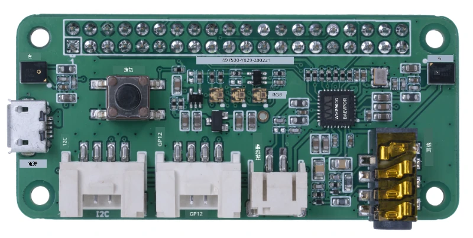
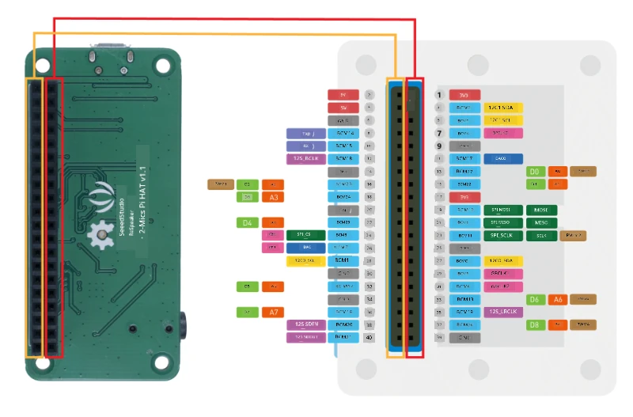
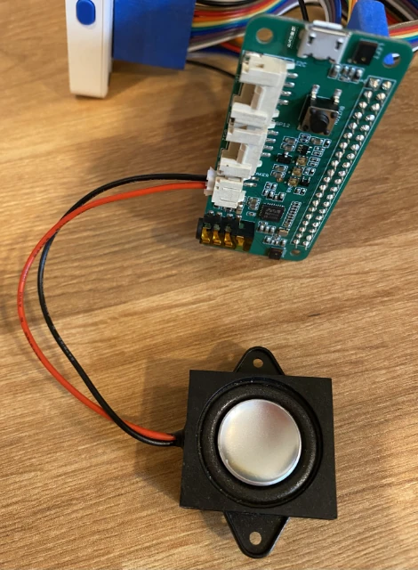

# 配置你的麥克風和揚聲器 - Wio Terminal

在這部分課程中，你將為 Wio Terminal 添加揚聲器。Wio Terminal 已內建麥克風，可用於捕捉語音。

## 硬件

Wio Terminal 已內建麥克風，可用於捕捉音頻進行語音識別。

若要添加揚聲器，你可以使用 [ReSpeaker 2-Mics Pi Hat](https://www.seeedstudio.com/ReSpeaker-2-Mics-Pi-HAT.html)。這是一塊外部擴展板，包含兩個 MEMS 麥克風，以及一個揚聲器連接器和耳機插孔。

你需要添加耳機、一個帶 3.5mm 插頭的揚聲器，或者一個帶 JST 接口的揚聲器，例如 [Mono Enclosed Speaker - 2W 6 Ohm](https://www.seeedstudio.com/Mono-Enclosed-Speaker-2W-6-Ohm-p-2832.html)。

要連接 ReSpeaker 2-Mics Pi Hat，你需要 40 根針對針（也稱為公對公）的跳線。

> 💁 如果你熟悉焊接，可以使用 [40 Pin Raspberry Pi Hat Adapter Board For Wio Terminal](https://www.seeedstudio.com/40-Pin-Raspberry-Pi-Hat-Adapter-Board-For-Wio-Terminal-p-4730.html) 來連接 ReSpeaker。

你還需要一張 SD 卡來下載和播放音頻。Wio Terminal 只支持最大 16GB 的 SD 卡，並且需要格式化為 FAT32 或 exFAT。

### 任務 - 連接 ReSpeaker Pi Hat

1. 在 Wio Terminal 關機的情況下，使用跳線和 Wio Terminal 背面的 GPIO 插座連接 ReSpeaker 2-Mics Pi Hat：

    需要按照以下方式連接引腳：

    

1. 將 ReSpeaker 和 Wio Terminal 擺放好，讓 GPIO 插座面向上，並位於左側。

1. 從 ReSpeaker GPIO 插座左上角的插孔開始，使用針對針跳線將 ReSpeaker 左上角插孔連接到 Wio Terminal 左上角插孔。

1. 按此方式依次連接左側 GPIO 插座的所有插孔。確保引腳牢固插入。

    

    

    > 💁 如果你的跳線是連成一條排線，保持它們整齊排列——這樣可以更容易確保所有線都按順序連接。

1. 使用 ReSpeaker 和 Wio Terminal 的右側 GPIO 插座重複上述過程。這些線需要繞過已連接的線。

    

    

    > 💁 如果你的跳線是連成一條排線，將它們分成兩條排線。分別從已連接的線的兩側穿過。

    > 💁 你可以使用膠帶將引腳固定成一個塊，以防止在連接過程中有引腳脫落。
    >
    > 

1. 你需要添加一個揚聲器。

    * 如果你使用的是帶 JST 線的揚聲器，將其連接到 ReSpeaker 的 JST 接口。

      

    * 如果你使用的是帶 3.5mm 插頭的揚聲器或耳機，將其插入 3.5mm 插孔。

      

### 任務 - 設置 SD 卡

1. 將 SD 卡連接到你的電腦，如果電腦沒有 SD 卡插槽，請使用外部讀卡器。

1. 使用電腦上的適當工具格式化 SD 卡，確保使用 FAT32 或 exFAT 文件系統。

1. 將 SD 卡插入 Wio Terminal 左側的 SD 卡插槽，插槽位於電源按鈕下方。確保卡完全插入並卡住——你可能需要使用細小工具或另一張 SD 卡幫助將其完全推入。

    

    > 💁 若要取出 SD 卡，你需要稍微推入卡片，它會彈出。你需要使用細小工具，例如平頭螺絲刀或另一張 SD 卡來完成此操作。

---

**免責聲明**：  
本文件已使用人工智能翻譯服務 [Co-op Translator](https://github.com/Azure/co-op-translator) 進行翻譯。儘管我們致力於提供準確的翻譯，但請注意，自動翻譯可能包含錯誤或不準確之處。原始語言的文件應被視為權威來源。對於重要信息，建議使用專業人工翻譯。我們對因使用此翻譯而引起的任何誤解或錯誤解釋概不負責。