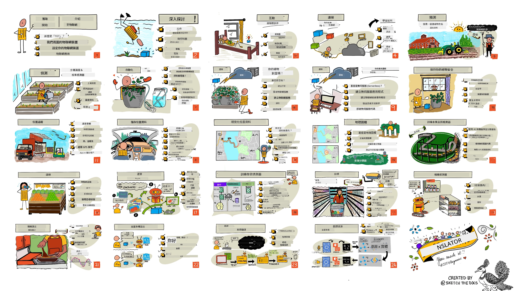

[](https://github.com/microsoft/IoT-For-Beginners/blob/master/LICENSE)
[](https://GitHub.com/microsoft/IoT-For-Beginners/graphs/contributors/)
[](https://GitHub.com/microsoft/IoT-For-Beginners/issues/)
[](https://GitHub.com/microsoft/IoT-For-Beginners/pulls/)
[](http://makeapullrequest.com)

[](https://GitHub.com/microsoft/IoT-For-Beginners/watchers/)
[](https://GitHub.com/microsoft/IoT-For-Beginners/network/)
[](https://GitHub.com/microsoft/IoT-For-Beginners/stargazers/)

### 加入 Azure AI Foundry 社群

如果你在建立 AI 應用時遇到困難或有任何問題，歡迎加入與其他學習者和經驗豐富的開發者一同討論 MCP。這是一個支持性的社群，鼓勵提問並自由分享知識。

[](https://discord.gg/nTYy5BXMWG)

如果你有產品反饋或在建立過程中遇到錯誤，請造訪：

[](https://aka.ms/foundry/forum)

請按照以下步驟開始使用這些資源：
1. **Fork 此儲存庫**：點擊 [](https://GitHub.com/microsoft/IoT-For-Beginners/fork)
2. **克隆此儲存庫**： `git clone https://github.com/microsoft/IoT-For-Beginners.git`
3. [**加入 Microsoft Foundry Discord，與專家和其他開發者會面**](https://discord.com/invite/ByRwuEEgH4)


### 🌐 多語言支援

#### 透過 GitHub Action 支援（自動且永遠保持最新）

<!-- CO-OP TRANSLATOR LANGUAGES TABLE START -->
[Arabic](../ar/README.md) | [Bengali](../bn/README.md) | [Bulgarian](../bg/README.md) | [Burmese (Myanmar)](../my/README.md) | [Chinese (Simplified)](../zh-CN/README.md) | [Chinese (Traditional, Hong Kong)](./README.md) | [Chinese (Traditional, Macau)](../zh-MO/README.md) | [Chinese (Traditional, Taiwan)](../zh-TW/README.md) | [Croatian](../hr/README.md) | [Czech](../cs/README.md) | [Danish](../da/README.md) | [Dutch](../nl/README.md) | [Estonian](../et/README.md) | [Finnish](../fi/README.md) | [French](../fr/README.md) | [German](../de/README.md) | [Greek](../el/README.md) | [Hebrew](../he/README.md) | [Hindi](../hi/README.md) | [Hungarian](../hu/README.md) | [Indonesian](../id/README.md) | [Italian](../it/README.md) | [Japanese](../ja/README.md) | [Kannada](../kn/README.md) | [Korean](../ko/README.md) | [Lithuanian](../lt/README.md) | [Malay](../ms/README.md) | [Malayalam](../ml/README.md) | [Marathi](../mr/README.md) | [Nepali](../ne/README.md) | [Nigerian Pidgin](../pcm/README.md) | [Norwegian](../no/README.md) | [Persian (Farsi)](../fa/README.md) | [Polish](../pl/README.md) | [Portuguese (Brazil)](../pt-BR/README.md) | [Portuguese (Portugal)](../pt-PT/README.md) | [Punjabi (Gurmukhi)](../pa/README.md) | [Romanian](../ro/README.md) | [Russian](../ru/README.md) | [Serbian (Cyrillic)](../sr/README.md) | [Slovak](../sk/README.md) | [Slovenian](../sl/README.md) | [Spanish](../es/README.md) | [Swahili](../sw/README.md) | [Swedish](../sv/README.md) | [Tagalog (Filipino)](../tl/README.md) | [Tamil](../ta/README.md) | [Telugu](../te/README.md) | [Thai](../th/README.md) | [Turkish](../tr/README.md) | [Ukrainian](../uk/README.md) | [Urdu](../ur/README.md) | [Vietnamese](../vi/README.md)

> **偏好本地克隆？**

> 此儲存庫包含超過 50 種語言的翻譯，會大幅增加下載大小。若要不下載翻譯內容，請使用稀疏檢出功能：
> ```bash
> git clone --filter=blob:none --sparse https://github.com/microsoft/IoT-For-Beginners.git
> cd IoT-For-Beginners
> git sparse-checkout set --no-cone '/*' '!translations' '!translated_images'
> ```
> 這樣就能更快下載，並擁有進行課程所需的所有內容。
<!-- CO-OP TRANSLATOR LANGUAGES TABLE END -->

# IoT 初學者課程計劃

微軟的 Azure Cloud Advocates 很高興提供一個為期 12 週、共 24 課的 IoT 基礎課程。每堂課包含課前和課後測驗、完成課程的書面指引、解答、作業等。我們採用專案導向的教學法，讓你邊做邊學，這是學習新技能的有效方法。

這些專案涵蓋食物從農場到餐桌的旅程。包括農業、運輸、製造、零售和消費，這些都是 IoT 裝置熱門的產業領域。



> 速寫筆記由 [Nitya Narasimhan](https://github.com/nitya) 製作。點擊圖片可查看較大版本。

**衷心感謝編寫者 [Jen Fox](https://github.com/jenfoxbot)、[Jen Looper](https://github.com/jlooper)、[Jim Bennett](https://github.com/jimbobbennett) 與速寫筆記藝術家 [Nitya Narasimhan](https://github.com/nitya)。**

**也感謝我們的 [Microsoft Learn 學生大使團隊](https://studentambassadors.microsoft.com?WT.mc_id=academic-17441-jabenn) 協助審核及翻譯課程內容 - 包括 [Aditya Garg](https://github.com/AdityaGarg00)、[Anurag Sharma](https://github.com/Anurag-0-1-A)、[Arpita Das](https://github.com/Arpiiitaaa)、[Aryan Jain](https://www.linkedin.com/in/aryan-jain-47a4a1145/)、[Bhavesh Suneja](https://github.com/EliteWarrior315)、[Faith Hunja](https://faithhunja.github.io/)、[Lateefah Bello](https://www.linkedin.com/in/lateefah-bello/)、[Manvi Jha](https://github.com/Severus-Matthew)、[Mireille Tan](https://www.linkedin.com/in/mireille-tan-a4834819a/)、[Mohammad Iftekher (Iftu) Ebne Jalal](https://github.com/Iftu119)、[Mohammad Zulfikar](https://github.com/mohzulfikar)、[Priyanshu Srivastav](https://www.linkedin.com/in/priyanshu-srivastav-b067241ba)、[Thanmai Gowducheruvu](https://github.com/innovation-platform) 與 [Zina Kamel](https://www.linkedin.com/in/zina-kamel/)。**

認識團隊吧！

[](https://youtu.be/-wippUJRi5k)

**Gif 由** [Mohit Jaisal](https://linkedin.com/in/mohitjaisal) 製作

> 🎥 點擊上方圖片觀看本專案影片！

> **教師們**，我們提供了[使用本課程的建議](for-teachers.md)。若想自行建立課程，亦可參考我們附上的[課程模板](lesson-template/README.md)。

> **[學生們](https://aka.ms/student-page)**，若想自行使用本課程，請 fork 整個儲存庫並獨立完成練習，從課前測驗開始，閱讀課程內容並完成其他活動。嘗試理解課程內容後自行完成專案，不建議直接複製解答程式碼；不過每個專案導向課程的 /solutions 資料夾中有提供程式碼。另一個方法是組織朋輩學習小組，一起學習內容。若要進階學習，我們推薦 [Microsoft Learn](https://docs.microsoft.com/users/jimbobbennett/collections/ke2ehd351jopwr?WT.mc_id=academic-17441-jabenn)。

關於本課程的影片介紹，請觀看此影片：

[](https://youtube.com/watch?v=bccEMm8gRuc "Promo video")

> 🎥 點擊上方圖片觀看本專案影片！

## 教學理念

我們在開發這套課程時，採用了兩個教學原則：確保專案導向，以及包含頻繁的測驗。課程結束時，學生將完成一套植物監控與灌溉系統、車輛追蹤器、智慧工廠以追蹤及檢查食物，還有一個語音控制的烹飪計時器；同時學會物聯網基礎，包括如何撰寫裝置程式碼、連接雲端、分析遙測資料，並在邊緣運行 AI。

透過專案對應內容，讓學生更投入學習，也提高概念記憶度。

另外，上課前的低壓力測驗能幫助學生設定學習目標，而課後測驗則促進學習鞏固。本課程設計靈活有趣，可完整或部分修讀。專案由簡入深，隨著 12 週週期逐漸變得更複雜。

每個專案都依據學生和嗜好者可取得的真實硬體設計。專案同時探討特定領域，提供相關背景知識。要成為成功的開發者，了解你解決問題的領域非常重要，這些背景知識幫助學生將物聯網解決方案與實際問題情境相連結，明白自己建構解決方案的原因，並體會最終使用者的需求。

## 硬體設備

我們提供兩款 IoT 硬體選項，供專案使用，取決於個人喜好、程式語言知識或學習目標與硬體可用性。另也提供「虛擬硬體」版本，適合尚無硬體或想先學習再購買的人。你可以在 [硬體頁面](./hardware.md) 詳讀更多內容，並取得購買套件的清單，亦包含我們合作夥伴 Seeed Studio 的連結。
> 💁 查閱我們的[行為守則](CODE_OF_CONDUCT.md)、[貢獻指南](CONTRIBUTING.md)及[翻譯指南](TRANSLATIONS.md)。歡迎您提供建設性的意見反饋！
>
> 🔧 遇到問題？請查看我們的[疑難排解指南](TROUBLESHOOTING.md)，了解常見問題的解決方法。

## 每個課程包含：

- 手繪筆記
- 可選補充影片
- 課前熱身小測驗
- 書面課程內容
- 專案式課程包含逐步指導如何完成專案
- 知識檢查
- 挑戰題
- 補充閱讀
- 作業
- [課後小測驗](https://ff-quizzes.netlify.app/en/)

> **關於小測驗的說明**：所有小測驗均包含在 quiz-app 資料夾內，共有 48 個小測驗，每個小測驗包含三題。這些小測驗會在課程內容中提供連結，但 quiz app 也能本地運行或部署到 Azure；請依照 quiz-app 資料夾內的說明操作。目前正在逐步進行本地化。

## 課程

|       |              專案名稱              |                       教授概念                       | 學習目標                                                                                                                                                 |                                                        連結課程                                                         |
| :---: | :------------------------------------: | :---------------------------------------------------------: | ------------------------------------------------------------------------------------------------------------------------------------------------------------------- | :--------------------------------------------------------------------------------------------------------------------------: |
|  01   | [Getting started](./1-getting-started/README.md) |                     物聯網入門                     | 學習物聯網的基本原理與物聯網解決方案的基礎元素，如感測器與雲端服務，同時設定您的第一個物聯網裝置                                  |                      [Introduction to IoT](./1-getting-started/lessons/1-introduction-to-iot/README.md)                      |
|  02   | [Getting started](./1-getting-started/README.md) |                   深入了解物聯網                    | 深入了解物聯網系統的組成元件，並學習微控制器與單板電腦的基礎知識                                                              |                        [A deeper dive into IoT](./1-getting-started/lessons/2-deeper-dive/README.md)                         |
|  03   | [Getting started](./1-getting-started/README.md) | 使用感測器與執行器與物理世界互動 | 瞭解如何利用感測器擷取物理世界資料，與利用執行器傳送反饋，同時打造一個夜燈                                                     | [Interact with the physical world with sensors and actuators](./1-getting-started/lessons/3-sensors-and-actuators/README.md) |
|  04   | [Getting started](./1-getting-started/README.md) |             將您的裝置連接到網際網路             | 學習如何將物聯網裝置連接到網際網路，透過連接夜燈到 MQTT 代理伺服器來傳送與接收訊息                                             |               [Connect your device to the Internet](./1-getting-started/lessons/4-connect-internet/README.md)                |
|  05   |            [Farm](./2-farm/README.md)            |                    預測植物生長                     | 使用物聯網裝置擷取的溫度資料，學習如何預測植物生長                                                                           |                          [Predict plant growth](./2-farm/lessons/1-predict-plant-growth/README.md)                           |
|  06   |            [Farm](./2-farm/README.md)            |                    偵測土壤濕度                     | 學習如何偵測土壤濕度並校準土壤濕度感測器                                                                                      |                          [Detect soil moisture](./2-farm/lessons/2-detect-soil-moisture/README.md)                           |
|  07   |            [Farm](./2-farm/README.md)            |                  自動化植物澆水                   | 學習如何使用繼電器與 MQTT 自動與定時澆水                                                                                          |                      [Automated plant watering](./2-farm/lessons/3-automated-plant-watering/README.md)                       |
|  08   |            [Farm](./2-farm/README.md)            |               將您的植物遷移至雲端               | 了解雲端與雲端託管的物聯網服務，以及如何將您的植物連接到這些服務之一，而非使用公共 MQTT 代理伺服器                             |               [Migrate your plant to the cloud](./2-farm/lessons/4-migrate-your-plant-to-the-cloud/README.md)                |
|  09   |            [Farm](./2-farm/README.md)            |         將您的應用程式邏輯遷移到雲端         | 了解如何在雲端撰寫響應物聯網訊息的應用程式邏輯                                                                               |         [Migrate your application logic to the cloud](./2-farm/lessons/5-migrate-application-to-the-cloud/README.md)         |
|  10   |            [Farm](./2-farm/README.md)            |                   保護您的植物安全                    | 了解物聯網安全概念以及如何使用金鑰與憑證來保護您的植物安全                                                                      |                        [Keep your plant secure](./2-farm/lessons/6-keep-your-plant-secure/README.md)                         |
|  11   |       [Transport](./3-transport/README.md)       |                      位置追蹤                      | 了解物聯網裝置的 GPS 位置追蹤                                                                                                   |                           [Location tracking](./3-transport/lessons/1-location-tracking/README.md)                           |
|  12   |       [Transport](./3-transport/README.md)       |                     儲存位置資料                     | 學習如何儲存物聯網資料以供後續視覺化或分析                                                                                     |                         [Store location data](./3-transport/lessons/2-store-location-data/README.md)                         |
|  13   |       [Transport](./3-transport/README.md)       |                   視覺化位置資料                   | 了解如何在地圖上視覺化位置資料，以及地圖如何以二維方式表示真實的三維世界                                                       |                     [Visualize location data](./3-transport/lessons/3-visualize-location-data/README.md)                     |
|  14   |       [Transport](./3-transport/README.md)       |                          地理圍欄                          | 了解什麼是地理圍欄，以及如何利用它在供應鏈車輛接近目的地時發出警示                                                             |                                   [Geofences](./3-transport/lessons/4-geofences/README.md)                                   |
|  15   |   [Manufacturing](./4-manufacturing/README.md)   |               訓練水果品質檢測器                | 了解如何在雲端訓練影像分類器來檢測水果品質                                                                                     |                 [Train a fruit quality detector](./4-manufacturing/lessons/1-train-fruit-detector/README.md)                 |
|  16   |   [Manufacturing](./4-manufacturing/README.md)   |           從物聯網裝置檢查水果品質            | 了解如何從物聯網裝置使用您的水果品質檢測器                                                                                     |           [Check fruit quality from an IoT device](./4-manufacturing/lessons/2-check-fruit-from-device/README.md)            |
|  17   |   [Manufacturing](./4-manufacturing/README.md)   |             在邊緣運行您的水果檢測器             | 了解如何在物聯網邊緣裝置上運行您的水果檢測器                                                                                   |             [Run your fruit detector on the edge](./4-manufacturing/lessons/3-run-fruit-detector-edge/README.md)             |
|  18   |   [Manufacturing](./4-manufacturing/README.md)   |        從感測器觸發水果品質檢測        | 了解如何從感測器觸發水果品質檢測                                                                                               |        [Trigger fruit quality detection from a sensor](./4-manufacturing/lessons/4-trigger-fruit-detector/README.md)         |
|  19   |          [Retail](./5-retail/README.md)          |                   訓練庫存檢測器                    | 了解如何使用物件偵測訓練庫存檢測器以計算商店內的庫存                                                                        |                        [Train a stock detector](./5-retail/lessons/1-train-stock-detector/README.md)                         |
|  20   |          [Retail](./5-retail/README.md)          |               從物聯網裝置檢查庫存                | 了解如何使用物件偵測模型從物聯網裝置檢查庫存                                                                                   |                     [Check stock from an IoT device](./5-retail/lessons/2-check-stock-device/README.md)                      |
|  21   |        [Consumer](./6-consumer/README.md)        |             利用物聯網裝置識別語音             | 了解如何從物聯網裝置識別語音，打造智慧計時器                                                                                   |                  [Recognize speech with an IoT device](./6-consumer/lessons/1-speech-recognition/README.md)                  |
|  22   |        [Consumer](./6-consumer/README.md)        |                     語言理解                     | 了解如何理解對物聯網裝置說出的句子                                                                                             |                        [Understand language](./6-consumer/lessons/2-language-understanding/README.md)                        |
|  23   |        [Consumer](./6-consumer/README.md)        |           設定計時器並提供語音反饋           | 了解如何在物聯網裝置上設計計時器，並在計時開始與結束時給予語音反饋                                                             |                 [Set a timer and provide spoken feedback](./6-consumer/lessons/3-spoken-feedback/README.md)                  |
|  24   |        [Consumer](./6-consumer/README.md)        |                 支援多種語言                  | 了解如何支援多語言設定，包含語音輸入及智慧計時器的語音回應                                                                     |                   [Support multiple languages](./6-consumer/lessons/4-multiple-language-support/README.md)                   |

## 離線存取

您可以使用 [Docsify](https://docsify.js.org/#/) 離線執行本文件。請先 fork 本儲存庫，並於本機安裝 [Docsify](https://docsify.js.org/#/quickstart)，接著在本儲存庫根目錄中執行 `docsify serve`。網站將會在本機的 3000 埠提供服務：`localhost:3000`。

## 小測驗

感謝社群提供互動式小測驗，測試您對每個章節的理解。您可以[在此測試您的知識](https://ff-quizzes.netlify.app/en/)。

### PDF

您可以生成內容的 PDF 以供離線使用。請確定已安裝 [npm](https://docs.npmjs.com/downloading-and-installing-node-js-and-npm)，並在本儲存庫根目錄執行以下指令：

```sh
npm i
npm run convert
```

### 投影片

部分課程有相應的投影片，請見 [slides](../../slides) 資料夾。

## 其他課程

我們團隊還有其他課程！歡迎參考：

<!-- CO-OP TRANSLATOR OTHER COURSES START -->
### LangChain
[](https://aka.ms/langchain4j-for-beginners)
[](https://aka.ms/langchainjs-for-beginners?WT.mc_id=m365-94501-dwahlin)

---

### Azure / Edge / MCP / Agents
[](https://github.com/microsoft/AZD-for-beginners?WT.mc_id=academic-105485-koreyst)
[](https://github.com/microsoft/edgeai-for-beginners?WT.mc_id=academic-105485-koreyst)
[](https://github.com/microsoft/mcp-for-beginners?WT.mc_id=academic-105485-koreyst)
[](https://github.com/microsoft/ai-agents-for-beginners?WT.mc_id=academic-105485-koreyst)

---
 
### 生成式 AI 系列
[](https://github.com/microsoft/generative-ai-for-beginners?WT.mc_id=academic-105485-koreyst)
[-9333EA?style=for-the-badge&labelColor=E5E7EB&color=9333EA)](https://github.com/microsoft/Generative-AI-for-beginners-dotnet?WT.mc_id=academic-105485-koreyst)
[-C084FC?style=for-the-badge&labelColor=E5E7EB&color=C084FC)](https://github.com/microsoft/generative-ai-for-beginners-java?WT.mc_id=academic-105485-koreyst)
[-E879F9?style=for-the-badge&labelColor=E5E7EB&color=E879F9)](https://github.com/microsoft/generative-ai-with-javascript?WT.mc_id=academic-105485-koreyst)

---
 
### 核心學習
[](https://aka.ms/ml-beginners?WT.mc_id=academic-105485-koreyst)
[](https://aka.ms/datascience-beginners?WT.mc_id=academic-105485-koreyst)
[](https://aka.ms/ai-beginners?WT.mc_id=academic-105485-koreyst)
[](https://github.com/microsoft/Security-101?WT.mc_id=academic-96948-sayoung)
[](https://aka.ms/webdev-beginners?WT.mc_id=academic-105485-koreyst)
[](https://aka.ms/iot-beginners?WT.mc_id=academic-105485-koreyst)
[](https://github.com/microsoft/xr-development-for-beginners?WT.mc_id=academic-105485-koreyst)

---
 
### Copilot 系列
[](https://aka.ms/GitHubCopilotAI?WT.mc_id=academic-105485-koreyst)
[](https://github.com/microsoft/mastering-github-copilot-for-dotnet-csharp-developers?WT.mc_id=academic-105485-koreyst)
[](https://github.com/microsoft/CopilotAdventures?WT.mc_id=academic-105485-koreyst)
<!-- CO-OP TRANSLATOR OTHER COURSES END -->

## 圖片版權聲明

你可以在本課程所需的 [Attributions](./attributions.md) 中找到使用圖片的所有版權聲明。

---

<!-- CO-OP TRANSLATOR DISCLAIMER START -->
**免責聲明**：  
本文件已使用 AI 翻譯服務 [Co-op Translator](https://github.com/Azure/co-op-translator) 進行翻譯。儘管我們力求準確，但請注意自動翻譯可能包含錯誤或不準確之處。原始語言版本的文件應被視為權威來源。對於關鍵資訊，建議使用專業人工翻譯。我們對因使用本翻譯所引起的任何誤解或誤譯概不負責。
<!-- CO-OP TRANSLATOR DISCLAIMER END -->