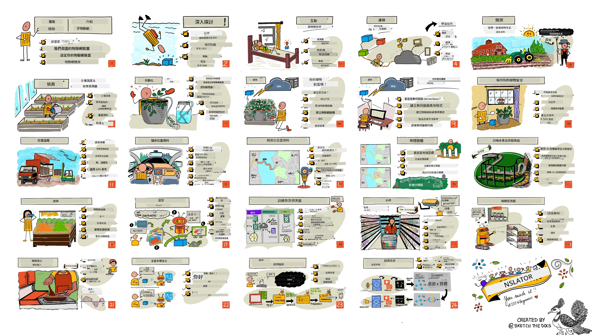

[](https://github.com/microsoft/IoT-For-Beginners/blob/master/LICENSE)
[](https://GitHub.com/microsoft/IoT-For-Beginners/graphs/contributors/)
[](https://GitHub.com/microsoft/IoT-For-Beginners/issues/)
[](https://GitHub.com/microsoft/IoT-For-Beginners/pulls/)
[](http://makeapullrequest.com)

[](https://GitHub.com/microsoft/IoT-For-Beginners/watchers/)
[](https://GitHub.com/microsoft/IoT-For-Beginners/network/)
[](https://GitHub.com/microsoft/IoT-For-Beginners/stargazers/)

### 加入 Azure AI Foundry 社群

如果你在建立 AI 應用程式時遇到困難或有任何問題，歡迎加入與其他學習者及經驗豐富的開發者一起討論 MCP 的行列。這是一個支持性的社群，歡迎提問並自由分享知識。

[](https://discord.gg/nTYy5BXMWG)

如果你在開發過程中有產品回饋或錯誤，請造訪：

[](https://aka.ms/foundry/forum)

請依照以下步驟開始使用這些資源：
1. <strong>派生這個儲存庫</strong>：點擊 [](https://GitHub.com/microsoft/IoT-For-Beginners/fork)
2. <strong>複製儲存庫</strong>： `git clone https://github.com/microsoft/IoT-For-Beginners.git`
3. [**加入 Microsot Foundry Discord，並與專家及其他開發者會面**](https://discord.com/invite/ByRwuEEgH4)


### 🌐 多語言支援

#### 透過 GitHub Action 支援（自動且隨時更新）

<!-- CO-OP TRANSLATOR LANGUAGES TABLE START -->
[Arabic](../ar/README.md) | [Bengali](../bn/README.md) | [Bulgarian](../bg/README.md) | [Burmese (Myanmar)](../my/README.md) | [Chinese (Simplified)](../zh-CN/README.md) | [Chinese (Traditional, Hong Kong)](./README.md) | [Chinese (Traditional, Macau)](../zh-MO/README.md) | [Chinese (Traditional, Taiwan)](../zh-TW/README.md) | [Croatian](../hr/README.md) | [Czech](../cs/README.md) | [Danish](../da/README.md) | [Dutch](../nl/README.md) | [Estonian](../et/README.md) | [Finnish](../fi/README.md) | [French](../fr/README.md) | [German](../de/README.md) | [Greek](../el/README.md) | [Hebrew](../he/README.md) | [Hindi](../hi/README.md) | [Hungarian](../hu/README.md) | [Indonesian](../id/README.md) | [Italian](../it/README.md) | [Japanese](../ja/README.md) | [Kannada](../kn/README.md) | [Khmer](../km/README.md) | [Korean](../ko/README.md) | [Lithuanian](../lt/README.md) | [Malay](../ms/README.md) | [Malayalam](../ml/README.md) | [Marathi](../mr/README.md) | [Nepali](../ne/README.md) | [Nigerian Pidgin](../pcm/README.md) | [Norwegian](../no/README.md) | [Persian (Farsi)](../fa/README.md) | [Polish](../pl/README.md) | [Portuguese (Brazil)](../pt-BR/README.md) | [Portuguese (Portugal)](../pt-PT/README.md) | [Punjabi (Gurmukhi)](../pa/README.md) | [Romanian](../ro/README.md) | [Russian](../ru/README.md) | [Serbian (Cyrillic)](../sr/README.md) | [Slovak](../sk/README.md) | [Slovenian](../sl/README.md) | [Spanish](../es/README.md) | [Swahili](../sw/README.md) | [Swedish](../sv/README.md) | [Tagalog (Filipino)](../tl/README.md) | [Tamil](../ta/README.md) | [Telugu](../te/README.md) | [Thai](../th/README.md) | [Turkish](../tr/README.md) | [Ukrainian](../uk/README.md) | [Urdu](../ur/README.md) | [Vietnamese](../vi/README.md)

> **想本地複製？**
>
> 這個儲存庫包括 50 多種語言的翻譯，會大幅增加下載大小。若想不包含翻譯只複製部分，請使用稀疏檢出：
>
> **Bash / macOS / Linux:**
> ```bash
> git clone --filter=blob:none --sparse https://github.com/microsoft/IoT-For-Beginners.git
> cd IoT-For-Beginners
> git sparse-checkout set --no-cone '/*' '!translations' '!translated_images'
> ```
>
> **CMD (Windows):**
> ```cmd
> git clone --filter=blob:none --sparse https://github.com/microsoft/IoT-For-Beginners.git
> cd IoT-For-Beginners
> git sparse-checkout set --no-cone "/*" "!translations" "!translated_images"
> ```
>
> 這樣你可以更快下載並獲得完成課程所需的所有內容。
<!-- CO-OP TRANSLATOR LANGUAGES TABLE END -->

# 新手物聯網課程大綱

微軟的 Azure Cloud Advocates 很高興提供一套為期 12 週、共 24 課的物聯網基礎課程。每課包含課前和課後小測驗、詳盡的書面教學、解答、作業等等。我們以專案為核心的教學法讓你在實作中學習，這是新技能更容易「融會貫通」的有效方法。

課程的專案涵蓋食物從農場到餐桌的整個過程，包括農業、物流、製造、零售與消費端，這些都是物聯網設備常見應用領域。



> 繪圖筆記由 [Nitya Narasimhan](https://github.com/nitya) 製作。點擊圖片可觀看大圖。

**非常感謝我們的作者 [Jen Fox](https://github.com/jenfoxbot)、[Jen Looper](https://github.com/jlooper)、[Jim Bennett](https://github.com/jimbobbennett)，以及繪圖筆記藝術家 [Nitya Narasimhan](https://github.com/nitya)。**

**同時感謝我們的 [Microsoft Learn 學生大使團隊](https://studentambassadors.microsoft.com?WT.mc_id=academic-17441-jabenn) 審閱與翻譯這套課程——[Aditya Garg](https://github.com/AdityaGarg00)、[Anurag Sharma](https://github.com/Anurag-0-1-A)、[Arpita Das](https://github.com/Arpiiitaaa)、[Aryan Jain](https://www.linkedin.com/in/aryan-jain-47a4a1145/)、[Bhavesh Suneja](https://github.com/EliteWarrior315)、[Faith Hunja](https://faithhunja.github.io/)、[Lateefah Bello](https://www.linkedin.com/in/lateefah-bello/)、[Manvi Jha](https://github.com/Severus-Matthew)、[Mireille Tan](https://www.linkedin.com/in/mireille-tan-a4834819a/)、[Mohammad Iftekher (Iftu) Ebne Jalal](https://github.com/Iftu119)、[Mohammad Zulfikar](https://github.com/mohzulfikar)、[Priyanshu Srivastav](https://www.linkedin.com/in/priyanshu-srivastav-b067241ba)、[Thanmai Gowducheruvu](https://github.com/innovation-platform) 和 [Zina Kamel](https://www.linkedin.com/in/zina-kamel/)。**

認識團隊成員！

[](https://youtu.be/-wippUJRi5k)

**Gif 由** [Mohit Jaisal](https://linkedin.com/in/mohitjaisal) 製作

> 🎥 點擊上方圖片觀看專案影片！

> <strong>給老師的建議</strong> 我們[提供了使用這份課程的建議](for-teachers.md)，如果你想建立自己的課程，我們也提供了[課程模板](lesson-template/README.md)。

> **[給學生](https://aka.ms/student-page)**，若想自行使用這門課程，請派生整個儲存庫並自行完成練習，從課前小測驗開始，閱讀講義並完成所有活動。盡量理解課程後自行完成專案，而非直接複製解答代碼；不過專案導向課程的/solutions資料夾中有提供解答代碼。另一個方式是組成讀書會，與朋友一同學習。若想更深入學習，我們推薦[Microsoft Learn](https://docs.microsoft.com/users/jimbobbennett/collections/ke2ehd351jopwr?WT.mc_id=academic-17441-jabenn)。

想要瞭解這課程的視訊總覽，請看這 影片：

[](https://youtube.com/watch?v=bccEMm8gRuc "Promo video")

> 🎥 點擊上方圖片觀看專案影片！

## 教學法

本課程採用兩大教學原則：專案導向與頻繁的小測驗。學完系列課程結束時，學生將完成植物監控及澆水系統、車輛追蹤器、智慧工廠的食物追蹤與檢查系統，以及語音控制烹飪計時器，並學會物聯網基本概念，包括如何撰寫裝置程式碼、連接雲端、分析遙測資料及在邊緣運行 AI。

結合實際專案讓內容更有趣，學習成效與概念的記憶也會有所提升。

此外，課前的低壓力測驗能讓學生設立學習目標，課後再有第二次測驗則幫助鞏固所學。這套課程設計彈性且有趣，學員可全修或部分選修，專案從簡單到複雜，循序漸進完成 12 週循環。

每個專案使用學生及愛好者可取得的實體硬體為基礎，探索專案領域並提供相關背景知識。成功的開發者通常會對所解決的領域有所理解，提供背景知識幫助學生將物聯網方案與學習內容，放在真實世界可能遇到的問題脈絡中思考。學生能了解所建構方案的「為什麼」，並心懷對最終用戶的理解。

## 硬體
我們有兩個物聯網硬件選擇，視個人喜好、編程語言知識或偏好、學習目標及可用性而定。我們亦提供了「虛擬硬件」版本，適合沒有硬件的用家，或想在購買前多了解的學習者。您可以在[硬件頁面](./hardware.md)閱讀更多內容及「購物清單」，其中包括我們的合作夥伴 Seeed Studio 提供的完整套件購買連結。

> 💁 請參閱我們的[行為守則](CODE_OF_CONDUCT.md)、[貢獻指南](CONTRIBUTING.md)及[翻譯指南](TRANSLATIONS.md)。我們歡迎您的建設性意見！
>
> 🔧 遇到問題？請查看我們的[疑難排解指南](TROUBLESHOOTING.md)，尋找常見問題解決方案。

## 每節課包含：

- 筆記草圖
- 選擇性的補充視頻
- 課前暖身測驗
- 書面課程內容
- 對於基於項目的課程，提供逐步指導如何構建項目
- 知識檢查
- 挑戰題
- 補充閱讀
- 作業
- [課後測驗](https://ff-quizzes.netlify.app/en/)

> <strong>關於測驗的說明</strong>：所有測驗均包含於 quiz-app 資料夾內，共有 48 個測驗，每個測驗包含三道題目。測驗連結設於課程中，但測驗應用可於本地運行或部署至 Azure；請按照 quiz-app 資料夾中的指示操作。測驗正逐步本地化中。

## 課程

|       |              項目名稱               |                       授課概念                       | 學習目標                                                                                                                                                 |                                                        連結課程                                                         |
| :---: | :---------------------------------: | :--------------------------------------------------: | --------------------------------------------------------------------------------------------------------------------------------------------------------- | :-----------------------------------------------------------------------------------------------------------------------: |
|  01   | [入門](./1-getting-started/README.md) |                     物聯網介紹                     | 學習物聯網的基本原理及物聯網解決方案的基本組件，例如感應器和雲端服務，同時設置您的第一個物聯網設備                                                    |                      [物聯網介紹](./1-getting-started/lessons/1-introduction-to-iot/README.md)                             |
|  02   | [入門](./1-getting-started/README.md) |                   深入了解物聯網                    | 學習更多有關物聯網系統的組件，以及微控制器和單板電腦                                                                                                    |                        [深入了解物聯網](./1-getting-started/lessons/2-deeper-dive/README.md)                               |
|  03   | [入門](./1-getting-started/README.md) | 透過感應器和執行器與實體世界互動 | 瞭解感應器用於從物理世界收集數據，及執行器用於回饋，並構建一個夜燈                                                                                        | [透過感應器和執行器與實體世界互動](./1-getting-started/lessons/3-sensors-and-actuators/README.md)                        |
|  04   | [入門](./1-getting-started/README.md) |             連接裝置至互聯網             | 學習如何將物聯網設備連接至互聯網，透過連接您的夜燈到 MQTT 代理發送及接收消息                                                                            |               [連接裝置至互聯網](./1-getting-started/lessons/4-connect-internet/README.md)                                |
|  05   |            [農場](./2-farm/README.md)            |                    預測植物生長                   | 學習如何利用物聯網裝置收集的溫度數據來預測植物生長                                                                                                      |                          [預測植物生長](./2-farm/lessons/1-predict-plant-growth/README.md)                                |
|  06   |            [農場](./2-farm/README.md)            |                    檢測土壤濕度                   | 學習如何檢測土壤濕度並校準土壤濕度感測器                                                                                                                |                          [檢測土壤濕度](./2-farm/lessons/2-detect-soil-moisture/README.md)                                |
|  07   |            [農場](./2-farm/README.md)            |                 自動化灌溉系統                   | 學習如何利用繼電器與 MQTT 自動化及定時灌溉                                                                                                              |                      [自動化灌溉系統](./2-farm/lessons/3-automated-plant-watering/README.md)                                  |
|  08   |            [農場](./2-farm/README.md)            |               將您的植物數據遷移至雲端               | 學習關於雲端及雲端物聯網服務，以及如何將您的植物接入這類服務，而非公眾 MQTT 代理                                                                       |               [將您的植物數據遷移至雲端](./2-farm/lessons/4-migrate-your-plant-to-the-cloud/README.md)                     |
|  09   |            [農場](./2-farm/README.md)            |         將應用程式邏輯遷移至雲端         | 學習如何在雲端編寫可回應物聯網消息的應用程式邏輯                                                                                                        |         [將應用程式邏輯遷移至雲端](./2-farm/lessons/5-migrate-application-to-the-cloud/README.md)                             |
|  10   |            [農場](./2-farm/README.md)            |                   保護您的植物安全                    | 學習物聯網安全，及如何用密鑰和證書保障您的植物安全                                                                                                      |                        [保護您的植物安全](./2-farm/lessons/6-keep-your-plant-secure/README.md)                               |
|  11   |       [運輸](./3-transport/README.md)       |                      位置追蹤                      | 學習物聯網設備的 GPS 位置跟蹤                                                                                                                          |                           [位置追蹤](./3-transport/lessons/1-location-tracking/README.md)                                   |
|  12   |       [運輸](./3-transport/README.md)       |                     儲存位置資料                     | 學習如何儲存物聯網數據以便後續視覺化或分析                                                                                                             |                         [儲存位置資料](./3-transport/lessons/2-store-location-data/README.md)                               |
|  13   |       [運輸](./3-transport/README.md)       |                   視覺化位置資料                   | 了解如何在地圖上視覺化位置資料，以及地圖如何以二維形式呈現三維的現實世界                                                                              |                     [視覺化位置資料](./3-transport/lessons/3-visualize-location-data/README.md)                              |
|  14   |       [運輸](./3-transport/README.md)       |                          地理圍欄                          | 學習關於地理圍欄，以及如何用它們在供應鏈中車輛靠近目的地時發出警示                                                                                      |                                   [地理圍欄](./3-transport/lessons/4-geofences/README.md)                                  |
|  15   |   [製造](./4-manufacturing/README.md)   |               訓練水果品質檢測器                | 學習如何在雲端訓練圖像分類器來檢測水果品質                                                                                                             |                 [訓練水果品質檢測器](./4-manufacturing/lessons/1-train-fruit-detector/README.md)                            |
|  16   |   [製造](./4-manufacturing/README.md)   |           從物聯網裝置檢測水果品質            | 學習如何使用您的水果品質檢測器於物聯網裝置                                                                                                             |           [從物聯網裝置檢測水果品質](./4-manufacturing/lessons/2-check-fruit-from-device/README.md)                         |
|  17   |   [製造](./4-manufacturing/README.md)   |             在邊緣裝置執行水果檢測器             | 學習如何在物聯網裝置的邊緣計算端運行水果檢測器                                                                                                         |             [在邊緣裝置執行水果檢測器](./4-manufacturing/lessons/3-run-fruit-detector-edge/README.md)                       |
|  18   |   [製造](./4-manufacturing/README.md)   |        從感測器觸發水果品質檢測        | 學習如何從感測器觸發水果品質檢測                                                                                                                         |        [從感測器觸發水果品質檢測](./4-manufacturing/lessons/4-trigger-fruit-detector/README.md)                            |
|  19   |          [零售](./5-retail/README.md)          |                   訓練庫存檢測器                    | 學習如何利用物件檢測訓練庫存檢測器來統計店內庫存                                                                                                       |                        [訓練庫存檢測器](./5-retail/lessons/1-train-stock-detector/README.md)                                |
|  20   |          [零售](./5-retail/README.md)          |               從物聯網裝置檢查庫存                | 學習如何使用物聯網裝置和物件檢測模型來檢查庫存                                                                                                         |                     [從物聯網裝置檢查庫存](./5-retail/lessons/2-check-stock-device/README.md)                               |
|  21   |        [消費者](./6-consumer/README.md)        |             利用物聯網裝置進行語音識別             | 學習如何利用物聯網裝置來識別語音，用以構建智能計時器                                                                                                   |                  [利用物聯網裝置進行語音識別](./6-consumer/lessons/1-speech-recognition/README.md)                         |
|  22   |        [消費者](./6-consumer/README.md)        |                     理解語言                     | 學習如何理解對物聯網裝置說出的句子                                                                                                                       |                        [理解語言](./6-consumer/lessons/2-language-understanding/README.md)                                  |
|  23   |        [消費者](./6-consumer/README.md)        |           設定計時器並提供語音反饋           | 學習如何在物聯網裝置上設定計時器，並於計時器開始及結束時提供語音反饋                                                                                   |                 [設定計時器並提供語音反饋](./6-consumer/lessons/3-spoken-feedback/README.md)                                |
|  24   |        [消費者](./6-consumer/README.md)        |                 支援多語言                  | 學習如何支援多種語言，包含語音輸入及智能計時器的語音回應                                                                                               |                   [支援多語言](./6-consumer/lessons/4-multiple-language-support/README.md)                                  |

## 離線存取

您可以使用 [Docsify](https://docsify.js.org/#/) 離線瀏覽本文件。請分支此倉庫，並在本地機器上[安裝 Docsify](https://docsify.js.org/#/quickstart)，然後於本倉庫根目錄輸入 `docsify serve`。網站將在您本機的 3000 埠運行，網址為：`localhost:3000`。

## 測驗

感謝社區提供互動式測驗，測試您對各章節的理解。您可以在[這裡](https://ff-quizzes.netlify.app/en/) 測試您的知識。

### PDF

如有需要，您可以生成本內容的 PDF 以便離線存取。請確保您已[安裝 npm](https://docs.npmjs.com/downloading-and-installing-node-js-and-npm)，並在本倉庫根目錄執行以下命令：

```sh
npm i
npm run convert
```


### 投影片

部分課程有投影片，可於 [slides](../../slides) 資料夾找到。

## 其他課程

我們的團隊還有其他課程！請查看：

<!-- CO-OP TRANSLATOR OTHER COURSES START -->
### LangChain
[](https://aka.ms/langchain4j-for-beginners)
[](https://aka.ms/langchainjs-for-beginners?WT.mc_id=m365-94501-dwahlin)
[](https://github.com/microsoft/langchain-for-beginners?WT.mc_id=m365-94501-dwahlin)
---

### Azure / Edge / MCP / Agents
[](https://github.com/microsoft/AZD-for-beginners?WT.mc_id=academic-105485-koreyst)
[](https://github.com/microsoft/edgeai-for-beginners?WT.mc_id=academic-105485-koreyst)
[](https://github.com/microsoft/mcp-for-beginners?WT.mc_id=academic-105485-koreyst)
[](https://github.com/microsoft/ai-agents-for-beginners?WT.mc_id=academic-105485-koreyst)

---
 
### 生成式 AI 系列
[](https://github.com/microsoft/generative-ai-for-beginners?WT.mc_id=academic-105485-koreyst)
[-9333EA?style=for-the-badge&labelColor=E5E7EB&color=9333EA)](https://github.com/microsoft/Generative-AI-for-beginners-dotnet?WT.mc_id=academic-105485-koreyst)
[-C084FC?style=for-the-badge&labelColor=E5E7EB&color=C084FC)](https://github.com/microsoft/generative-ai-for-beginners-java?WT.mc_id=academic-105485-koreyst)
[-E879F9?style=for-the-badge&labelColor=E5E7EB&color=E879F9)](https://github.com/microsoft/generative-ai-with-javascript?WT.mc_id=academic-105485-koreyst)

---
 
### 核心學習
[](https://aka.ms/ml-beginners?WT.mc_id=academic-105485-koreyst)
[](https://aka.ms/datascience-beginners?WT.mc_id=academic-105485-koreyst)
[](https://aka.ms/ai-beginners?WT.mc_id=academic-105485-koreyst)
[](https://github.com/microsoft/Security-101?WT.mc_id=academic-96948-sayoung)
[](https://aka.ms/webdev-beginners?WT.mc_id=academic-105485-koreyst)
[](https://aka.ms/iot-beginners?WT.mc_id=academic-105485-koreyst)
[](https://github.com/microsoft/xr-development-for-beginners?WT.mc_id=academic-105485-koreyst)

---
 
### Copilot 系列
[](https://aka.ms/GitHubCopilotAI?WT.mc_id=academic-105485-koreyst)
[](https://github.com/microsoft/mastering-github-copilot-for-dotnet-csharp-developers?WT.mc_id=academic-105485-koreyst)
[](https://github.com/microsoft/CopilotAdventures?WT.mc_id=academic-105485-koreyst)
<!-- CO-OP TRANSLATOR OTHER COURSES END -->

## 圖像來源說明

您可以在[Attributions](./attributions.md) 中找到本課程所用圖像的所有來源說明。

---

<!-- CO-OP TRANSLATOR DISCLAIMER START -->
**免責聲明**：  
本文件是使用 AI 翻譯服務 [Co-op Translator](https://github.com/Azure/co-op-translator) 翻譯而成。雖然我們致力於確保準確性，但請注意自動翻譯可能包含錯誤或不準確之處。原始語言文件應視為權威來源。對於重要資訊，建議採用專業人工翻譯。我們對因使用本翻譯而引起的任何誤解或誤釋概不負責。
<!-- CO-OP TRANSLATOR DISCLAIMER END -->