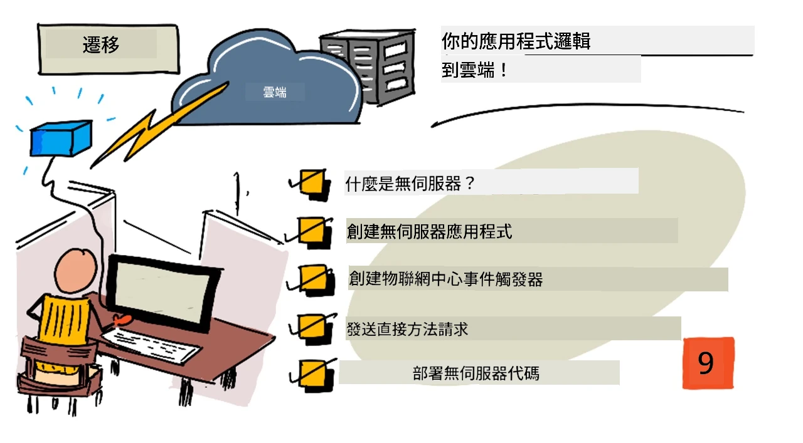
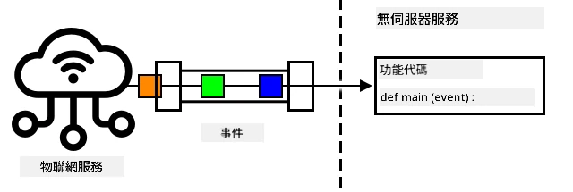
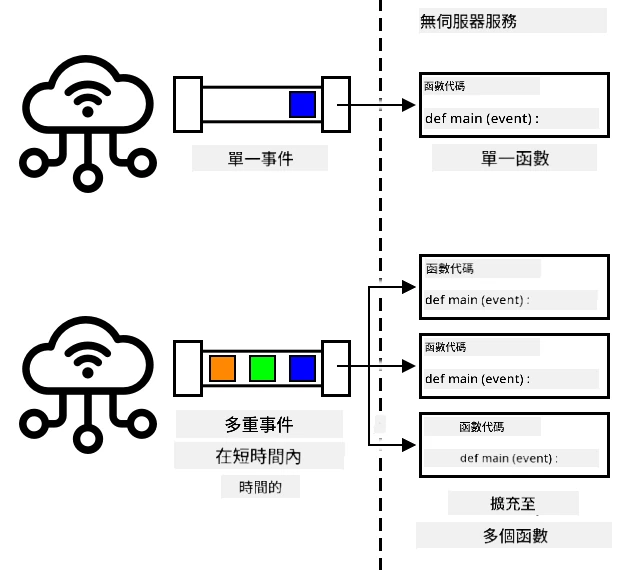
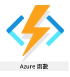
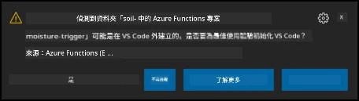

# 將您的應用程式邏輯遷移到雲端



> 手繪筆記由 [Nitya Narasimhan](https://github.com/nitya) 提供。點擊圖片查看更大版本。

本課程是 [IoT 初學者專案 2 - 數位農業系列](https://youtube.com/playlist?list=PLmsFUfdnGr3yCutmcVg6eAUEfsGiFXgcx) 的一部分，由 [Microsoft Reactor](https://developer.microsoft.com/reactor/?WT.mc_id=academic-17441-jabenn) 提供。

[](https://youtu.be/VVZDcs5u1_I)

## 課前測驗

[課前測驗](https://black-meadow-040d15503.1.azurestaticapps.net/quiz/17)

## 簡介

在上一課中，您學會了如何將植物土壤濕度監測和繼電器控制連接到基於雲端的 IoT 服務。下一步是將控制繼電器定時的伺服器程式碼移至雲端。在本課中，您將學習如何使用無伺服器函數來完成這一過程。

本課將涵蓋以下內容：

* [什麼是無伺服器？](../../../../../2-farm/lessons/5-migrate-application-to-the-cloud)
* [建立無伺服器應用程式](../../../../../2-farm/lessons/5-migrate-application-to-the-cloud)
* [建立 IoT Hub 事件觸發器](../../../../../2-farm/lessons/5-migrate-application-to-the-cloud)
* [從無伺服器程式碼發送直接方法請求](../../../../../2-farm/lessons/5-migrate-application-to-the-cloud)
* [將您的無伺服器程式碼部署到雲端](../../../../../2-farm/lessons/5-migrate-application-to-the-cloud)

## 什麼是無伺服器？

無伺服器，或稱無伺服器運算，是指建立小型程式碼塊，這些程式碼會在雲端中根據不同類型的事件執行。當事件發生時，您的程式碼會被執行，並接收有關該事件的數據。這些事件可以來自多種來源，包括網頁請求、放入佇列的訊息、資料庫中數據的變更，或 IoT 裝置發送到 IoT 服務的訊息。



> 💁 如果您之前使用過資料庫觸發器，可以將其視為類似的概念，即程式碼因事件（如插入一行）而觸發。



您的程式碼僅在事件發生時執行，其他時間不會保持活躍。事件發生時，程式碼會被載入並執行。這使得無伺服器具有很高的可擴展性——如果多個事件同時發生，雲端提供商可以根據需要同時執行多個函數，分配到可用的伺服器上。不過，這也意味著如果需要在事件之間共享資訊，您需要將其儲存在資料庫等地方，而不是記憶體中。

您的程式碼以函數的形式撰寫，並將事件的詳細資訊作為參數傳遞。您可以使用多種程式語言來撰寫這些無伺服器函數。

> 🎓 無伺服器也被稱為「函數即服務」（Functions as a Service，FaaS），因為每個事件觸發器都以程式碼中的函數形式實現。

儘管名稱是「無伺服器」，但實際上仍然使用伺服器。這個名稱的由來是因為作為開發者，您不需要關心執行程式碼所需的伺服器，您只需關心程式碼是否能根據事件執行。雲端提供商有一個無伺服器*執行環境*，負責管理伺服器分配、網路、儲存、CPU、記憶體等所有執行程式碼所需的資源。這種模式意味著您無法按伺服器付費，因為沒有伺服器的概念。相反，您按程式碼執行的時間和使用的記憶體量付費。

> 💰 無伺服器是雲端中執行程式碼最便宜的方式之一。例如，截至撰寫本文時，有一個雲端提供商允許所有無伺服器函數每月執行總計 1,000,000 次之前免費，超過後每 1,000,000 次執行收費 0.20 美元。當您的程式碼未執行時，您不需要付費。

對於 IoT 開發者來說，無伺服器模型非常理想。您可以撰寫一個函數，當任何連接到雲端 IoT 服務的 IoT 裝置發送訊息時觸發執行。您的程式碼將處理所有發送的訊息，但僅在需要時執行。

✅ 回顧您之前撰寫的伺服器程式碼，該程式碼通過 MQTT 接收訊息。這段程式碼如何在雲端中以無伺服器方式執行？您認為程式碼需要如何修改以支援無伺服器運算？

> 💁 無伺服器模型正在擴展到其他雲端服務，不僅限於執行程式碼。例如，雲端中有無伺服器資料庫，使用無伺服器定價模型，按對資料庫的請求次數（如查詢或插入）付費，通常根據完成請求所需的工作量定價。例如，根據主鍵選擇一行的操作成本低於執行多表聯結並返回數千行的複雜操作。

## 建立無伺服器應用程式

Microsoft 的無伺服器運算服務稱為 Azure Functions。



以下的短影片提供了 Azure Functions 的概覽：

[](https://www.youtube.com/watch?v=8-jz5f_JyEQ)

> 🎥 點擊上方圖片觀看影片

✅ 花點時間研究並閱讀 [Microsoft Azure Functions 文件](https://docs.microsoft.com/azure/azure-functions/functions-overview?WT.mc_id=academic-17441-jabenn) 中的 Azure Functions 概覽。

要撰寫 Azure Functions，您需要選擇一種程式語言來建立 Azure Functions 應用程式。Azure Functions 原生支援 Python、JavaScript、TypeScript、C#、F#、Java 和 Powershell。在本課中，您將學習如何使用 Python 撰寫 Azure Functions 應用程式。

> 💁 Azure Functions 還支援自訂處理器，因此您可以使用任何支援 HTTP 請求的語言撰寫函數，包括像 COBOL 這樣的舊語言。

Functions 應用程式由一個或多個*觸發器*組成——這些觸發器是響應事件的函數。您可以在一個 Functions 應用程式中包含多個觸發器，並共享通用的設定。例如，您的 Functions 應用程式的設定檔案中可以包含 IoT Hub 的連接詳細資訊，應用程式中的所有函數都可以使用這些資訊來連接和監聽事件。

### 任務 - 安裝 Azure Functions 工具

> 截至撰寫本文時，Azure Functions 的程式碼工具在 Apple Silicon 上的 Python 專案中尚未完全運作。您需要使用基於 Intel 的 Mac、Windows PC 或 Linux PC。

Azure Functions 的一大特色是您可以在本地執行它們。與雲端中使用的執行環境相同，您可以在自己的電腦上運行，撰寫程式碼來響應 IoT 訊息，並在本地測試和除錯。一旦對程式碼感到滿意，就可以將其部署到雲端。

Azure Functions 工具以 CLI 的形式提供，稱為 Azure Functions Core Tools。

1. 按照 [Azure Functions Core Tools 文件](https://docs.microsoft.com/azure/azure-functions/functions-run-local?WT.mc_id=academic-17441-jabenn) 中的指示安裝 Azure Functions Core Tools。

1. 安裝 VS Code 的 Azure Functions 擴展。此擴展提供建立、除錯和部署 Azure Functions 的支援。請參考 [Azure Functions 擴展文件](https://marketplace.visualstudio.com/items?WT.mc_id=academic-17441-jabenn&itemName=ms-azuretools.vscode-azurefunctions) 了解如何在 VS Code 中安裝此擴展。

當您將 Azure Functions 應用程式部署到雲端時，它需要使用少量的雲端儲存來存放應用程式檔案和日誌檔案等內容。在本地執行 Functions 應用程式時，您仍然需要連接到雲端儲存，但可以使用名為 [Azurite](https://github.com/Azure/Azurite) 的儲存模擬器。這個模擬器在本地運行，但模擬雲端儲存的行為。

> 🎓 在 Azure 中，Azure Functions 使用的儲存是 Azure 儲存帳戶。這些帳戶可以存放檔案、Blob、表格中的數據或佇列中的數據。您可以在多個應用程式之間共享一個儲存帳戶，例如 Functions 應用程式和 Web 應用程式。

1. Azurite 是一個 Node.js 應用程式，因此您需要安裝 Node.js。您可以在 [Node.js 官網](https://nodejs.org/) 上找到下載和安裝指示。如果您使用的是 Mac，也可以從 [Homebrew](https://formulae.brew.sh/formula/node) 安裝。

1. 使用以下命令安裝 Azurite（`npm` 是安裝 Node.js 時附帶的工具）：

    ```sh
    npm install -g azurite
    ```

1. 建立一個名為 `azurite` 的資料夾，供 Azurite 用於存放數據：

    ```sh
    mkdir azurite
    ```

1. 啟動 Azurite，並將新建的資料夾作為參數傳遞：

    ```sh
    azurite --location azurite
    ```

    Azurite 儲存模擬器將啟動，並準備好供本地 Functions 執行環境連接。

    ```output
    ➜  ~ azurite --location azurite  
    Azurite Blob service is starting at http://127.0.0.1:10000
    Azurite Blob service is successfully listening at http://127.0.0.1:10000
    Azurite Queue service is starting at http://127.0.0.1:10001
    Azurite Queue service is successfully listening at http://127.0.0.1:10001
    Azurite Table service is starting at http://127.0.0.1:10002
    Azurite Table service is successfully listening at http://127.0.0.1:10002
    ```

### 任務 - 建立 Azure Functions 專案

Azure Functions CLI 可用於建立新的 Functions 應用程式。

1. 建立一個資料夾來存放您的 Functions 應用程式，並進入該資料夾。將其命名為 `soil-moisture-trigger`：

    ```sh
    mkdir soil-moisture-trigger
    cd soil-moisture-trigger
    ```

1. 在此資料夾中建立一個 Python 虛擬環境：

    ```sh
    python3 -m venv .venv
    ```

1. 啟用虛擬環境：

    * 在 Windows 上：
        * 如果您使用的是命令提示字元或 Windows Terminal 中的命令提示字元，執行以下命令：

            ```cmd
            .venv\Scripts\activate.bat
            ```

        * 如果您使用的是 PowerShell，執行以下命令：

            ```powershell
            .\.venv\Scripts\Activate.ps1
            ```

    * 在 macOS 或 Linux 上，執行以下命令：

        ```cmd
        source ./.venv/bin/activate
        ```

    > 💁 這些命令應在您建立虛擬環境的相同位置執行。您永遠不需要進入 `.venv` 資料夾，應始終從建立虛擬環境的資料夾執行啟用命令以及任何安裝套件或執行程式碼的命令。

1. 執行以下命令，在此資料夾中建立 Functions 應用程式：

    ```sh
    func init --worker-runtime python soil-moisture-trigger
    ```

    這將在當前資料夾中建立三個檔案：

    * `host.json` - 此 JSON 文件包含您的 Functions 應用程式的設定。您不需要修改這些設定。
    * `local.settings.json` - 此 JSON 文件包含應用程式在本地執行時使用的設定，例如 IoT Hub 的連接字串。這些設定僅限本地使用，不應加入到原始碼控制中。當您將應用程式部署到雲端時，這些設定不會被部署，而是從應用程式設定中載入。本課稍後將介紹這一點。
    * `requirements.txt` - 這是一個 [Pip requirements 文件](https://pip.pypa.io/en/stable/user_guide/#requirements-files)，包含執行 Functions 應用程式所需的 Pip 套件。

1. `local.settings.json` 文件中有一個設定是 Functions 應用程式將使用的儲存帳戶。預設為空，因此需要設定。要連接到 Azurite 本地儲存模擬器，將此值設定為以下內容：

    ```json
    "AzureWebJobsStorage": "UseDevelopmentStorage=true",
    ```

1. 使用 requirements 文件安裝必要的 Pip 套件：

    ```sh
    pip install -r requirements.txt
    ```

    > 💁 必要的 Pip 套件需要在此文件中，這樣當 Functions 應用程式部署到雲端時，執行環境可以確保安裝正確的套件。

1. 為了測試一切是否正常運作，您可以啟動 Functions 執行環境。執行以下命令來啟動：

    ```sh
    func start
    ```

    您將看到執行環境啟動，並報告未找到任何作業函數（觸發器）。

    ```output
    (.venv) ➜  soil-moisture-trigger func start
    Found Python version 3.9.1 (python3).
    
    Azure Functions Core Tools
    Core Tools Version:       3.0.3442 Commit hash: 6bfab24b2743f8421475d996402c398d2fe4a9e0  (64-bit)
    Function Runtime Version: 3.0.15417.0
    
    [2021-05-05T01:24:46.795Z] No job functions found.
    ```
> ⚠️ 如果收到防火牆通知，請授予訪問權限，因為 `func` 應用程式需要能夠讀寫您的網路。
> ⚠️ 如果您使用 macOS，輸出中可能會出現警告：
>
> ```output
    > (.venv) ➜  soil-moisture-trigger func start
    > Found Python version 3.9.1 (python3).
    >
    > Azure Functions Core Tools
    > Core Tools Version:       3.0.3442 Commit hash: 6bfab24b2743f8421475d996402c398d2fe4a9e0  (64-bit)
    > Function Runtime Version: 3.0.15417.0
    >
    > [2021-06-16T08:18:28.315Z] Cannot create directory for shared memory usage: /dev/shm/AzureFunctions
    > [2021-06-16T08:18:28.316Z] System.IO.FileSystem: Access to the path '/dev/shm/AzureFunctions' is denied. Operation not permitted.
    > [2021-06-16T08:18:30.361Z] No job functions found.
    > ```
>
> 只要 Functions 應用程式能正確啟動並列出正在執行的函數，您可以忽略這些警告。如 [Microsoft Docs Q&A 中的這個問題](https://docs.microsoft.com/answers/questions/396617/azure-functions-core-tools-error-osx-devshmazurefu.html?WT.mc_id=academic-17441-jabenn) 所述，這些警告可以忽略。

1. 按下 `ctrl+c` 停止 Functions 應用程式。

1. 在 VS Code 中打開目前的資料夾，可以直接打開 VS Code，然後選擇此資料夾，或者執行以下指令：

    ```sh
    code .
    ```

    VS Code 會偵測到您的 Functions 專案，並顯示一個通知：

    ```output
    Detected an Azure Functions Project in folder "soil-moisture-trigger" that may have been created outside of
    VS Code. Initialize for optimal use with VS Code?
    ```

    

    從通知中選擇 **Yes**。

1. 確保 Python 虛擬環境在 VS Code 的終端機中正在運行。如果需要，請終止並重新啟動。

## 建立 IoT Hub 事件觸發器

Functions 應用程式是無伺服器代碼的外殼。為了回應 IoT Hub 的事件，您可以在此應用程式中新增一個 IoT Hub 觸發器。此觸發器需要連接到 IoT Hub 傳送的訊息流並進行回應。要獲取這些訊息流，您的觸發器需要連接到 IoT Hub 的 *Event Hub 相容端點*。

IoT Hub 是基於另一個 Azure 服務 Azure Event Hubs。Event Hubs 是一個允許您傳送和接收訊息的服務，而 IoT Hub 擴展了此功能以支援 IoT 裝置。連接到 IoT Hub 以讀取訊息的方式與使用 Event Hubs 的方式相同。

✅ 做一些研究：閱讀 [Azure Event Hubs 文件](https://docs.microsoft.com/azure/event-hubs/event-hubs-about?WT.mc_id=academic-17441-jabenn) 中的概述。基本功能與 IoT Hub 有何不同？

IoT 裝置要連接到 IoT Hub，必須使用一個秘密金鑰以確保只有授權的裝置能夠連接。同樣地，當連接以讀取訊息時，您的代碼需要一個包含秘密金鑰以及 IoT Hub 詳細資訊的連接字串。

> 💁 預設的連接字串具有 **iothubowner** 權限，這使得任何使用它的代碼都能擁有 IoT Hub 的完整權限。理想情況下，您應該使用最低必要權限進行連接。這部分內容將在下一課中介紹。

一旦觸發器連接成功，函數中的代碼將會在每次有訊息傳送到 IoT Hub 時被呼叫，無論是哪個裝置傳送的訊息。觸發器會將訊息作為參數傳遞。

### 任務 - 獲取 Event Hub 相容端點的連接字串

1. 從 VS Code 的終端機執行以下指令以獲取 IoT Hub 的 Event Hub 相容端點的連接字串：

    ```sh
    az iot hub connection-string show --default-eventhub \
                                      --output table \
                                      --hub-name <hub_name>
    ```

    將 `<hub_name>` 替換為您為 IoT Hub 使用的名稱。

1. 在 VS Code 中打開 `local.settings.json` 文件。在 `Values` 部分中新增以下值：

    ```json
    "IOT_HUB_CONNECTION_STRING": "<connection string>"
    ```

    將 `<connection string>` 替換為上一步中的值。您需要在上一行後添加逗號以使其成為有效的 JSON。

### 任務 - 建立事件觸發器

現在您可以建立事件觸發器了。

1. 從 VS Code 的終端機，在 `soil-moisture-trigger` 資料夾中執行以下指令：

    ```sh
    func new --name iot-hub-trigger --template "Azure Event Hub trigger"
    ```

    這會建立一個名為 `iot-hub-trigger` 的新函數。此觸發器將連接到 IoT Hub 的 Event Hub 相容端點，因此您可以使用 Event Hub 觸發器。沒有特定的 IoT Hub 觸發器。

這將在 `soil-moisture-trigger` 資料夾中建立一個名為 `iot-hub-trigger` 的資料夾，該資料夾包含此函數。資料夾內的文件包括：

* `__init__.py` - 這是包含觸發器的 Python 代碼文件，使用標準的 Python 文件命名規則將此資料夾轉換為 Python 模組。

    此文件包含以下代碼：

    ```python
    import logging

    import azure.functions as func


    def main(event: func.EventHubEvent):
        logging.info('Python EventHub trigger processed an event: %s',
                    event.get_body().decode('utf-8'))
    ```

    觸發器的核心是 `main` 函數。每次 IoT Hub 傳送訊息時，該函數都會被呼叫，並將訊息作為 `event` 參數傳遞。該函數的核心功能是記錄事件。

* `function.json` - 此文件包含觸發器的配置。主要配置在名為 `bindings` 的部分中。綁定是 Azure Functions 與其他 Azure 服務之間的連接。此函數有一個輸入綁定到 Event Hub - 它連接到 Event Hub 並接收數據。

    > 💁 您也可以有輸出綁定，將函數的輸出傳送到其他服務。例如，您可以新增一個輸出綁定到資料庫，並將 IoT Hub 的事件從函數返回，這樣事件就會自動插入到資料庫中。

    ✅ 做一些研究：閱讀 [Azure Functions 觸發器和綁定概念文件](https://docs.microsoft.com/azure/azure-functions/functions-triggers-bindings?WT.mc_id=academic-17441-jabenn&tabs=python) 中的綁定相關內容。

    `bindings` 部分包括綁定的配置。以下值值得注意：

  * `"type": "eventHubTrigger"` - 指定函數需要監聽 Event Hub 的事件
  * `"name": "events"` - Event Hub 事件的參數名稱。這與 Python 代碼中 `main` 函數的參數名稱一致。
  * `"direction": "in"` - 這是一個輸入綁定，Event Hub 的數據進入函數
  * `"connection": ""` - 定義要從設置中讀取連接字串的名稱。在本地運行時，將從 `local.settings.json` 文件中讀取此設置。

    > 💁 連接字串不能存儲在 `function.json` 文件中，必須從設置中讀取。這是為了防止意外暴露連接字串。

1. 由於 [Azure Functions 模板中的一個錯誤](https://github.com/Azure/azure-functions-templates/issues/1250)，`function.json` 文件中的 `cardinality` 欄位值不正確。將此欄位的值從 `many` 更新為 `one`：

    ```json
    "cardinality": "one",
    ```

1. 更新 `function.json` 文件中 `"connection"` 的值，使其指向您在 `local.settings.json` 文件中新增的值：

    ```json
    "connection": "IOT_HUB_CONNECTION_STRING",
    ```

    > 💁 請記住 - 這需要指向設置，而不是包含實際的連接字串。

1. 連接字串包含 `eventHubName` 值，因此 `function.json` 文件中的此值需要清空。將此值更新為空字串：

    ```json
    "eventHubName": "",
    ```

### 任務 - 運行事件觸發器

1. 確保您未運行 IoT Hub 事件監視器。如果此監視器與 Functions 應用程式同時運行，Functions 應用程式將無法連接並消耗事件。

    > 💁 多個應用程式可以使用不同的 *消費者群組* 連接到 IoT Hub 的端點。這部分內容將在後續課程中介紹。

1. 要運行 Functions 應用程式，請從 VS Code 的終端機執行以下指令：

    ```sh
    func start
    ```

    Functions 應用程式將啟動，並發現 `iot-hub-trigger` 函數。它將處理過去一天內已傳送到 IoT Hub 的所有事件。

    ```output
    (.venv) ➜  soil-moisture-trigger func start
    Found Python version 3.9.1 (python3).
    
    Azure Functions Core Tools
    Core Tools Version:       3.0.3442 Commit hash: 6bfab24b2743f8421475d996402c398d2fe4a9e0  (64-bit)
    Function Runtime Version: 3.0.15417.0
    
    Functions:
    
            iot-hub-trigger: eventHubTrigger
    
    For detailed output, run func with --verbose flag.
    [2021-05-05T02:44:07.517Z] Worker process started and initialized.
    [2021-05-05T02:44:09.202Z] Executing 'Functions.iot-hub-trigger' (Reason='(null)', Id=802803a5-eae9-4401-a1f4-176631456ce4)
    [2021-05-05T02:44:09.205Z] Trigger Details: PartitionId: 0, Offset: 1011240-1011632, EnqueueTimeUtc: 2021-05-04T19:04:04.2030000Z-2021-05-04T19:04:04.3900000Z, SequenceNumber: 2546-2547, Count: 2
    [2021-05-05T02:44:09.352Z] Python EventHub trigger processed an event: {"soil_moisture":628}
    [2021-05-05T02:44:09.354Z] Python EventHub trigger processed an event: {"soil_moisture":624}
    [2021-05-05T02:44:09.395Z] Executed 'Functions.iot-hub-trigger' (Succeeded, Id=802803a5-eae9-4401-a1f4-176631456ce4, Duration=245ms)
    ```

    每次函數被呼叫時，輸出中都會顯示 `Executing 'Functions.iot-hub-trigger'` 和 `Executed 'Functions.iot-hub-trigger'` 的區塊，您可以看到每次函數呼叫處理了多少訊息。

1. 確保您的 IoT 裝置正在運行，您將在 Functions 應用程式中看到新的土壤濕度訊息。

1. 停止並重新啟動 Functions 應用程式。您會看到它不會再次處理之前的訊息，只會處理新的訊息。

> 💁 VS Code 也支援調試您的 Functions。您可以通過點擊代碼行的邊框、將光標放在代碼行上並選擇 *Run -> Toggle breakpoint*，或按下 `F9` 來設置斷點。您可以通過選擇 *Run -> Start debugging*、按下 `F5` 或選擇 *Run and debug* 面板並點擊 **Start debugging** 按鈕來啟動調試器。這樣您可以查看正在處理的事件的詳細資訊。

#### 疑難排解

* 如果出現以下錯誤：

    ```output
    The listener for function 'Functions.iot-hub-trigger' was unable to start. Microsoft.WindowsAzure.Storage: Connection refused. System.Net.Http: Connection refused. System.Private.CoreLib: Connection refused.
    ```

    檢查 Azurite 是否正在運行，並且您已在 `local.settings.json` 文件中將 `AzureWebJobsStorage` 設置為 `UseDevelopmentStorage=true`。

* 如果出現以下錯誤：

    ```output
    System.Private.CoreLib: Exception while executing function: Functions.iot-hub-trigger. System.Private.CoreLib: Result: Failure Exception: AttributeError: 'list' object has no attribute 'get_body'
    ```

    檢查您是否已將 `function.json` 文件中的 `cardinality` 設置為 `one`。

* 如果出現以下錯誤：

    ```output
    Azure.Messaging.EventHubs: The path to an Event Hub may be specified as part of the connection string or as a separate value, but not both.  Please verify that your connection string does not have the `EntityPath` token if you are passing an explicit Event Hub name. (Parameter 'connectionString').
    ```

    檢查您是否已將 `function.json` 文件中的 `eventHubName` 設置為空字串。

## 從無伺服器代碼發送直接方法請求

到目前為止，您的 Functions 應用程式正在使用 Event Hub 相容端點監聽來自 IoT Hub 的訊息。現在您需要向 IoT 裝置發送命令。這是通過使用 *Registry Manager* 連接到 IoT Hub 來完成的。Registry Manager 是一個工具，允許您查看哪些裝置已註冊到 IoT Hub，並通過發送雲到裝置訊息、直接方法請求或更新裝置雙胞胎與這些裝置進行通信。您也可以使用它來註冊、更新或刪除 IoT Hub 中的 IoT 裝置。

要連接到 Registry Manager，您需要一個連接字串。

### 任務 - 獲取 Registry Manager 連接字串

1. 要獲取連接字串，請執行以下指令：

    ```sh
    az iot hub connection-string show --policy-name service \
                                      --output table \
                                      --hub-name <hub_name>
    ```

    將 `<hub_name>` 替換為您為 IoT Hub 使用的名稱。

    連接字串是根據 *ServiceConnect* 策略請求的，使用 `--policy-name service` 參數。當您請求連接字串時，可以指定該連接字串允許的權限。ServiceConnect 策略允許您的代碼連接並向 IoT 裝置發送訊息。

    ✅ 做一些研究：閱讀 [IoT Hub 權限文件](https://docs.microsoft.com/azure/iot-hub/iot-hub-devguide-security#iot-hub-permissions?WT.mc_id=academic-17441-jabenn) 中的不同策略。

1. 在 VS Code 中打開 `local.settings.json` 文件。在 `Values` 部分中新增以下值：

    ```json
    "REGISTRY_MANAGER_CONNECTION_STRING": "<connection string>"
    ```

    將 `<connection string>` 替換為上一步中的值。您需要在上一行後添加逗號以使其成為有效的 JSON。

### 任務 - 向裝置發送直接方法請求

1. Registry Manager 的 SDK 可通過 Pip 套件獲得。在 `requirements.txt` 文件中新增以下行以添加此套件的依賴：

    ```sh
    azure-iot-hub
    ```

1. 確保 VS Code 終端機已啟動虛擬環境，並執行以下指令以安裝 Pip 套件：

    ```sh
    pip install -r requirements.txt
    ```

1. 在 `__init__.py` 文件中新增以下導入：

    ```python
    import json
    import os
    from azure.iot.hub import IoTHubRegistryManager
    from azure.iot.hub.models import CloudToDeviceMethod
    ```

    這導入了一些系統庫，以及與 Registry Manager 交互並發送直接方法請求的庫。

1. 移除 `main` 方法中的代碼，但保留方法本身。

1. 在 `main` 方法中新增以下代碼：

    ```python
    body = json.loads(event.get_body().decode('utf-8'))
    device_id = event.iothub_metadata['connection-device-id']

    logging.info(f'Received message: {body} from {device_id}')
    ```

    此代碼提取事件的主體，其中包含 IoT 裝置傳送的 JSON 訊息。

    然後從訊息的註解中獲取裝置 ID。事件的主體包含作為遙測傳送的訊息，`iothub_metadata` 字典包含 IoT Hub 設置的屬性，例如發送者的裝置 ID 和訊息的傳送時間。

    此資訊隨後被記錄。當您在本地運行 Functions 應用程式時，您將在終端機中看到這些日誌。

1. 在此代碼下方新增以下代碼：

    ```python
    soil_moisture = body['soil_moisture']

    if soil_moisture > 450:
        direct_method = CloudToDeviceMethod(method_name='relay_on', payload='{}')
    else:
        direct_method = CloudToDeviceMethod(method_name='relay_off', payload='{}')
    ```

    此代碼從訊息中獲取土壤濕度。然後檢查土壤濕度，根據值創建一個輔助類別，用於 `relay_on` 或 `relay_off` 直接方法。方法請求不需要有效載荷，因此傳送一個空的 JSON 文件。

1. 在此代碼下方新增以下代碼：

    ```python
    logging.info(f'Sending direct method request for {direct_method.method_name} for device {device_id}')

    registry_manager_connection_string = os.environ['REGISTRY_MANAGER_CONNECTION_STRING']
    registry_manager = IoTHubRegistryManager(registry_manager_connection_string)
    ```
此程式碼從 `local.settings.json` 檔案中載入 `REGISTRY_MANAGER_CONNECTION_STRING`。此檔案中的值會作為環境變數提供，並可透過 `os.environ` 函數讀取，該函數會返回所有環境變數的字典。

> 💁 當此程式碼部署到雲端時，`local.settings.json` 檔案中的值將設置為 *應用程式設定*，並可從環境變數中讀取。

接著，程式碼使用連接字串建立 Registry Manager 輔助類別的實例。

1. 在下方新增以下程式碼：

    ```python
    registry_manager.invoke_device_method(device_id, direct_method)

    logging.info('Direct method request sent!')
    ```

    此程式碼指示 Registry Manager 將直接方法請求發送至傳送遙測資料的裝置。

    > 💁 在之前課程中使用 MQTT 建立的應用程式版本中，繼電器控制指令會發送至所有裝置。程式碼假設您只有一個裝置。此版本的程式碼僅向單一裝置發送方法請求，因此如果您有多個濕度感測器和繼電器的設置，該程式碼能向正確的裝置發送正確的直接方法請求。

1. 執行 Functions 應用程式，並確保您的 IoT 裝置正在傳送資料。您將看到訊息被處理以及直接方法請求被發送。將土壤濕度感測器移入和移出土壤，觀察數值變化以及繼電器的開啟和關閉。

> 💁 您可以在 [code/functions](../../../../../2-farm/lessons/5-migrate-application-to-the-cloud/code/functions) 資料夾中找到此程式碼。

## 將無伺服器程式碼部署到雲端

您的程式碼現在已在本地運行，下一步是將 Functions 應用程式部署到雲端。

### 任務 - 建立雲端資源

您的 Functions 應用程式需要部署到 Azure 中的 Functions App 資源，該資源位於您為 IoT Hub 建立的資源群組內。您還需要在 Azure 中建立一個儲存帳戶，以取代您在本地運行的模擬儲存。

1. 執行以下指令以建立儲存帳戶：

    ```sh
    az storage account create --resource-group soil-moisture-sensor \
                              --sku Standard_LRS \
                              --name <storage_name> 
    ```

    將 `<storage_name>` 替換為您的儲存帳戶名稱。此名稱必須是全球唯一的，因為它是用於存取儲存帳戶的 URL 的一部分。您只能使用小寫字母和數字，不能使用其他字元，且名稱限制為 24 個字元。可以使用類似 `sms` 的名稱，並在後面加上唯一識別碼，例如隨機字詞或您的名字。

    `--sku Standard_LRS` 選擇定價層級，選擇最低成本的一般用途帳戶。儲存帳戶沒有免費層，您需支付使用費用。成本相對較低，最昂貴的儲存每月每 GB 不超過美金 0.05。

    ✅ 在 [Azure 儲存帳戶定價頁面](https://azure.microsoft.com/pricing/details/storage/?WT.mc_id=academic-17441-jabenn) 上了解定價。

1. 執行以下指令以建立 Functions App：

    ```sh
    az functionapp create --resource-group soil-moisture-sensor \
                          --runtime python \
                          --functions-version 3 \
                          --os-type Linux \
                          --consumption-plan-location <location> \
                          --storage-account <storage_name> \
                          --name <functions_app_name>
    ```

    將 `<location>` 替換為您在上一課程中建立資源群組時使用的位置。

    將 `<storage_name>` 替換為您在上一步中建立的儲存帳戶名稱。

    將 `<functions_app_name>` 替換為您的 Functions App 的唯一名稱。此名稱必須是全球唯一的，因為它是用於存取 Functions App 的 URL 的一部分。可以使用類似 `soil-moisture-sensor-` 的名稱，並在後面加上唯一識別碼，例如隨機字詞或您的名字。

    `--functions-version 3` 選項設置 Azure Functions 的版本。版本 3 是最新版本。

    `--os-type Linux` 指示 Functions 執行環境使用 Linux 作為操作系統來托管這些函數。函數可以托管在 Linux 或 Windows 上，具體取決於使用的程式語言。Python 應用程式僅支援 Linux。

### 任務 - 上傳您的應用程式設定

在開發 Functions App 時，您將一些設定存儲在 `local.settings.json` 檔案中，用於 IoT Hub 的連接字串。這些設定需要寫入 Azure 中的 Functions App 的應用程式設定，以便您的程式碼使用。

> 🎓 `local.settings.json` 檔案僅用於本地開發設定，且不應提交到版本控制系統（如 GitHub）。部署到雲端時，使用應用程式設定。應用程式設定是託管在雲端的鍵值對，可透過程式碼或執行環境從環境變數中讀取。

1. 執行以下指令以在 Functions App 的應用程式設定中設置 `IOT_HUB_CONNECTION_STRING`：

    ```sh
    az functionapp config appsettings set --resource-group soil-moisture-sensor \
                                          --name <functions_app_name> \
                                          --settings "IOT_HUB_CONNECTION_STRING=<connection string>"
    ```

    將 `<functions_app_name>` 替換為您為 Functions App 使用的名稱。

    將 `<connection string>` 替換為 `local.settings.json` 檔案中的 `IOT_HUB_CONNECTION_STRING` 值。

1. 重複上述步驟，但將 `REGISTRY_MANAGER_CONNECTION_STRING` 的值設置為 `local.settings.json` 檔案中的相應值。

執行這些指令後，會輸出 Functions App 的所有應用程式設定列表。您可以使用此列表檢查值是否正確設置。

> 💁 您會看到已設置的 `AzureWebJobsStorage` 值。在您的 `local.settings.json` 檔案中，此值設置為使用本地儲存模擬器。當您建立 Functions App 時，您將儲存帳戶作為參數傳遞，此值會自動設置。

### 任務 - 將 Functions App 部署到雲端

現在 Functions App 已準備好，您的程式碼可以部署。

1. 從 VS Code 的終端執行以下指令以發布 Functions App：

    ```sh
    func azure functionapp publish <functions_app_name>
    ```

    將 `<functions_app_name>` 替換為您為 Functions App 使用的名稱。

程式碼將被打包並發送到 Functions App，然後進行部署並啟動。會有大量的終端輸出，最後會確認部署完成並列出已部署的函數。在此情況下，列表中僅包含觸發器。

```output
Deployment successful.
Remote build succeeded!
Syncing triggers...
Functions in soil-moisture-sensor:
    iot-hub-trigger - [eventHubTrigger]
```

確保您的 IoT 裝置正在運行。透過調整土壤濕度或將感測器移入和移出土壤來改變濕度水平。您將看到繼電器隨著土壤濕度的變化而開啟和關閉。

---

## 🚀 挑戰

在上一課程中，您透過在繼電器開啟時取消訂閱 MQTT 訊息，以及在繼電器關閉後短暫時間內取消訂閱，來管理繼電器的時間。此方法在此處無法使用——您無法取消訂閱 IoT Hub 觸發器。

思考在 Functions App 中處理此問題的不同方法。

## 課後測驗

[課後測驗](https://black-meadow-040d15503.1.azurestaticapps.net/quiz/18)

## 回顧與自學

* 在 [維基百科的無伺服器運算頁面](https://wikipedia.org/wiki/Serverless_computing) 上了解無伺服器運算。
* 閱讀 Azure 上使用無伺服器的相關內容，包括更多範例：[Azure 部落格文章 - 為您的 IoT 需求採用無伺服器](https://azure.microsoft.com/blog/go-serverless-for-your-iot-needs/?WT.mc_id=academic-17441-jabenn)。
* 在 [Azure Functions YouTube 頻道](https://www.youtube.com/c/AzureFunctions) 上了解更多 Azure Functions 的資訊。

## 作業

[新增手動繼電器控制](assignment.md)

---

**免責聲明**：  
本文件已使用 AI 翻譯服務 [Co-op Translator](https://github.com/Azure/co-op-translator) 進行翻譯。儘管我們努力確保翻譯的準確性，但請注意，自動翻譯可能包含錯誤或不準確之處。原始文件的母語版本應被視為權威來源。對於關鍵信息，建議使用專業人工翻譯。我們對因使用此翻譯而引起的任何誤解或錯誤解釋不承擔責任。