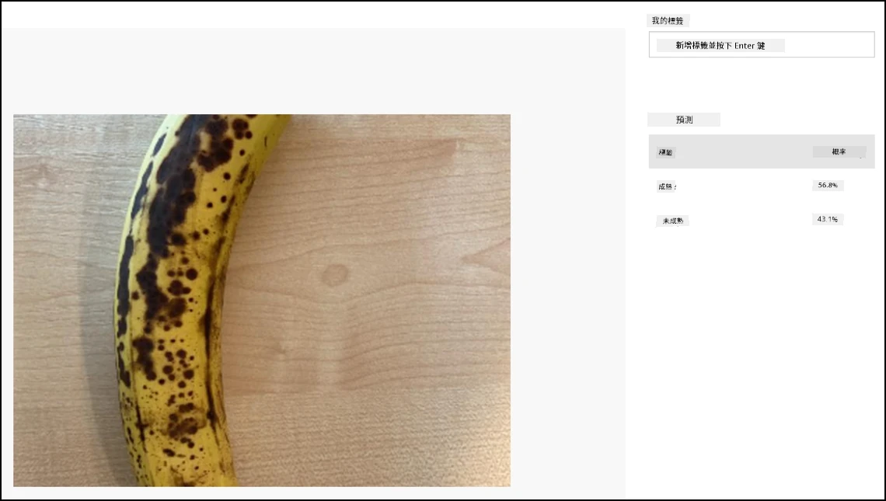

# 將影像分類 - Wio Terminal

在本課程中，您將把相機拍攝的影像傳送到 Custom Vision 服務進行分類。

## 將影像分類

Custom Vision 服務提供了一個 REST API，您可以從 Wio Terminal 呼叫該 API 來分類影像。這個 REST API 是透過 HTTPS 連線（安全的 HTTP 連線）來存取的。

當與 HTTPS 端點互動時，客戶端程式碼需要向被存取的伺服器請求公鑰憑證，並使用該憑證加密傳輸的資料。您的網頁瀏覽器會自動完成這個過程，但微控制器不會。您需要手動請求這個憑證，並使用它來建立與 REST API 的安全連線。這些憑證是固定的，因此一旦獲取憑證，您可以將其硬編碼到應用程式中。

這些憑證包含公鑰，無需保密。您可以將它們用於原始碼中，並公開分享，例如在 GitHub 上。

### 任務 - 設置 SSL 客戶端

1. 如果尚未開啟，請打開 `fruit-quality-detector` 應用程式專案。

1. 打開 `config.h` 標頭檔案，並新增以下內容：

    ```cpp
    const char *CERTIFICATE =
        "-----BEGIN CERTIFICATE-----\r\n"
        "MIIF8zCCBNugAwIBAgIQAueRcfuAIek/4tmDg0xQwDANBgkqhkiG9w0BAQwFADBh\r\n"
        "MQswCQYDVQQGEwJVUzEVMBMGA1UEChMMRGlnaUNlcnQgSW5jMRkwFwYDVQQLExB3\r\n"
        "d3cuZGlnaWNlcnQuY29tMSAwHgYDVQQDExdEaWdpQ2VydCBHbG9iYWwgUm9vdCBH\r\n"
        "MjAeFw0yMDA3MjkxMjMwMDBaFw0yNDA2MjcyMzU5NTlaMFkxCzAJBgNVBAYTAlVT\r\n"
        "MR4wHAYDVQQKExVNaWNyb3NvZnQgQ29ycG9yYXRpb24xKjAoBgNVBAMTIU1pY3Jv\r\n"
        "c29mdCBBenVyZSBUTFMgSXNzdWluZyBDQSAwNjCCAiIwDQYJKoZIhvcNAQEBBQAD\r\n"
        "ggIPADCCAgoCggIBALVGARl56bx3KBUSGuPc4H5uoNFkFH4e7pvTCxRi4j/+z+Xb\r\n"
        "wjEz+5CipDOqjx9/jWjskL5dk7PaQkzItidsAAnDCW1leZBOIi68Lff1bjTeZgMY\r\n"
        "iwdRd3Y39b/lcGpiuP2d23W95YHkMMT8IlWosYIX0f4kYb62rphyfnAjYb/4Od99\r\n"
        "ThnhlAxGtfvSbXcBVIKCYfZgqRvV+5lReUnd1aNjRYVzPOoifgSx2fRyy1+pO1Uz\r\n"
        "aMMNnIOE71bVYW0A1hr19w7kOb0KkJXoALTDDj1ukUEDqQuBfBxReL5mXiu1O7WG\r\n"
        "0vltg0VZ/SZzctBsdBlx1BkmWYBW261KZgBivrql5ELTKKd8qgtHcLQA5fl6JB0Q\r\n"
        "gs5XDaWehN86Gps5JW8ArjGtjcWAIP+X8CQaWfaCnuRm6Bk/03PQWhgdi84qwA0s\r\n"
        "sRfFJwHUPTNSnE8EiGVk2frt0u8PG1pwSQsFuNJfcYIHEv1vOzP7uEOuDydsmCjh\r\n"
        "lxuoK2n5/2aVR3BMTu+p4+gl8alXoBycyLmj3J/PUgqD8SL5fTCUegGsdia/Sa60\r\n"
        "N2oV7vQ17wjMN+LXa2rjj/b4ZlZgXVojDmAjDwIRdDUujQu0RVsJqFLMzSIHpp2C\r\n"
        "Zp7mIoLrySay2YYBu7SiNwL95X6He2kS8eefBBHjzwW/9FxGqry57i71c2cDAgMB\r\n"
        "AAGjggGtMIIBqTAdBgNVHQ4EFgQU1cFnOsKjnfR3UltZEjgp5lVou6UwHwYDVR0j\r\n"
        "BBgwFoAUTiJUIBiV5uNu5g/6+rkS7QYXjzkwDgYDVR0PAQH/BAQDAgGGMB0GA1Ud\r\n"
        "JQQWMBQGCCsGAQUFBwMBBggrBgEFBQcDAjASBgNVHRMBAf8ECDAGAQH/AgEAMHYG\r\n"
        "CCsGAQUFBwEBBGowaDAkBggrBgEFBQcwAYYYaHR0cDovL29jc3AuZGlnaWNlcnQu\r\n"
        "Y29tMEAGCCsGAQUFBzAChjRodHRwOi8vY2FjZXJ0cy5kaWdpY2VydC5jb20vRGln\r\n"
        "aUNlcnRHbG9iYWxSb290RzIuY3J0MHsGA1UdHwR0MHIwN6A1oDOGMWh0dHA6Ly9j\r\n"
        "cmwzLmRpZ2ljZXJ0LmNvbS9EaWdpQ2VydEdsb2JhbFJvb3RHMi5jcmwwN6A1oDOG\r\n"
        "MWh0dHA6Ly9jcmw0LmRpZ2ljZXJ0LmNvbS9EaWdpQ2VydEdsb2JhbFJvb3RHMi5j\r\n"
        "cmwwHQYDVR0gBBYwFDAIBgZngQwBAgEwCAYGZ4EMAQICMBAGCSsGAQQBgjcVAQQD\r\n"
        "AgEAMA0GCSqGSIb3DQEBDAUAA4IBAQB2oWc93fB8esci/8esixj++N22meiGDjgF\r\n"
        "+rA2LUK5IOQOgcUSTGKSqF9lYfAxPjrqPjDCUPHCURv+26ad5P/BYtXtbmtxJWu+\r\n"
        "cS5BhMDPPeG3oPZwXRHBJFAkY4O4AF7RIAAUW6EzDflUoDHKv83zOiPfYGcpHc9s\r\n"
        "kxAInCedk7QSgXvMARjjOqdakor21DTmNIUotxo8kHv5hwRlGhBJwps6fEVi1Bt0\r\n"
        "trpM/3wYxlr473WSPUFZPgP1j519kLpWOJ8z09wxay+Br29irPcBYv0GMXlHqThy\r\n"
        "8y4m/HyTQeI2IMvMrQnwqPpY+rLIXyviI2vLoI+4xKE4Rn38ZZ8m\r\n"
        "-----END CERTIFICATE-----\r\n";
    ```

    這是 *Microsoft Azure DigiCert Global Root G2 憑證*，它是許多 Azure 服務全球使用的憑證之一。

    > 💁 若要確認這是需要使用的憑證，請在 macOS 或 Linux 上執行以下指令。如果您使用的是 Windows，可以透過 [Windows Subsystem for Linux (WSL)](https://docs.microsoft.com/windows/wsl/?WT.mc_id=academic-17441-jabenn) 執行此指令：
    >
    > ```sh
    > openssl s_client -showcerts -verify 5 -connect api.cognitive.microsoft.com:443
    > ```
    >
    > 輸出將列出 DigiCert Global Root G2 憑證。

1. 打開 `main.cpp`，新增以下 include 指令：

    ```cpp
    #include <WiFiClientSecure.h>
    ```

1. 在 include 指令下方，宣告一個 `WifiClientSecure` 的實例：

    ```cpp
    WiFiClientSecure client;
    ```

    此類別包含與 HTTPS 網路端點通訊的程式碼。

1. 在 `connectWiFi` 方法中，設置 WiFiClientSecure 使用 DigiCert Global Root G2 憑證：

    ```cpp
    client.setCACert(CERTIFICATE);
    ```

### 任務 - 將影像分類

1. 在 `platformio.ini` 檔案的 `lib_deps` 清單中新增以下內容作為額外的一行：

    ```ini
    bblanchon/ArduinoJson @ 6.17.3
    ```

    這會匯入 [ArduinoJson](https://arduinojson.org)，一個 Arduino 的 JSON 函式庫，將用於解碼來自 REST API 的 JSON 回應。

1. 在 `config.h` 中，新增 Custom Vision 服務的預測 URL 和金鑰的常數：

    ```cpp
    const char *PREDICTION_URL = "<PREDICTION_URL>";
    const char *PREDICTION_KEY = "<PREDICTION_KEY>";
    ```

    將 `<PREDICTION_URL>` 替換為 Custom Vision 的預測 URL。將 `<PREDICTION_KEY>` 替換為預測金鑰。

1. 在 `main.cpp` 中，新增 ArduinoJson 函式庫的 include 指令：

    ```cpp
    #include <ArduinoJSON.h>
    ```

1. 在 `main.cpp` 中，於 `buttonPressed` 函式上方新增以下函式：

    ```cpp
    void classifyImage(byte *buffer, uint32_t length)
    {
        HTTPClient httpClient;
        httpClient.begin(client, PREDICTION_URL);
        httpClient.addHeader("Content-Type", "application/octet-stream");
        httpClient.addHeader("Prediction-Key", PREDICTION_KEY);
    
        int httpResponseCode = httpClient.POST(buffer, length);
    
        if (httpResponseCode == 200)
        {
            String result = httpClient.getString();
    
            DynamicJsonDocument doc(1024);
            deserializeJson(doc, result.c_str());
    
            JsonObject obj = doc.as<JsonObject>();
            JsonArray predictions = obj["predictions"].as<JsonArray>();
    
            for(JsonVariant prediction : predictions) 
            {
                String tag = prediction["tagName"].as<String>();
                float probability = prediction["probability"].as<float>();
    
                char buff[32];
                sprintf(buff, "%s:\t%.2f%%", tag.c_str(), probability * 100.0);
                Serial.println(buff);
            }
        }
    
        httpClient.end();
    }
    ```

    此程式碼首先宣告一個 `HTTPClient`，這是一個包含與 REST API 互動方法的類別。接著，它使用先前設置的 Azure 公鑰透過 `WiFiClientSecure` 實例連接到預測 URL。

    一旦連接成功，它會傳送標頭資訊，這些資訊描述即將對 REST API 發出的請求。`Content-Type` 標頭表示 API 呼叫將傳送原始二進位資料，`Prediction-Key` 標頭則傳遞 Custom Vision 的預測金鑰。

    接著，對 HTTP 客戶端發出 POST 請求，並上傳一個位元組陣列。這個陣列包含當此函式被呼叫時，從相機拍攝的 JPEG 影像。

    > 💁 POST 請求用於傳送資料並獲取回應。還有其他請求類型，例如 GET 請求，用於檢索資料。您的網頁瀏覽器使用 GET 請求來載入網頁。

    POST 請求會返回一個回應狀態碼。這些是定義良好的值，其中 200 表示 **OK**，即 POST 請求成功。

    > 💁 您可以在 [Wikipedia 的 HTTP 狀態碼列表頁面](https://wikipedia.org/wiki/List_of_HTTP_status_codes) 中查看所有回應狀態碼。

    如果返回 200，則從 HTTP 客戶端讀取結果。這是一個來自 REST API 的文字回應，包含預測結果的 JSON 文件。JSON 的格式如下：

    ```jSON
    {
        "id":"45d614d3-7d6f-47e9-8fa2-04f237366a16",
        "project":"135607e5-efac-4855-8afb-c93af3380531",
        "iteration":"04f1c1fa-11ec-4e59-bb23-4c7aca353665",
        "created":"2021-06-10T17:58:58.959Z",
        "predictions":[
            {
                "probability":0.5582016,
                "tagId":"05a432ea-9718-4098-b14f-5f0688149d64",
                "tagName":"ripe"
            },
            {
                "probability":0.44179836,
                "tagId":"bb091037-16e5-418e-a9ea-31c6a2920f17",
                "tagName":"unripe"
            }
        ]
    }
    ```

    這裡重要的部分是 `predictions` 陣列。它包含預測結果，每個標籤都有一個條目，包含標籤名稱和機率。返回的機率是從 0 到 1 的浮點數，0 表示與該標籤匹配的機率為 0%，1 表示 100%。

    > 💁 影像分類器會返回所有使用過的標籤的百分比。每個標籤都會有一個影像與該標籤匹配的機率。

    此 JSON 被解碼後，將每個標籤的機率傳送到序列監視器。

1. 在 `buttonPressed` 函式中，將儲存到 SD 卡的程式碼替換為對 `classifyImage` 的呼叫，或者在影像寫入後但 **在刪除緩衝區之前** 新增該呼叫：

    ```cpp
    classifyImage(buffer, length);
    ```

    > 💁 如果您替換了儲存到 SD 卡的程式碼，可以清理您的程式碼，移除 `setupSDCard` 和 `saveToSDCard` 函式。

1. 上傳並執行您的程式碼。將相機對準一些水果並按下 C 按鈕。您將在序列監視器中看到輸出：

    ```output
    Connecting to WiFi..
    Connected!
    Image captured
    Image read to buffer with length 8200
    ripe:   56.84%
    unripe: 43.16%
    ```

    您將能夠看到拍攝的影像，並在 Custom Vision 的 **Predictions** 標籤中看到這些值。

    

> 💁 您可以在 [code-classify/wio-terminal](../../../../../4-manufacturing/lessons/2-check-fruit-from-device/code-classify/wio-terminal) 資料夾中找到這段程式碼。

😀 您的水果品質分類器程式大功告成！

---

**免責聲明**：  
本文件使用 AI 翻譯服務 [Co-op Translator](https://github.com/Azure/co-op-translator) 進行翻譯。儘管我們努力確保翻譯的準確性，但請注意，自動翻譯可能包含錯誤或不準確之處。原始文件的母語版本應被視為權威來源。對於關鍵資訊，建議使用專業人工翻譯。我們對因使用此翻譯而引起的任何誤解或錯誤解釋不承擔責任。