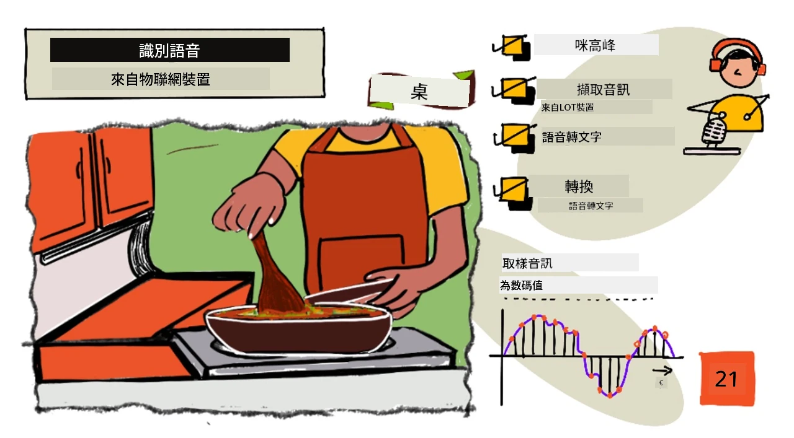
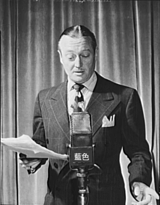
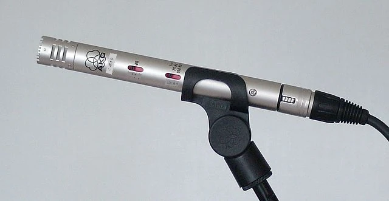
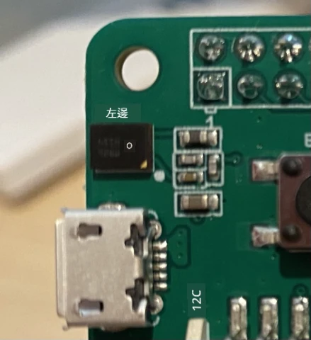
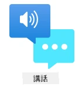

# 使用物聯網設備進行語音識別



> 手繪筆記由 [Nitya Narasimhan](https://github.com/nitya) 提供。點擊圖片查看更大版本。

這段影片概述了 Azure 語音服務，這是本課程將涵蓋的主題：

[](https://www.youtube.com/watch?v=iW0Fw0l3mrA)

> 🎥 點擊上方圖片觀看影片

## 課前測驗

[課前測驗](https://black-meadow-040d15503.1.azurestaticapps.net/quiz/41)

## 簡介

「Alexa，設置一個12分鐘的計時器」

「Alexa，計時器狀態」

「Alexa，設置一個8分鐘的計時器，命名為蒸西蘭花」

智慧設備越來越普及。不僅僅是像 HomePods、Echos 和 Google Homes 這樣的智慧音箱，還嵌入到我們的手機、手錶，甚至燈具和恆溫器中。

> 💁 我家裡至少有19個具有語音助手功能的設備，這還只是我知道的部分！

語音控制提高了可及性，讓行動受限的人能夠與設備互動。無論是天生缺乏手臂的永久性障礙，還是像手臂骨折這樣的暫時性障礙，或者手上拿著購物袋或照顧小孩，能夠用語音而非雙手控制家居設備，開啟了一個全新的便利世界。比如在處理嬰兒換尿布和調皮的幼兒時，喊一聲「嘿 Siri，關閉我的車庫門」可能是一個小但有效的生活改善。

語音助手的一個流行用途是設置計時器，尤其是廚房計時器。能夠用語音設置多個計時器在廚房中非常有幫助——不需要停下揉麵團、攪拌湯或清理手上的餃子餡料來使用實體計時器。

在本課程中，您將學習如何將語音識別功能集成到物聯網設備中。您將了解麥克風作為感測器的工作原理，如何從連接到物聯網設備的麥克風捕捉音頻，以及如何使用人工智慧將聽到的內容轉換為文字。在整個專案中，您將構建一個智慧廚房計時器，能夠使用多種語言通過語音設置計時器。

在本課程中，我們將涵蓋以下內容：

* [麥克風](../../../../../6-consumer/lessons/1-speech-recognition)
* [從物聯網設備捕捉音頻](../../../../../6-consumer/lessons/1-speech-recognition)
* [語音轉文字](../../../../../6-consumer/lessons/1-speech-recognition)
* [將語音轉換為文字](../../../../../6-consumer/lessons/1-speech-recognition)

## 麥克風

麥克風是將聲波轉換為電信號的類比感測器。空氣中的振動使麥克風內部的元件微小移動，從而引起電信號的微小變化。這些變化隨後被放大以生成電輸出。

### 麥克風類型

麥克風有多種類型：

* 動圈式 - 動圈式麥克風具有一個附著在移動振膜上的磁鐵，該磁鐵在線圈中移動時會產生電流。這與大多數揚聲器的工作原理相反，揚聲器使用電流移動線圈中的磁鐵，從而移動振膜產生聲音。這意味著揚聲器可以用作動圈式麥克風，而動圈式麥克風也可以用作揚聲器。在像對講機這樣的設備中，使用者要麼在聽，要麼在說，但不會同時進行，一個設備可以同時充當揚聲器和麥克風。

    動圈式麥克風不需要電源，電信號完全由麥克風產生。

    

* 緞帶式 - 緞帶式麥克風類似於動圈式麥克風，但使用金屬緞帶代替振膜。該緞帶在磁場中移動時會產生電流。與動圈式麥克風一樣，緞帶式麥克風不需要電源。

    

* 電容式 - 電容式麥克風具有一個薄金屬振膜和一個固定的金屬背板。電流被施加到這兩者上，當振膜振動時，板之間的靜電荷發生變化，從而產生信號。電容式麥克風需要電源才能工作，稱為 *幻象電源*。

    

* MEMS - 微機電系統麥克風，或 MEMS，是芯片上的麥克風。它們在矽芯片上刻有壓力敏感振膜，工作原理類似於電容式麥克風。這些麥克風可以非常小，並集成到電路中。

    

    在上圖中，標記為 **LEFT** 的芯片是一個 MEMS 麥克風，其振膜寬度不到一毫米。

✅ 做些研究：您周圍有哪些麥克風——無論是在您的電腦、手機、耳機還是其他設備中。它們屬於哪種類型的麥克風？

### 數位音頻

音頻是一種攜帶非常細緻信息的類比信號。要將此信號轉換為數位信號，需要每秒對音頻進行數千次取樣。

> 🎓 取樣是將音頻信號轉換為代表該時刻信號的數位值。


數位音頻使用脈衝編碼調變（Pulse Code Modulation，PCM）進行取樣。PCM 涉及讀取信號的電壓，並使用定義的大小選擇最接近該電壓的離散值。

> 💁 您可以將 PCM 視為脈衝寬度調變（Pulse Width Modulation，PWM）的感測器版本（PWM 在[入門專案的第3課](../../../1-getting-started/lessons/3-sensors-and-actuators/README.md#pulse-width-modulation)中已介紹）。PCM 涉及將類比信號轉換為數位信號，而 PWM 涉及將數位信號轉換為類比信號。

例如，大多數流媒體音樂服務提供 16 位或 24 位音頻。這意味著它們將電壓轉換為適合 16 位整數或 24 位整數的值。16 位音頻的值範圍是 -32,768 到 32,767，24 位音頻的範圍是 −8,388,608 到 8,388,607。位數越多，取樣越接近我們耳朵實際聽到的聲音。

> 💁 您可能聽說過 8 位音頻，通常被稱為 LoFi。這是使用僅 8 位進行取樣的音頻，因此範圍是 -128 到 127。早期的電腦音頻因硬體限制而僅限於 8 位，因此在復古遊戲中經常看到。

這些取樣每秒進行數千次，使用以 KHz（每秒取樣次數的千次）為單位的定義取樣率。流媒體音樂服務大多使用 48KHz，但某些「無損」音頻使用高達 96KHz 甚至 192KHz。取樣率越高，音頻越接近原始聲音，但有一定的限制。是否能區分超過 48KHz 的差異仍存在爭議。

✅ 做些研究：如果您使用流媒體音樂服務，它使用的取樣率和大小是多少？如果您使用 CD，CD 音頻的取樣率和大小是多少？

音頻數據有多種格式。您可能聽說過 mp3 文件——壓縮後的音頻數據，能在不損失質量的情況下減小文件大小。未壓縮音頻通常以 WAV 文件存儲——這是一個包含 44 字節標頭信息的文件，後面是原始音頻數據。標頭包含取樣率（例如 16000 表示 16KHz）、取樣大小（16 表示 16 位）以及通道數量。標頭之後是 WAV 文件的原始音頻數據。

> 🎓 通道指音頻由多少個不同的音頻流組成。例如，立體聲音頻有左右聲道，則有 2 個通道。家庭影院系統的 7.1 環繞聲則有 8 個通道。

### 音頻數據大小

音頻數據相對較大。例如，捕捉未壓縮的 16 位音頻，取樣率為 16KHz（對語音轉文字模型來說足夠），每秒需要 32KB 的數據：

* 16 位表示每個取樣有 2 字節（1 字節是 8 位）。
* 16KHz 表示每秒 16,000 次取樣。
* 16,000 x 2 字節 = 32,000 字節每秒。

這看起來數據量不大，但如果您使用的是內存有限的微控制器，這可能會佔用大量空間。例如，Wio Terminal 只有 192KB 的內存，這需要存儲程式碼和變數。即使您的程式碼非常小，也無法捕捉超過 5 秒的音頻。

微控制器可以訪問額外的存儲，例如 SD 卡或快閃記憶體。在構建捕捉音頻的物聯網設備時，您需要確保不僅有額外的存儲，還需要讓程式碼將從麥克風捕捉的音頻直接寫入存儲，並在發送到雲端時，從存儲流式傳輸到網路請求。這樣可以避免試圖一次性在內存中保存整塊音頻數據而導致內存不足。

## 從物聯網設備捕捉音頻

您的物聯網設備可以連接到麥克風以捕捉音頻，準備轉換為文字。它也可以連接到揚聲器以輸出音頻。在後續課程中，這將用於提供音頻反饋，但現在設置揚聲器以測試麥克風是有用的。

### 任務 - 配置您的麥克風和揚聲器

按照相關指南配置物聯網設備的麥克風和揚聲器：

* [Arduino - Wio Terminal](wio-terminal-microphone.md)
* [單板電腦 - Raspberry Pi](pi-microphone.md)
* [單板電腦 - 虛擬設備](virtual-device-microphone.md)

### 任務 - 捕捉音頻

按照相關指南在您的物聯網設備上捕捉音頻：

* [Arduino - Wio Terminal](wio-terminal-audio.md)
* [單板電腦 - Raspberry Pi](pi-audio.md)
* [單板電腦 - 虛擬設備](virtual-device-audio.md)

## 語音轉文字

語音轉文字或語音識別涉及使用人工智慧將音頻信號中的單詞轉換為文字。

### 語音識別模型

要將語音轉換為文字，音頻信號中的取樣會被分組並輸入到基於循環神經網路（Recurrent Neural Network，RNN）的機器學習模型中。這是一種可以使用先前數據來對新數據進行決策的機器學習模型。例如，RNN 可以將一段音頻取樣識別為「Hel」的聲音，當它接收到另一段音頻取樣並認為是「lo」的聲音時，可以將其與之前的聲音結合，發現「Hello」是一個有效的單詞並選擇它作為結果。

機器學習模型始終接受固定大小的數據。您在之前課程中構建的圖像分類器會將圖像調整為固定大小並進行處理。語音模型也是如此，它們必須處理固定大小的音頻塊。語音模型需要能夠結合多次預測的輸出來得出答案，以便區分「Hi」和「Highway」，或「flock」和「floccinaucinihilipilification」。

語音模型也足夠先進，可以理解上下文，並在處理更多聲音時修正它們檢測到的單詞。例如，如果您說「我去商店買了兩根香蕉和一個蘋果」，您會使用三個發音相同但拼寫不同的單詞——to、two 和 too。語音模型能夠理解上下文並使用正確的單詞拼寫。
💁 某些語音服務允許進行自訂，以便在嘈雜的環境（例如工廠）中更好地運作，或者處理特定行業的詞彙（例如化學名稱）。這些自訂是透過提供樣本音訊和文字轉錄來訓練的，並使用遷移學習的方式運作，就像您在之前的課程中僅使用少量圖片訓練影像分類器的方式一樣。
### 隱私

在使用消費型物聯網設備進行語音轉文字時，隱私至關重要。這些設備會持續聆聽音頻，因此作為消費者，你不希望自己說的每句話都被傳送到雲端並轉換為文字。這不僅會消耗大量的網絡頻寬，還會帶來巨大的隱私問題，尤其是當某些智能設備製造商隨機選擇音頻供[人工驗證生成的文字以改進模型](https://www.theverge.com/2019/4/10/18305378/amazon-alexa-ai-voice-assistant-annotation-listen-private-recordings)時。

你只希望智能設備在你使用它時才將音頻傳送到雲端進行處理，而不是在它聽到家中的音頻時，這些音頻可能包括私人會議或親密互動。大多數智能設備的工作方式是使用*喚醒詞*，例如「Alexa」、「Hey Siri」或「OK Google」等關鍵短語，這些短語會使設備「喚醒」並聆聽你說的話，直到它檢測到你的語音中斷，表明你已完成與設備的對話。

> 🎓 喚醒詞檢測也被稱為*關鍵詞檢測*或*關鍵詞識別*。

這些喚醒詞是在設備上檢測的，而不是在雲端。這些智能設備內置了小型的人工智能模型，這些模型在設備上運行，用於聆聽喚醒詞，當檢測到喚醒詞時，開始將音頻流傳送到雲端進行識別。這些模型非常專業化，只負責聆聽喚醒詞。

> 💁 一些科技公司正在為其設備增加更多隱私功能，並在設備上進行部分語音轉文字的轉換。蘋果公司宣布，作為其2021年iOS和macOS更新的一部分，他們將支持在設備上進行語音轉文字的轉換，並能處理許多請求而無需使用雲端。這得益於其設備中強大的處理器，可以運行機器學習模型。

✅ 你認為將音頻傳送到雲端存儲會帶來哪些隱私和倫理問題？這些音頻應該被存儲嗎？如果存儲，應該如何存儲？你認為將錄音用於執法是否是一個值得的隱私交換？

喚醒詞檢測通常使用一種稱為TinyML的技術，即將機器學習模型轉換為能在微控制器上運行的形式。這些模型體積小，運行時消耗的能量非常少。

為了避免訓練和使用喚醒詞模型的複雜性，你在本課程中構建的智能計時器將使用按鈕來啟動語音識別。

> 💁 如果你想嘗試創建一個喚醒詞檢測模型以在Wio Terminal或Raspberry Pi上運行，可以查看這篇[Edge Impulse的語音響應教程](https://docs.edgeimpulse.com/docs/responding-to-your-voice)。如果你想使用電腦來完成此操作，可以試試[Microsoft Docs上的自定義關鍵詞快速入門](https://docs.microsoft.com/azure/cognitive-services/speech-service/keyword-recognition-overview?WT.mc_id=academic-17441-jabenn)。

## 語音轉文字



就像之前的影像分類項目一樣，有一些預建的人工智能服務可以將音頻文件中的語音轉換為文字。其中一項服務是語音服務，它是認知服務的一部分，這些預建的人工智能服務可以在你的應用中使用。

### 任務 - 配置語音人工智能資源

1. 為此項目創建一個名為`smart-timer`的資源組。

1. 使用以下命令創建一個免費的語音資源：

    ```sh
    az cognitiveservices account create --name smart-timer \
                                        --resource-group smart-timer \
                                        --kind SpeechServices \
                                        --sku F0 \
                                        --yes \
                                        --location <location>
    ```

    將`<location>`替換為創建資源組時使用的位置。

1. 你需要一個API密鑰來從代碼中訪問語音資源。運行以下命令以獲取密鑰：

    ```sh
    az cognitiveservices account keys list --name smart-timer \
                                           --resource-group smart-timer \
                                           --output table
    ```

    複製其中一個密鑰。

### 任務 - 語音轉文字

按照相關指南在你的物聯網設備上完成語音轉文字：

* [Arduino - Wio Terminal](wio-terminal-speech-to-text.md)
* [單板電腦 - Raspberry Pi](pi-speech-to-text.md)
* [單板電腦 - 虛擬設備](virtual-device-speech-to-text.md)

---

## 🚀 挑戰

語音識別技術已經存在很長時間，並且在不斷改進。研究目前的技術能力，並比較其隨時間的演變，包括機器轉錄的準確性與人工相比如何。

你認為語音識別的未來會是什麼樣子？

## 課後測驗

[課後測驗](https://black-meadow-040d15503.1.azurestaticapps.net/quiz/42)

## 回顧與自學

* 閱讀不同類型的麥克風及其工作原理，參考[Musician's HQ上的動圈與電容麥克風差異文章](https://musicianshq.com/whats-the-difference-between-dynamic-and-condenser-microphones/)。
* 閱讀更多關於認知服務語音服務的內容，參考[Microsoft Docs上的語音服務文檔](https://docs.microsoft.com/azure/cognitive-services/speech-service/?WT.mc_id=academic-17441-jabenn)。
* 閱讀關於關鍵詞檢測的內容，參考[Microsoft Docs上的關鍵詞識別文檔](https://docs.microsoft.com/azure/cognitive-services/speech-service/keyword-recognition-overview?WT.mc_id=academic-17441-jabenn)。

## 作業

[](assignment.md)

---

**免責聲明**：  
本文件已使用 AI 翻譯服務 [Co-op Translator](https://github.com/Azure/co-op-translator) 進行翻譯。雖然我們致力於提供準確的翻譯，但請注意，自動翻譯可能包含錯誤或不準確之處。原始文件的母語版本應被視為權威來源。對於關鍵信息，建議尋求專業人工翻譯。我們對因使用此翻譯而引起的任何誤解或錯誤解釋不承擔責任。