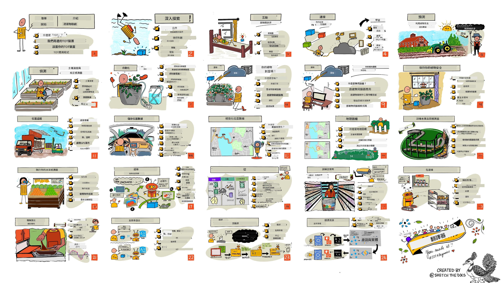

[](https://github.com/microsoft/IoT-For-Beginners/blob/master/LICENSE)
[](https://GitHub.com/microsoft/IoT-For-Beginners/graphs/contributors/)
[](https://GitHub.com/microsoft/IoT-For-Beginners/issues/)
[](https://GitHub.com/microsoft/IoT-For-Beginners/pulls/)
[](http://makeapullrequest.com)

[](https://GitHub.com/microsoft/IoT-For-Beginners/watchers/)
[](https://GitHub.com/microsoft/IoT-For-Beginners/network/)
[](https://GitHub.com/microsoft/IoT-For-Beginners/stargazers/)

### 加入 Azure AI Foundry 社群

如果你遇到瓶頸或者對建造 AI 應用程式有任何疑問，歡迎加入其他學習者和有經驗的開發人員一起討論 MCP。這是一個支持性的社群，歡迎提問且自由分享知識。

[](https://discord.gg/nTYy5BXMWG)

如在建置過程中有產品反饋或錯誤，請訪問：

[](https://aka.ms/foundry/forum)

開始使用這些資源請依照以下步驟：
1. **分支此資源庫**: 點擊 [](https://GitHub.com/microsoft/IoT-For-Beginners/fork)
2. **複製此資源庫**: `git clone https://github.com/microsoft/IoT-For-Beginners.git`
3. [**加入 Microsoft Foundry Discord，認識專家與其他開發者**](https://discord.com/invite/ByRwuEEgH4)


### 🌐 多語言支援

#### 透過 GitHub Action 支援（自動且永遠保持最新）

<!-- CO-OP TRANSLATOR LANGUAGES TABLE START -->
[Arabic](../ar/README.md) | [Bengali](../bn/README.md) | [Bulgarian](../bg/README.md) | [Burmese (Myanmar)](../my/README.md) | [Chinese (Simplified)](../zh-CN/README.md) | [Chinese (Traditional, Hong Kong)](../zh-HK/README.md) | [Chinese (Traditional, Macau)](./README.md) | [Chinese (Traditional, Taiwan)](../zh-TW/README.md) | [Croatian](../hr/README.md) | [Czech](../cs/README.md) | [Danish](../da/README.md) | [Dutch](../nl/README.md) | [Estonian](../et/README.md) | [Finnish](../fi/README.md) | [French](../fr/README.md) | [German](../de/README.md) | [Greek](../el/README.md) | [Hebrew](../he/README.md) | [Hindi](../hi/README.md) | [Hungarian](../hu/README.md) | [Indonesian](../id/README.md) | [Italian](../it/README.md) | [Japanese](../ja/README.md) | [Kannada](../kn/README.md) | [Korean](../ko/README.md) | [Lithuanian](../lt/README.md) | [Malay](../ms/README.md) | [Malayalam](../ml/README.md) | [Marathi](../mr/README.md) | [Nepali](../ne/README.md) | [Nigerian Pidgin](../pcm/README.md) | [Norwegian](../no/README.md) | [Persian (Farsi)](../fa/README.md) | [Polish](../pl/README.md) | [Portuguese (Brazil)](../pt-BR/README.md) | [Portuguese (Portugal)](../pt-PT/README.md) | [Punjabi (Gurmukhi)](../pa/README.md) | [Romanian](../ro/README.md) | [Russian](../ru/README.md) | [Serbian (Cyrillic)](../sr/README.md) | [Slovak](../sk/README.md) | [Slovenian](../sl/README.md) | [Spanish](../es/README.md) | [Swahili](../sw/README.md) | [Swedish](../sv/README.md) | [Tagalog (Filipino)](../tl/README.md) | [Tamil](../ta/README.md) | [Telugu](../te/README.md) | [Thai](../th/README.md) | [Turkish](../tr/README.md) | [Ukrainian](../uk/README.md) | [Urdu](../ur/README.md) | [Vietnamese](../vi/README.md)

> **比較想本地化複製？**

> 此資源庫包含 50 多種語言的翻譯，會大幅增加下載大小。若要不帶翻譯複製，請使用稀疏結帳：
> ```bash
> git clone --filter=blob:none --sparse https://github.com/microsoft/IoT-For-Beginners.git
> cd IoT-For-Beginners
> git sparse-checkout set --no-cone '/*' '!translations' '!translated_images'
> ```
> 這樣你可以更快下載並擁有完成課程所需的全部內容。
<!-- CO-OP TRANSLATOR LANGUAGES TABLE END -->

# IoT 入門課程

微軟 Azure Cloud Advocates 很高興能提供一個為期12週，共24堂課的物聯網基礎課程。每堂課都包括課前與課後小測驗、完成課程的書面指引、解答、作業及更多。我們專案導向的教學方法讓你一邊學習一邊實作，是新技能學習更為牢固的有效方式。

這些專案涵蓋食物從農場到餐桌的旅程，包括農業、物流、製造、零售以及消費者端，都是物聯網設備熱門的產業領域。



> 筆記圖由 [Nitya Narasimhan](https://github.com/nitya) 製作。點擊圖片可看更大版本。

**特別感謝我們的作者 [Jen Fox](https://github.com/jenfoxbot)、[Jen Looper](https://github.com/jlooper)、[Jim Bennett](https://github.com/jimbobbennett) 與我們的筆記圖藝術家 [Nitya Narasimhan](https://github.com/nitya)。**

**也感謝我們的 [Microsoft Learn 學生大使團隊](https://studentambassadors.microsoft.com?WT.mc_id=academic-17441-jabenn) 持續審核與翻譯本課程—[Aditya Garg](https://github.com/AdityaGarg00)、[Anurag Sharma](https://github.com/Anurag-0-1-A)、[Arpita Das](https://github.com/Arpiiitaaa)、[Aryan Jain](https://www.linkedin.com/in/aryan-jain-47a4a1145/)、[Bhavesh Suneja](https://github.com/EliteWarrior315)、[Faith Hunja](https://faithhunja.github.io/)、[Lateefah Bello](https://www.linkedin.com/in/lateefah-bello/)、[Manvi Jha](https://github.com/Severus-Matthew)、[Mireille Tan](https://www.linkedin.com/in/mireille-tan-a4834819a/)、[Mohammad Iftekher (Iftu) Ebne Jalal](https://github.com/Iftu119)、[Mohammad Zulfikar](https://github.com/mohzulfikar)、[Priyanshu Srivastav](https://www.linkedin.com/in/priyanshu-srivastav-b067241ba)、[Thanmai Gowducheruvu](https://github.com/innovation-platform)、與 [Zina Kamel](https://www.linkedin.com/in/zina-kamel/)。**

認識團隊！

[](https://youtu.be/-wippUJRi5k)

**Gif 製作者** [Mohit Jaisal](https://linkedin.com/in/mohitjaisal)

> 🎥 點擊上方圖片觀看專案介紹影片！

> **教師們**，我們[提供了一些使用此課程的建議](for-teachers.md)。如想自行創建課程，也有[課程模版](lesson-template/README.md)供使用。

> **[學生們](https://aka.ms/student-page)**，若想自己學習本課程，請將整個資源庫分支並自行完成練習，從課前測驗開始，閱讀內容並完成課程活動。盡量從理解課程內容來製作專案，而非直接複製解答。不過，各專案課程中的 /solutions 資料夾有解答可參考。你也可以與朋友組成讀書會，共同學習。如需更深入學習，推薦 [Microsoft Learn](https://docs.microsoft.com/users/jimbobbennett/collections/ke2ehd351jopwr?WT.mc_id=academic-17441-jabenn)。

課程概覽影片：

[](https://youtube.com/watch?v=bccEMm8gRuc "宣傳影片")

> 🎥 點擊上方圖片觀看專案介紹影片！

## 教學法

我們在建構課程時選擇兩大教學原則：確保課程是專案導向，且包含頻繁的測驗。完成整套課程後，學生將會建立植物監控與灌溉系統、車輛追蹤系統、智慧工廠設定以追蹤與檢查食物，以及語音控制烹飪計時器，並學會物聯網基礎，包括如何撰寫裝置程式碼、連接雲端、分析遙測數據和在邊緣運行 AI。

利用與專案內容相符合的教學，學生參與感提升，對觀念的記憶也會更好。

此外，課前低壓力測驗幫助學生定下學習主題的目標，課後測驗則強化記憶。此課程設計彈性且有趣，可整體學習或分段進行。專案規模從小開始，至第12週結束時逐步變得複雜。

每個專案基於學生和業餘者可取得的實際硬體。專案聚焦於特定領域，提供相關背景知識。要成為成功開發者，了解解決問題的領域非常重要；提供背境知識可以幫助學生思考物聯網解決方案和學習，讓他們在面對實際物聯網問題時更有準備。學生理解他們所製作解決方案的「原因」，並對最終使用者有更深的認識。

## 硬體

根據個人偏好、程式語言基礎、學習目標及可得性，我們提供兩種物聯網硬體選擇來進行專案。我們也提供「虛擬硬體」版本，給沒有硬體設備，或想先瞭解再購買的人。你可以在[硬體頁](./hardware.md)閱讀更多內容及取得完整套件的購買連結，我們的合作夥伴 Seeed Studio 也有相關資訊。
> 💁 請參閱我們的[行為準則](CODE_OF_CONDUCT.md)、[貢獻指南](CONTRIBUTING.md)及[翻譯指南](TRANSLATIONS.md)。我們歡迎您的建設性意見反饋！
>
> 🔧 有問題？請查看我們的[故障排除指南](TROUBLESHOOTING.md)，尋找常見問題的解決方法。

## 每課內容包含：

- 筆記示意圖
- 可選的補充影片
- 課前暖身小測驗
- 書面課程
- 專案課程則包含逐步指引教學如何構建專案
- 知識檢測
- 挑戰任務
- 補充閱讀
- 作業
- [課後小測驗](https://ff-quizzes.netlify.app/en/)

> **關於小測驗的說明**：所有小測驗皆位於 quiz-app 資料夾中，共有 48 個小測驗，每個三題。小測驗從課程中連結而來，亦可本地執行或部署到 Azure；請參考 `quiz-app` 資料夾中的說明。小測驗正逐步本地化中。

## 課程列表

|       |              專案名稱              |                       授課概念                       | 學習目標                                                                                                                                                           |                                                        連結課程                                                         |
| :---: | :-------------------------------: | :--------------------------------------------------: | ----------------------------------------------------------------------------------------------------------------------------------------------------------------- | :------------------------------------------------------------------------------------------------------------------------: |
|  01   | [入門](./1-getting-started/README.md) |                     物聯網入門                      | 學習物聯網基本原理及物聯網解決方案的基本組件，如感測器與雲端服務，同時設定您的第一個物聯網裝置                                                                          |                      [物聯網入門](./1-getting-started/lessons/1-introduction-to-iot/README.md)                      |
|  02   | [入門](./1-getting-started/README.md) |                   物聯網深度學習                   | 進一步了解物聯網系統的組件，以及微控制器和單板電腦                                                                                                                   |                        [物聯網深度學習](./1-getting-started/lessons/2-deeper-dive/README.md)                         |
|  03   | [入門](./1-getting-started/README.md) | 用感測器和執行器與物理世界互動 | 瞭解感測器用於從物理世界收集資料，執行器用於反饋訊號，同時製作夜燈                                                                                                  | [用感測器和執行器與物理世界互動](./1-getting-started/lessons/3-sensors-and-actuators/README.md) |
|  04   | [入門](./1-getting-started/README.md) |             讓您的裝置連接到網際網路              | 學習如何連接物聯網裝置到網際網路，藉由連接您的夜燈到 MQTT 代理來收發訊息                                                                                              |               [讓您的裝置連接到網際網路](./1-getting-started/lessons/4-connect-internet/README.md)                |
|  05   |            [農業](./2-farm/README.md)            |                  預測植物生長                   | 學會如何使用物聯網裝置捕捉的溫度資料來預測植物生長                                                                                                                |                          [預測植物生長](./2-farm/lessons/1-predict-plant-growth/README.md)                           |
|  06   |            [農業](./2-farm/README.md)            |                  偵測土壤濕度                   | 學會如何偵測土壤濕度並校正土壤濕度感測器                                                                                                                        |                          [偵測土壤濕度](./2-farm/lessons/2-detect-soil-moisture/README.md)                           |
|  07   |            [農業](./2-farm/README.md)            |                 自動化植物澆水                 | 學習如何使用繼電器及 MQTT 自動化並定時澆水                                                                                                                     |                      [自動化植物澆水](./2-farm/lessons/3-automated-plant-watering/README.md)                       |
|  08   |            [農業](./2-farm/README.md)            |              將植物移轉至雲端                 | 瞭解雲端與雲端托管的物聯網服務，並學會如何將植物連接到這些服務，而非公開的 MQTT 代理                                                                                |               [將植物移轉至雲端](./2-farm/lessons/4-migrate-your-plant-to-the-cloud/README.md)                |
|  09   |            [農業](./2-farm/README.md)            |          將應用邏輯移轉至雲端              | 學習如何在雲端撰寫回應物聯網訊息的應用邏輯                                                                                                                      |         [將應用邏輯移轉至雲端](./2-farm/lessons/5-migrate-application-to-the-cloud/README.md)         |
|  10   |            [農業](./2-farm/README.md)            |                  保護您的植物安全              | 瞭解物聯網安全性，以及如何使用金鑰與憑證來保護您的植物                                                                                                         |                        [保護您的植物安全](./2-farm/lessons/6-keep-your-plant-secure/README.md)                         |
|  11   |       [運輸](./3-transport/README.md)       |                   位置追蹤                    | 瞭解物聯網裝置的 GPS 位置追蹤                                                                                                                                    |                           [位置追蹤](./3-transport/lessons/1-location-tracking/README.md)                           |
|  12   |       [運輸](./3-transport/README.md)       |                  儲存位置資料                  | 學習如何儲存物聯網資料以便日後視覺化或分析                                                                                                                     |                         [儲存位置資料](./3-transport/lessons/2-store-location-data/README.md)                         |
|  13   |       [運輸](./3-transport/README.md)       |                視覺化位置資料                  | 瞭解如何在地圖上視覺化位置資料，以及地圖如何以二維方式呈現現實的三維世界                                                                                         |                     [視覺化位置資料](./3-transport/lessons/3-visualize-location-data/README.md)                     |
|  14   |       [運輸](./3-transport/README.md)       |                      地理圍欄                  | 瞭解地理圍欄以及如何用以當供應鏈中的車輛接近其目的地時發出警示                                                                                                   |                                   [地理圍欄](./3-transport/lessons/4-geofences/README.md)                                   |
|  15   |   [製造](./4-manufacturing/README.md)   |             訓練果實品質檢測器                | 學習如何在雲端訓練影像分類器以檢測果實品質                                                                                                                      |                 [訓練果實品質檢測器](./4-manufacturing/lessons/1-train-fruit-detector/README.md)                 |
|  16   |   [製造](./4-manufacturing/README.md)   |         從物聯網裝置檢查果實品質               | 學習如何從物聯網裝置使用果實品質檢測器                                                                                                                         |           [從物聯網裝置檢查果實品質](./4-manufacturing/lessons/2-check-fruit-from-device/README.md)            |
|  17   |   [製造](./4-manufacturing/README.md)   |               在邊緣端執行果實檢測器             | 瞭解如何在邊緣端的物聯網裝置上執行果實檢測器                                                                                                                   |             [在邊緣端執行果實檢測器](./4-manufacturing/lessons/3-run-fruit-detector-edge/README.md)             |
|  18   |   [製造](./4-manufacturing/README.md)   |            從感測器觸發果實品質檢測             | 瞭解如何從感測器觸發果實品質檢測                                                                                                                               |        [從感測器觸發果實品質檢測](./4-manufacturing/lessons/4-trigger-fruit-detector/README.md)         |
|  19   |          [零售](./5-retail/README.md)          |                 訓練庫存檢測器                  | 學習如何使用物件檢測訓練庫存檢測器以計算店內庫存                                                                                                              |                        [訓練庫存檢測器](./5-retail/lessons/1-train-stock-detector/README.md)                         |
|  20   |          [零售](./5-retail/README.md)          |                  從物聯網裝置檢查庫存            | 學習如何從物聯網裝置使用物件檢測模型檢查庫存                                                                                                                  |                     [從物聯網裝置檢查庫存](./5-retail/lessons/2-check-stock-device/README.md)                      |
|  21   |        [消費者](./6-consumer/README.md)        |             用物聯網裝置識別語音              | 學習如何從物聯網裝置識別語音，打造智慧計時器                                                                                                                 |                  [用物聯網裝置識別語音](./6-consumer/lessons/1-speech-recognition/README.md)                  |
|  22   |        [消費者](./6-consumer/README.md)        |                 理解語言                     | 學習如何理解對物聯網裝置說出的句子                                                                                                                           |                        [理解語言](./6-consumer/lessons/2-language-understanding/README.md)                        |
|  23   |        [消費者](./6-consumer/README.md)        |           設定計時器並提供語音回饋           | 學習如何在物聯網裝置上設定計時器，並在計時開始及結束時提供語音回饋                                                                                            |                 [設定計時器並提供語音回饋](./6-consumer/lessons/3-spoken-feedback/README.md)                  |
|  24   |        [消費者](./6-consumer/README.md)        |                支援多種語言                  | 學習如何支援多種語言，無論是語音輸入還是智慧計時器的回應                                                                                                  |                   [支援多種語言](./6-consumer/lessons/4-multiple-language-support/README.md)                   |

## 離線存取

您可以使用[Docsify](https://docsify.js.org/#/)來離線瀏覽此文件。請將此倉庫分支，於本機安裝[Docsify](https://docsify.js.org/#/quickstart)，然後在此倉庫根目錄中輸入 `docsify serve`。網站將在本地主機的 3000 埠提供服務：`localhost:3000`。

## 小測驗

感謝社群提供互動式小測驗來測試您對各章節的知識。您可以在[這裡](https://ff-quizzes.netlify.app/en/)測驗您的知識。

### PDF

若需要，您可產生此內容的 PDF 版以供離線存取。請確保您已安裝[npm](https://docs.npmjs.com/downloading-and-installing-node-js-and-npm)，並於此倉庫根目錄執行以下指令：

```sh
npm i
npm run convert
```

### 投影片

部分課程有相關投影片，請參閱 [slides](../../slides) 資料夾。

## 其他課程

我們的團隊也製作其他課程！歡迎查看：

<!-- CO-OP TRANSLATOR OTHER COURSES START -->
### LangChain
[](https://aka.ms/langchain4j-for-beginners)
[](https://aka.ms/langchainjs-for-beginners?WT.mc_id=m365-94501-dwahlin)

---

### Azure / Edge / MCP / Agents
[](https://github.com/microsoft/AZD-for-beginners?WT.mc_id=academic-105485-koreyst)
[](https://github.com/microsoft/edgeai-for-beginners?WT.mc_id=academic-105485-koreyst)
[](https://github.com/microsoft/mcp-for-beginners?WT.mc_id=academic-105485-koreyst)
[](https://github.com/microsoft/ai-agents-for-beginners?WT.mc_id=academic-105485-koreyst)

---
 
### 生成式 AI 系列
[](https://github.com/microsoft/generative-ai-for-beginners?WT.mc_id=academic-105485-koreyst)
[-9333EA?style=for-the-badge&labelColor=E5E7EB&color=9333EA)](https://github.com/microsoft/Generative-AI-for-beginners-dotnet?WT.mc_id=academic-105485-koreyst)
[-C084FC?style=for-the-badge&labelColor=E5E7EB&color=C084FC)](https://github.com/microsoft/generative-ai-for-beginners-java?WT.mc_id=academic-105485-koreyst)
[-E879F9?style=for-the-badge&labelColor=E5E7EB&color=E879F9)](https://github.com/microsoft/generative-ai-with-javascript?WT.mc_id=academic-105485-koreyst)

---
 
### 核心學習
[](https://aka.ms/ml-beginners?WT.mc_id=academic-105485-koreyst)
[](https://aka.ms/datascience-beginners?WT.mc_id=academic-105485-koreyst)
[](https://aka.ms/ai-beginners?WT.mc_id=academic-105485-koreyst)
[](https://github.com/microsoft/Security-101?WT.mc_id=academic-96948-sayoung)
[](https://aka.ms/webdev-beginners?WT.mc_id=academic-105485-koreyst)
[](https://aka.ms/iot-beginners?WT.mc_id=academic-105485-koreyst)
[](https://github.com/microsoft/xr-development-for-beginners?WT.mc_id=academic-105485-koreyst)

---
 
### Copilot 系列
[](https://aka.ms/GitHubCopilotAI?WT.mc_id=academic-105485-koreyst)
[](https://github.com/microsoft/mastering-github-copilot-for-dotnet-csharp-developers?WT.mc_id=academic-105485-koreyst)
[](https://github.com/microsoft/CopilotAdventures?WT.mc_id=academic-105485-koreyst)
<!-- CO-OP TRANSLATOR OTHER COURSES END -->

## 圖片版權歸屬

你可以在本課程所使用圖片的[版權歸屬](./attributions.md)中找到所有必要的版權說明。

---

<!-- CO-OP TRANSLATOR DISCLAIMER START -->
**免責聲明**：  
本文件使用 AI 翻譯服務 [Co-op Translator](https://github.com/Azure/co-op-translator) 進行翻譯。儘管我們力求準確，但請注意，自動翻譯可能包含錯誤或不準確之處。原始語言版本之文件應被視為權威資料來源。對於重要資訊，建議採用專業人工翻譯。我們不對使用本翻譯所引起的任何誤解或誤譯承擔責任。
<!-- CO-OP TRANSLATOR DISCLAIMER END -->