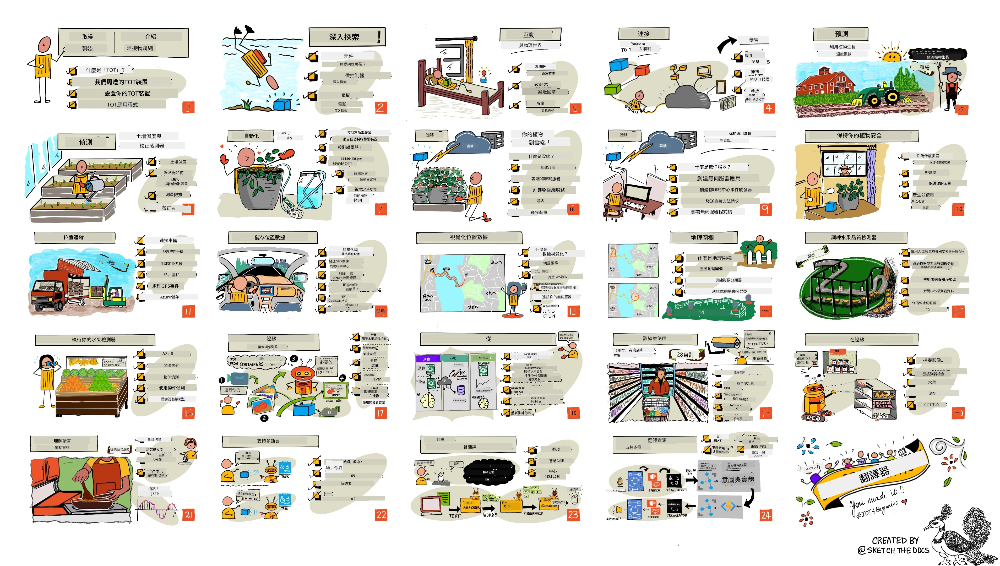

[](https://github.com/microsoft/IoT-For-Beginners/blob/master/LICENSE)
[](https://GitHub.com/microsoft/IoT-For-Beginners/graphs/contributors/)
[](https://GitHub.com/microsoft/IoT-For-Beginners/issues/)
[](https://GitHub.com/microsoft/IoT-For-Beginners/pulls/)
[](http://makeapullrequest.com)

[](https://GitHub.com/microsoft/IoT-For-Beginners/watchers/)
[](https://GitHub.com/microsoft/IoT-For-Beginners/network/)
[](https://GitHub.com/microsoft/IoT-For-Beginners/stargazers/)

### 加入 Azure AI Foundry 社群

如果你遇到困難或有關於建立 AI 應用的任何問題，歡迎加入其他學習者和有經驗的開發者，一同在 MCP 討論中交流。這是一個支持性的社群，歡迎提問並自由分享知識。

[](https://discord.gg/nTYy5BXMWG)

如果你在建立過程中有產品回饋或錯誤，請造訪：

[](https://aka.ms/foundry/forum)

遵循下列步驟開始使用這些資源：
1. **Fork 此存放庫**：點擊 [](https://GitHub.com/microsoft/IoT-For-Beginners/fork)
2. **Clone 此存放庫**： `git clone https://github.com/microsoft/IoT-For-Beginners.git`
3. [**加入 Microsot Foundry Discord，與專家及其他開發者交流**](https://discord.com/invite/ByRwuEEgH4)


### 🌐 多語言支援

#### 透過 GitHub Action 支援（自動化且始終保持最新）

<!-- CO-OP TRANSLATOR LANGUAGES TABLE START -->
[阿拉伯文](../ar/README.md) | [孟加拉文](../bn/README.md) | [保加利亞文](../bg/README.md) | [緬甸語](../my/README.md) | [中文（簡體）](../zh-CN/README.md) | [中文（繁體，香港）](../zh-HK/README.md) | [中文（繁體，澳門）](./README.md) | [中文（繁體，台灣）](../zh-TW/README.md) | [克羅地亞文](../hr/README.md) | [捷克文](../cs/README.md) | [丹麥文](../da/README.md) | [荷蘭文](../nl/README.md) | [愛沙尼亞文](../et/README.md) | [芬蘭文](../fi/README.md) | [法文](../fr/README.md) | [德文](../de/README.md) | [希臘文](../el/README.md) | [希伯來文](../he/README.md) | [印地文](../hi/README.md) | [匈牙利文](../hu/README.md) | [印尼文](../id/README.md) | [義大利文](../it/README.md) | [日文](../ja/README.md) | [坎納達語](../kn/README.md) | [高棉文](../km/README.md) | [韓文](../ko/README.md) | [立陶宛文](../lt/README.md) | [馬來文](../ms/README.md) | [馬拉雅拉姆文](../ml/README.md) | [馬拉地文](../mr/README.md) | [尼泊爾語](../ne/README.md) | [奈及利亞皮欽語](../pcm/README.md) | [挪威文](../no/README.md) | [波斯文 (法爾西語)](../fa/README.md) | [波蘭文](../pl/README.md) | [葡萄牙語（巴西）](../pt-BR/README.md) | [葡萄牙語（葡萄牙）](../pt-PT/README.md) | [旁遮普語（古爾穆奇文）](../pa/README.md) | [羅馬尼亞文](../ro/README.md) | [俄文](../ru/README.md) | [塞爾維亞文（西里爾字母）](../sr/README.md) | [斯洛伐克文](../sk/README.md) | [斯洛維尼亞文](../sl/README.md) | [西班牙文](../es/README.md) | [斯瓦希里文](../sw/README.md) | [瑞典文](../sv/README.md) | [他加祿語（菲律賓語）](../tl/README.md) | [泰米爾文](../ta/README.md) | [泰盧固語](../te/README.md) | [泰文](../th/README.md) | [土耳其文](../tr/README.md) | [烏克蘭文](../uk/README.md) | [烏爾都文](../ur/README.md) | [越南文](../vi/README.md)

> **Prefer to Clone Locally?**
>
> 此存放庫包含 50+ 種語言翻譯，會大幅增加下載大小。若要在不包含翻譯的情況下克隆，請使用稀疏檢出：
>
> **Bash / macOS / Linux:**
> ```bash
> git clone --filter=blob:none --sparse https://github.com/microsoft/IoT-For-Beginners.git
> cd IoT-For-Beginners
> git sparse-checkout set --no-cone '/*' '!translations' '!translated_images'
> ```
>
> **CMD (Windows):**
> ```cmd
> git clone --filter=blob:none --sparse https://github.com/microsoft/IoT-For-Beginners.git
> cd IoT-For-Beginners
> git sparse-checkout set --no-cone "/*" "!translations" "!translated_images"
> ```
>
> 這樣可以更快下載，並提供完成課程所需的所有資源。
<!-- CO-OP TRANSLATOR LANGUAGES TABLE END -->

# IoT 初學者課程大綱

微軟 Azure 雲端倡導者很高興提供一套為期 12 週、包含 24 節課程的物聯網基礎課程。每節課包括課前及課後測驗、完成課程的書面說明、解決方案、作業等。我們採用以專案為基礎的教學方法，讓你在實作中學習，這是新技能能夠「紮根」的有效方式。

這些專案涵蓋食物從農場到餐桌的整個旅程。包括農業、物流、製造、零售到消費者，全部都是物聯網裝置常見的產業領域。



> 草圖筆記作者： [Nitya Narasimhan](https://github.com/nitya)。點擊圖片檢視較大版本。

**衷心感謝我們的作者們 [Jen Fox](https://github.com/jenfoxbot)、[Jen Looper](https://github.com/jlooper)、[Jim Bennett](https://github.com/jimbobbennett)，以及我們的草圖筆記藝術家 [Nitya Narasimhan](https://github.com/nitya)。**

**也感謝 [Microsoft Learn Student Ambassadors](https://studentambassadors.microsoft.com?WT.mc_id=academic-17441-jabenn) 團隊，他們協助審閱和翻譯本課程學程－[Aditya Garg](https://github.com/AdityaGarg00)、[Anurag Sharma](https://github.com/Anurag-0-1-A)、[Arpita Das](https://github.com/Arpiiitaaa)、[Aryan Jain](https://www.linkedin.com/in/aryan-jain-47a4a1145/)、[Bhavesh Suneja](https://github.com/EliteWarrior315)、[Faith Hunja](https://faithhunja.github.io/)、[Lateefah Bello](https://www.linkedin.com/in/lateefah-bello/)、[Manvi Jha](https://github.com/Severus-Matthew)、[Mireille Tan](https://www.linkedin.com/in/mireille-tan-a4834819a/)、[Mohammad Iftekher (Iftu) Ebne Jalal](https://github.com/Iftu119)、[Mohammad Zulfikar](https://github.com/mohzulfikar)、[Priyanshu Srivastav](https://www.linkedin.com/in/priyanshu-srivastav-b067241ba)、[Thanmai Gowducheruvu](https://github.com/innovation-platform)、和 [Zina Kamel](https://www.linkedin.com/in/zina-kamel/)。**

認識團隊！

[](https://youtu.be/-wippUJRi5k)

**Gif 製作：** [Mohit Jaisal](https://linkedin.com/in/mohitjaisal)

> 🎥 點擊上方圖片觀看專案介紹影片！

> <strong>教師們</strong>，我們已[提供一些建議](for-teachers.md)說明如何使用本課程教材。若想自行創建課程，也有一個[課程範本](lesson-template/README.md)可供使用。

> **[學生們](https://aka.ms/student-page)**，要自行使用本課程，可 fork 整個 repo，依序完成練習，從課前小測起，接著閱讀講義並完成其他活動。建議透過理解課程內容自行完成專案，而非直接複製解決方案；不過每個專案課程中的 /solutions 資料夾都有解答碼可供參考。另外亦可組成讀書會，與朋友共同學習內容。若要深化學習，推薦使用 [Microsoft Learn](https://docs.microsoft.com/users/jimbobbennett/collections/ke2ehd351jopwr?WT.mc_id=academic-17441-jabenn)。

相關簡介影片請見：

[](https://youtube.com/watch?v=bccEMm8gRuc "宣傳影片")

> 🎥 點擊上方圖片觀看專案介紹影片！

## 教學法

我們在建構本課程時選擇了兩個教學原則：確保以專案為基底，並包含頻繁的小測驗。完成此系列課程後，學生將自建植物監控與澆水系統、車輛追蹤器、智慧工廠以追蹤與檢查食品，以及語音控制烹調計時器，並學會物聯網基礎，包括如何編寫裝置程式碼、連接雲端、分析遙測資料及在邊緣執行 AI。

確保課程內容符合專案導向，更能讓學生投入學習，提升概念記憶度。

此外，課前的低壓力小測幫助學生日前建立學習主題的動機，課後小測則加深記憶。本課程設計彈性且富趣味，可全程或部分修習。專案循序漸進，從簡入深，於 12 週週期結束時達到較高複雜度。

每個專案皆以學生與業餘愛好者可取得的真實硬體為基礎。專案涵蓋特定領域，提供相關背景知識。成為成功開發者需理解問題領域，此背景知識有助學生思考物聯網解決方案與學習內容，並理解他們所面對的真實問題。學生學會所建置解決方案的緣由，並對最終使用者產生認識。

## 硬體
我們有兩種可用於專案的物聯網硬件選擇，取決於個人偏好、程式語言知識或偏好、學習目標及供應情況。我們亦提供了「虛擬硬件」版本，適合那些無法取得硬件或想在購買前進一步了解的人。您可以在[硬件頁面](./hardware.md)閱讀更多並找到「購物清單」，其中包括我們的合作夥伴 Seeed Studio 提供的完整套件購買連結。

> 💁 查看我們的[行為準則](CODE_OF_CONDUCT.md)、[貢獻指南](CONTRIBUTING.md)及[翻譯指南](TRANSLATIONS.md)。我們歡迎您的建設性意見！
>
> 🔧 遇到問題？請參閱我們的[疑難排解指南](TROUBLESHOOTING.md)，尋找常見問題的解決方案。

## 每課包含：

- 手繪筆記
- 可選補充影片
- 課前熱身小測驗
- 書面課程內容
- 專案導向課程提供逐步建置指南
- 知識檢測
- 挑戰
- 補充閱讀
- 作業
- [課後小測驗](https://ff-quizzes.netlify.app/en/)

> <strong>關於小測驗的說明</strong>：所有小測驗皆置於 quiz-app 資料夾中，共 48 個小測，每個小測皆包含三個問題。小測從課程內連結，但 quiz app 可在本地執行或部署至 Azure；請依 quiz-app 資料夾中的說明操作。小測逐步進行本地化。

## 課程列表

|       |                專案名稱                 |                       教授概念                       |                                    學習目標                                     |                                                         相關課程                                                          |
| :---: | :------------------------------------: | :-------------------------------------------------: | :-----------------------------------------------------------------------------: | :-------------------------------------------------------------------------------------------------------------------------: |
|  01   | [入門教學](./1-getting-started/README.md) |                     物聯網介紹                      | 學習物聯網基本原理及感測器與雲端服務等物聯網解決方案的基本組件，同時設定您的第一臺物聯網裝置 |                          [物聯網介紹](./1-getting-started/lessons/1-introduction-to-iot/README.md)                          |
|  02   | [入門教學](./1-getting-started/README.md) |                   物聯網深入探索                    | 進一步了解物聯網系統的組件，微控制器與單板電腦                                                  |                            [物聯網深入探索](./1-getting-started/lessons/2-deeper-dive/README.md)                           |
|  03   | [入門教學](./1-getting-started/README.md) | 感測器和致動器與實體世界互動                         | 了解用於從實體世界收集資料的感測器，與反饋操作的致動器，並製作夜燈                              |          [感測器和致動器與實體世界互動](./1-getting-started/lessons/3-sensors-and-actuators/README.md)                   |
|  04   | [入門教學](./1-getting-started/README.md) |                 將裝置連接至網際網路                | 了解如何將物聯網裝置連接至網際網路，通過 MQTT 代理發送與接收訊息，同時連接夜燈                  |                      [將裝置連接至網際網路](./1-getting-started/lessons/4-connect-internet/README.md)                     |
|  05   |            [農場](./2-farm/README.md)             |                     預測植物生長                    | 學習如何透過物聯網裝置捕捉的溫度資料來預測植物生長                                            |                           [預測植物生長](./2-farm/lessons/1-predict-plant-growth/README.md)                              |
|  06   |            [農場](./2-farm/README.md)             |                    偵測土壤濕度                     | 學習如何偵測土壤濕度並校準土壤濕度感測器                                                      |                           [偵測土壤濕度](./2-farm/lessons/2-detect-soil-moisture/README.md)                              |
|  07   |            [農場](./2-farm/README.md)             |                 自動化澆水系統                      | 學習如何使用繼電器和 MQTT 來自動化與定時澆水                                                  |                         [自動化澆水系統](./2-farm/lessons/3-automated-plant-watering/README.md)                            |
|  08   |            [農場](./2-farm/README.md)             |                 將植物移轉至雲端                     | 了解雲端與雲端託管的物聯網服務，並學習如何將植物資料連接至這些服務而非公開 MQTT 代理            |                        [將植物移轉至雲端](./2-farm/lessons/4-migrate-your-plant-to-the-cloud/README.md)                   |
|  09   |            [農場](./2-farm/README.md)             |               將應用程式邏輯移轉到雲端               | 學習如何在雲端撰寫回應物聯網訊息的應用程式邏輯                                                |                    [將應用程式邏輯移轉到雲端](./2-farm/lessons/5-migrate-application-to-the-cloud/README.md)              |
|  10   |            [農場](./2-farm/README.md)             |                    保護您的植物安全                   | 了解物聯網安全性，並學習如何利用鑰匙與憑證保持植物安全                                        |                          [保護您的植物安全](./2-farm/lessons/6-keep-your-plant-secure/README.md)                         |
|  11   |        [運輸](./3-transport/README.md)            |                      位置追蹤                        | 了解物聯網裝置的 GPS 位置追蹤                                                                |                             [位置追蹤](./3-transport/lessons/1-location-tracking/README.md)                              |
|  12   |        [運輸](./3-transport/README.md)            |                    儲存位置資料                      | 學習如何儲存物聯網資料以供日後視覺化或分析                                                  |                             [儲存位置資料](./3-transport/lessons/2-store-location-data/README.md)                          |
|  13   |        [運輸](./3-transport/README.md)            |                    視覺化位置資料                    | 了解如何在地圖上視覺化位置資料，以及地圖如何將真實三維世界以二維方式呈現                      |                           [視覺化位置資料](./3-transport/lessons/3-visualize-location-data/README.md)                    |
|  14   |        [運輸](./3-transport/README.md)            |                        地理圍欄                      | 了解地理圍欄及其如何在供應鏈中當運輸車輛接近目的地時發出警報                                |                                 [地理圍欄](./3-transport/lessons/4-geofences/README.md)                                |
|  15   |     [製造](./4-manufacturing/README.md)           |                  訓練果實品質檢測器                 | 了解如何在雲端訓練圖像分類器以檢測果實品質                                                  |                         [訓練果實品質檢測器](./4-manufacturing/lessons/1-train-fruit-detector/README.md)               |
|  16   |     [製造](./4-manufacturing/README.md)           |             從物聯網裝置檢查果實品質                | 學習如何從物聯網裝置使用您的果實品質檢測器                                                  |                     [從物聯網裝置檢查果實品質](./4-manufacturing/lessons/2-check-fruit-from-device/README.md)           |
|  17   |     [製造](./4-manufacturing/README.md)           |              在邊緣裝置上運行果實檢測器             | 了解如何在邊緣端的物聯網裝置上運行您的果實檢測器                                            |                        [在邊緣裝置上運行果實檢測器](./4-manufacturing/lessons/3-run-fruit-detector-edge/README.md)        |
|  18   |     [製造](./4-manufacturing/README.md)           |              從感測器觸發果實品質檢測               | 了解如何從感測器觸發果實品質檢測                                                            |                        [從感測器觸發果實品質檢測](./4-manufacturing/lessons/4-trigger-fruit-detector/README.md)          |
|  19   |         [零售](./5-retail/README.md)              |                  訓練庫存檢測器                     | 學習如何使用物件偵測訓練庫存檢測器以計算店內庫存                                          |                          [訓練庫存檢測器](./5-retail/lessons/1-train-stock-detector/README.md)                          |
|  20   |         [零售](./5-retail/README.md)              |              從物聯網裝置檢查庫存                   | 學習如何使用物件偵測模型從物聯網裝置檢查庫存                                              |                        [從物聯網裝置檢查庫存](./5-retail/lessons/2-check-stock-device/README.md)                        |
|  21   |       [消費者](./6-consumer/README.md)            |             使用物聯網裝置辨識語音                  | 學習如何從物聯網裝置辨識語音，製作智慧計時器                                              |                       [使用物聯網裝置辨識語音](./6-consumer/lessons/1-speech-recognition/README.md)                     |
|  22   |       [消費者](./6-consumer/README.md)            |                   理解語言                            | 了解如何理解對物聯網裝置說出的句子                                                        |                            [理解語言](./6-consumer/lessons/2-language-understanding/README.md)                           |
|  23   |       [消費者](./6-consumer/README.md)            |              設定計時器並提供語音反饋                | 學習如何在物聯網裝置上設定計時器，並在設定及計時完成時給予語音反饋                          |                      [設定計時器並提供語音反饋](./6-consumer/lessons/3-spoken-feedback/README.md)                        |
|  24   |       [消費者](./6-consumer/README.md)            |                  支援多種語言                         | 學習如何支援多種語言，包含語音輸入與智慧計時器的回應                                      |                       [支援多種語言](./6-consumer/lessons/4-multiple-language-support/README.md)                         |

## 離線存取

您可以使用 [Docsify](https://docsify.js.org/#/) 離線瀏覽此文件。請分支本儲存庫，並在本機安裝 [Docsify](https://docsify.js.org/#/quickstart)，然後在本儲存庫根目錄執行 `docsify serve`。網站將會於本地主機的 3000 埠啟動：`localhost:3000`。

## 測驗

感謝社群協助提供互動測驗來測試您對各章節的理解。您可以在[這裡](https://ff-quizzes.netlify.app/en/)測試您的知識。

### PDF

如需離線存取，您可以將內容產生為 PDF。確保已安裝 [npm](https://docs.npmjs.com/downloading-and-installing-node-js-and-npm)，然後在本儲存庫根目錄執行以下指令：

```sh
npm i
npm run convert
```

### 投影片

部分課程附有簡報投影片，存於 [slides](../../slides) 資料夾。

## 其他課程內容

我們團隊還製作其他課程！歡迎瀏覽：

<!-- CO-OP TRANSLATOR OTHER COURSES START -->
### LangChain
[](https://aka.ms/langchain4j-for-beginners)
[](https://aka.ms/langchainjs-for-beginners?WT.mc_id=m365-94501-dwahlin)
[](https://github.com/microsoft/langchain-for-beginners?WT.mc_id=m365-94501-dwahlin)
---

### Azure / Edge / MCP / Agents
[](https://github.com/microsoft/AZD-for-beginners?WT.mc_id=academic-105485-koreyst)
[](https://github.com/microsoft/edgeai-for-beginners?WT.mc_id=academic-105485-koreyst)
[](https://github.com/microsoft/mcp-for-beginners?WT.mc_id=academic-105485-koreyst)
[](https://github.com/microsoft/ai-agents-for-beginners?WT.mc_id=academic-105485-koreyst)

---
 
### 生成式 AI 系列
[](https://github.com/microsoft/generative-ai-for-beginners?WT.mc_id=academic-105485-koreyst)
[-9333EA?style=for-the-badge&labelColor=E5E7EB&color=9333EA)](https://github.com/microsoft/Generative-AI-for-beginners-dotnet?WT.mc_id=academic-105485-koreyst)
[-C084FC?style=for-the-badge&labelColor=E5E7EB&color=C084FC)](https://github.com/microsoft/generative-ai-for-beginners-java?WT.mc_id=academic-105485-koreyst)
[-E879F9?style=for-the-badge&labelColor=E5E7EB&color=E879F9)](https://github.com/microsoft/generative-ai-with-javascript?WT.mc_id=academic-105485-koreyst)

---
 
### 核心學習
[](https://aka.ms/ml-beginners?WT.mc_id=academic-105485-koreyst)
[](https://aka.ms/datascience-beginners?WT.mc_id=academic-105485-koreyst)
[](https://aka.ms/ai-beginners?WT.mc_id=academic-105485-koreyst)
[](https://github.com/microsoft/Security-101?WT.mc_id=academic-96948-sayoung)
[](https://aka.ms/webdev-beginners?WT.mc_id=academic-105485-koreyst)
[](https://aka.ms/iot-beginners?WT.mc_id=academic-105485-koreyst)
[](https://github.com/microsoft/xr-development-for-beginners?WT.mc_id=academic-105485-koreyst)

---
 
### Copilot 系列
[](https://aka.ms/GitHubCopilotAI?WT.mc_id=academic-105485-koreyst)
[](https://github.com/microsoft/mastering-github-copilot-for-dotnet-csharp-developers?WT.mc_id=academic-105485-koreyst)
[](https://github.com/microsoft/CopilotAdventures?WT.mc_id=academic-105485-koreyst)
<!-- CO-OP TRANSLATOR OTHER COURSES END -->

## 图片來源說明

你可以在[Attributions](./attributions.md)找到本課程所用圖片的所有來源說明。

---

<!-- CO-OP TRANSLATOR DISCLAIMER START -->
**免責聲明**：  
本文檔係使用 AI 翻譯服務 [Co-op Translator](https://github.com/Azure/co-op-translator) 翻譯而成。雖然我哋力求準確，但請注意自動翻譯可能包含錯誤或不準確之處。原文檔嘅母語版本應視為權威資料來源。對於重要資訊，建議採用專業人類翻譯。我哋對因使用此翻譯而引致嘅任何誤解或誤釋概不負責。
<!-- CO-OP TRANSLATOR DISCLAIMER END -->