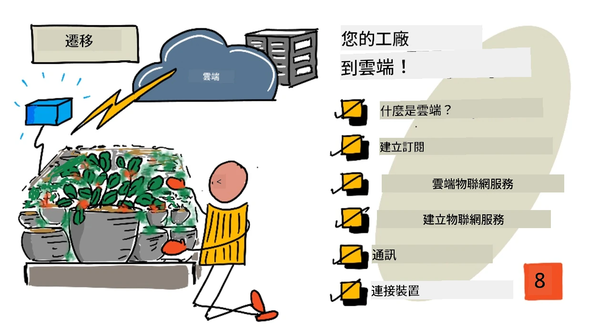
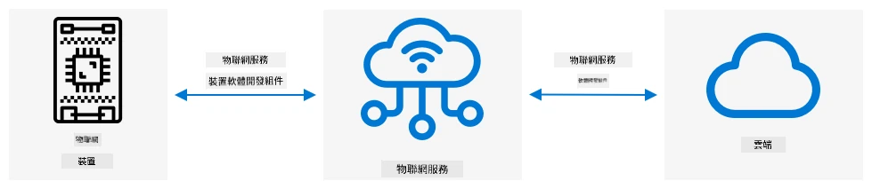
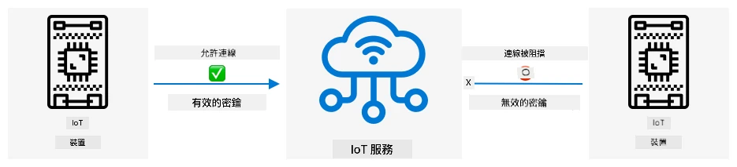
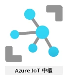

# 將植物遷移到雲端



> 手繪筆記由 [Nitya Narasimhan](https://github.com/nitya) 提供。點擊圖片查看更大版本。

本課程是 [Microsoft Reactor](https://developer.microsoft.com/reactor/?WT.mc_id=academic-17441-jabenn) 的 [IoT 初學者項目 2 - 數字農業系列](https://youtube.com/playlist?list=PLmsFUfdnGr3yCutmcVg6eAUEfsGiFXgcx) 的一部分。

[](https://youtu.be/bNxjopXkhvk)

## 課前測驗

[課前測驗](https://black-meadow-040d15503.1.azurestaticapps.net/quiz/15)

## 簡介

在上一課中，您學習了如何將植物連接到 MQTT broker，並通過本地運行的伺服器代碼控制繼電器。這構成了從家中單個植物到商業農場使用的互聯網連接自動灌溉系統的核心。

IoT 設備通過公共 MQTT broker 進行通信，以展示原理，但這並不是最可靠或安全的方式。在本課中，您將了解雲端以及公共雲服務提供的 IoT 功能。您還將學習如何將植物從公共 MQTT broker 遷移到其中一個雲服務。

本課將涵蓋以下內容：

* [什麼是雲端？](../../../../../2-farm/lessons/4-migrate-your-plant-to-the-cloud)
* [創建雲端訂閱](../../../../../2-farm/lessons/4-migrate-your-plant-to-the-cloud)
* [雲端 IoT 服務](../../../../../2-farm/lessons/4-migrate-your-plant-to-the-cloud)
* [在雲端創建 IoT 服務](../../../../../2-farm/lessons/4-migrate-your-plant-to-the-cloud)
* [與 IoT Hub 通信](../../../../../2-farm/lessons/4-migrate-your-plant-to-the-cloud)
* [將設備連接到 IoT 服務](../../../../../2-farm/lessons/4-migrate-your-plant-to-the-cloud)

## 什麼是雲端？

在雲端出現之前，當公司想要為員工（例如數據庫或文件存儲）或公眾（例如網站）提供服務時，他們需要建立並運行數據中心。這可能是一個有少量計算機的房間，也可能是一個有大量計算機的建築。公司需要管理所有事情，包括：

* 購買計算機
* 硬件維護
* 電力和冷卻
* 網絡
* 安全性，包括建築安全和計算機上的軟件安全
* 軟件安裝和更新

這可能非常昂貴，需要各種技能的員工，並且在需要更改時速度非常慢。例如，如果一家在線商店需要為繁忙的假期季節做準備，他們需要提前幾個月計劃購買更多硬件、配置它、安裝它並安裝運行銷售流程的軟件。假期季節結束後，銷售量下降，他們可能會留下閒置的計算機，直到下一個繁忙季節。

✅ 您認為這樣的方式能讓公司快速行動嗎？如果一家在線服裝零售商因某位名人穿著他們的服裝而突然流行起來，他們能否快速增加計算能力以支持突然湧入的訂單？

### 別人的計算機

雲端常被戲稱為「別人的計算機」。最初的想法很簡單——與其購買計算機，不如租用別人的計算機。雲計算提供商會管理巨大的數據中心。他們負責購買和安裝硬件、管理電力和冷卻、網絡、建築安全、硬件和軟件更新等所有事情。作為客戶，您只需租用所需的計算機，需求增加時租用更多，需求減少時減少租用。這些雲端數據中心分布在世界各地。


這些數據中心的面積可以達到數平方公里。上面的圖片拍攝於幾年前的 Microsoft 雲端數據中心，展示了初始規模以及擴展計劃。擴展清理出的區域超過 5 平方公里。

> 💁 這些數據中心需要大量的電力，有些甚至擁有自己的發電站。由於其規模和雲提供商的投資，它們通常非常環保。它們比大量小型數據中心更高效，主要使用可再生能源運行，雲提供商努力減少浪費、降低水資源使用並重新植樹以彌補因建設數據中心而砍伐的森林。您可以在 [Azure 可持續性網站](https://azure.microsoft.com/global-infrastructure/sustainability/?WT.mc_id=academic-17441-jabenn) 上了解更多關於雲提供商如何致力於可持續性的資訊。

✅ 做一些研究：了解主要的雲端服務，例如 [Microsoft 的 Azure](https://azure.microsoft.com/?WT.mc_id=academic-17441-jabenn) 或 [Google 的 GCP](https://cloud.google.com)。他們有多少數據中心？這些數據中心分布在哪些地方？

使用雲端可以降低公司的成本，並使其專注於自身的核心業務，將雲計算專業知識交給提供商。公司不再需要租用或購買數據中心空間、向不同的供應商支付連接和電力費用或僱用專家。相反，他們只需向雲提供商支付一張月度賬單，所有事情都由雲提供商處理。

雲提供商可以利用規模經濟降低成本，例如批量購買計算機以降低成本、投資工具以減少維護工作量，甚至設計和建造自己的硬件以改善雲端服務。

### Microsoft Azure

Azure 是 Microsoft 的開發者雲端，您將在這些課程中使用它。以下視頻提供了 Azure 的簡短概述：

[](https://www.microsoft.com/videoplayer/embed/RE4Ibng?WT.mc_id=academic-17441-jabenn)

## 創建雲端訂閱

要使用雲端服務，您需要向雲提供商註冊訂閱。在本課中，您將註冊 Microsoft Azure 訂閱。如果您已經有 Azure 訂閱，可以跳過此任務。以下描述的訂閱詳情在撰寫本文時是正確的，但可能會有所更改。

> 💁 如果您通過學校訪問這些課程，您可能已經有可用的 Azure 訂閱。請向您的老師確認。

您可以註冊兩種類型的免費 Azure 訂閱：

* **Azure for Students** - 這是為 18 歲以上學生設計的訂閱。您不需要信用卡即可註冊，並使用您的學校電子郵件地址驗證您是學生。註冊後，您將獲得 100 美元的雲資源使用額，以及包括 IoT 服務免費版本在內的免費服務。此訂閱有效期為 12 個月，您可以每年續訂一次，只要您仍是學生。

* **Azure 免費訂閱** - 這是為非學生設計的訂閱。您需要信用卡來註冊，但您的卡不會被扣款，僅用於驗證您是真人而非機器人。您在前 30 天內可獲得 200 美元的信用額，用於任何服務，並享受 Azure 服務的免費層。信用額用完後，除非您轉換為按使用付費訂閱，否則您的卡不會被扣款。

> 💁 Microsoft 確實為 18 歲以下學生提供 Azure for Students Starter 訂閱，但在撰寫本文時，它不支持任何 IoT 服務。

### 任務 - 註冊免費雲端訂閱

如果您是 18 歲以上的學生，可以註冊 Azure for Students 訂閱。您需要使用學校電子郵件地址進行驗證。您可以通過以下兩種方式完成：

* 在 [education.github.com/pack](https://education.github.com/pack) 註冊 GitHub 學生開發者包。這將使您能夠訪問一系列工具和優惠，包括 GitHub 和 Microsoft Azure。註冊開發者包後，您可以激活 Azure for Students 優惠。

* 直接在 [azure.microsoft.com/free/students](https://azure.microsoft.com/free/students/?WT.mc_id=academic-17441-jabenn) 註冊 Azure for Students 帳戶。

> ⚠️ 如果您的學校電子郵件地址未被認可，請在 [此 repo 提交問題](https://github.com/Microsoft/IoT-For-Beginners/issues)，我們將查看是否可以將其添加到 Azure for Students 的允許列表。

如果您不是學生，或者沒有有效的學校電子郵件地址，則可以註冊 Azure 免費訂閱。

* 在 [azure.microsoft.com/free](https://azure.microsoft.com/free/?WT.mc_id=academic-17441-jabenn) 註冊 Azure 免費訂閱。

## 雲端 IoT 服務

您使用的公共測試 MQTT broker 是一個很好的學習工具，但作為商業用途工具存在一些缺點：

* **可靠性** - 它是一個免費服務，沒有任何保證，可能隨時關閉
* **安全性** - 它是公共的，因此任何人都可以監聽您的遙測數據或發送命令控制您的硬件
* **性能** - 它設計僅用於少量測試消息，因此無法應對大量消息的傳輸
* **發現性** - 無法知道哪些設備已連接

雲端 IoT 服務解決了這些問題。它們由大型雲提供商維護，這些提供商在可靠性方面投入巨大，並隨時解決可能出現的問題。它們內置了安全性，防止黑客讀取您的數據或發送惡意命令。它們還具有高性能，能夠每天處理數百萬條消息，並利用雲端根據需要進行擴展。

> 💁 雖然您需要支付月費來享受這些優勢，但大多數雲提供商都提供免費版本的 IoT 服務，限制每日消息數量或可連接的設備數量。這些免費版本通常足夠開發者學習服務。在本課中，您將使用免費版本。

IoT 設備可以通過設備 SDK（提供代碼以使用服務功能的庫）或直接通過通信協議（如 MQTT 或 HTTP）連接到雲端服務。設備 SDK 通常是最簡單的路徑，因為它處理所有事情，例如知道要發布或訂閱的主題以及如何處理安全性。



您的設備然後通過該服務與應用程序的其他部分通信——類似於您通過 MQTT 發送遙測數據和接收命令。這通常使用服務 SDK 或類似的庫。消息從您的設備發送到服務，應用程序的其他部分可以讀取這些消息，並將消息發送回您的設備。



這些服務通過了解所有可以連接並發送數據的設備來實現安全性，這可以通過預先註冊設備或給設備提供密鑰或證書，讓它們在首次連接時自動註冊到服務。未知設備無法連接，如果嘗試，服務會拒絕連接並忽略它們發送的消息。

✅ 做一些研究：開放的 IoT 服務允許任何設備或代碼連接會有哪些缺點？您能找到黑客利用這種情況的具體例子嗎？

應用程序的其他部分可以連接到 IoT 服務，了解所有已連接或註冊的設備，並直接與它們進行批量或單獨通信。
💁 IoT 服務還實現了額外的功能，雲端供應商也提供了額外的服務和應用程式，可以與該服務連接。例如，如果您想將所有設備發送的遙測訊息存儲到資料庫中，通常只需要在雲端供應商的配置工具中點擊幾下，就能將服務連接到資料庫並將資料串流進去。
## 在雲端建立 IoT 服務

現在您已經擁有 Azure 訂閱，您可以註冊一個 IoT 服務。Microsoft 提供的 IoT 服務稱為 Azure IoT Hub。



以下影片簡要介紹了 Azure IoT Hub：

[](https://www.youtube.com/watch?v=smuZaZZXKsU)

> 🎥 點擊上方圖片觀看影片

✅ 花點時間進行研究，閱讀 [Microsoft IoT Hub 文件](https://docs.microsoft.com/azure/iot-hub/about-iot-hub?WT.mc_id=academic-17441-jabenn) 中的 IoT Hub 概述。

Azure 提供的雲端服務可以通過基於網頁的入口網站或命令列介面 (CLI) 進行配置。對於此任務，您將使用 CLI。

### 任務 - 安裝 Azure CLI

要使用 Azure CLI，首先需要在您的 PC 或 Mac 上安裝它。

1. 按照 [Azure CLI 文件](https://docs.microsoft.com/cli/azure/install-azure-cli?WT.mc_id=academic-17441-jabenn) 中的指示安裝 CLI。

1. Azure CLI 支援多種擴展功能，這些功能可用於管理各種 Azure 服務。從命令列或終端執行以下命令以安裝 IoT 擴展：

    ```sh
    az extension add --name azure-iot
    ```

1. 從命令列或終端執行以下命令，從 Azure CLI 登錄到您的 Azure 訂閱。

    ```sh
    az login
    ```

    預設瀏覽器將啟動一個網頁。使用您註冊 Azure 訂閱時的帳戶登錄。登錄後，您可以關閉瀏覽器標籤頁。

1. 如果您有多個 Azure 訂閱，例如學校提供的訂閱和您自己的 Azure for Students 訂閱，您需要選擇要使用的訂閱。執行以下命令以列出您有權訪問的所有訂閱：

    ```sh
    az account list --output table
    ```

    在輸出中，您將看到每個訂閱的名稱及其 `SubscriptionId`。

    ```output
    ➜  ~ az account list --output table
    Name                    CloudName    SubscriptionId                        State    IsDefault
    ----------------------  -----------  ------------------------------------  -------  -----------
    School-subscription     AzureCloud   cb30cde9-814a-42f0-a111-754cb788e4e1  Enabled  True
    Azure for Students      AzureCloud   fa51c31b-162c-4599-add6-781def2e1fbf  Enabled  False
    ```

    使用以下命令選擇您要使用的訂閱：

    ```sh
    az account set --subscription <SubscriptionId>
    ```

    將 `<SubscriptionId>` 替換為您要使用的訂閱的 ID。執行此命令後，重新執行列出帳戶的命令。您將看到 `IsDefault` 列被標記為 `True`，表示您剛剛設置的訂閱。

### 任務 - 建立資源群組

Azure 服務，例如 IoT Hub 實例、虛擬機器、資料庫或 AI 服務，被稱為 **資源**。每個資源都必須位於 **資源群組** 中，這是一個邏輯分組，包含一個或多個資源。

> 💁 使用資源群組意味著您可以一次管理多個服務。例如，完成此專案的所有課程後，您可以刪除資源群組，所有資源將自動刪除。

1. Azure 在全球有多個資料中心，分為不同的區域。當您建立 Azure 資源或資源群組時，您需要指定其建立的位置。執行以下命令以獲取位置列表：

    ```sh
    az account list-locations --output table
    ```

    您將看到一個位置列表。這個列表會很長。

    > 💁 截至撰寫本文時，您可以部署到 65 個位置。

    ```output
        ➜  ~ az account list-locations --output table
    DisplayName               Name                 RegionalDisplayName
    ------------------------  -------------------  -------------------------------------
    East US                   eastus               (US) East US
    East US 2                 eastus2              (US) East US 2
    South Central US          southcentralus       (US) South Central US
    ...
    ```

    記下離您最近的區域的 `Name` 列的值。您可以在 [Azure 地理位置頁面](https://azure.microsoft.com/global-infrastructure/geographies/?WT.mc_id=academic-17441-jabenn) 上的地圖中找到這些區域。

1. 執行以下命令建立一個名為 `soil-moisture-sensor` 的資源群組。資源群組名稱在您的訂閱中必須是唯一的。

    ```sh
    az group create --name soil-moisture-sensor \
                    --location <location>
    ```

    將 `<location>` 替換為您在上一步中選擇的位置。

### 任務 - 建立 IoT Hub

現在，您可以在資源群組中建立一個 IoT Hub 資源。

1. 使用以下命令建立您的 IoT Hub 資源：

    ```sh
    az iot hub create --resource-group soil-moisture-sensor \
                      --sku F1 \
                      --partition-count 2 \
                      --name <hub_name>
    ```

    將 `<hub_name>` 替換為您的 Hub 名稱。此名稱必須是全域唯一的——即任何人建立的 IoT Hub 都不能有相同的名稱。此名稱用於指向 Hub 的 URL，因此需要唯一。可以使用類似 `soil-moisture-sensor-` 的名稱，並在末尾添加一些唯一的識別符，例如隨機字詞或您的名字。

    `--sku F1` 選項表示使用免費層。免費層每天支援 8,000 條訊息，並提供大多數付費層的功能。

    > 🎓 Azure 服務的不同定價級別稱為層。每個層都有不同的成本，並提供不同的功能或資料量。

    > 💁 如果您想了解更多有關定價的信息，可以查看 [Azure IoT Hub 定價指南](https://azure.microsoft.com/pricing/details/iot-hub/?WT.mc_id=academic-17441-jabenn)。

    `--partition-count 2` 選項定義 IoT Hub 支援的資料流數量。更多的分區可以減少多個設備從 IoT Hub 讀寫時的資料阻塞。分區的詳細內容超出了本課程的範圍，但此值需要設置以建立免費層 IoT Hub。

    > 💁 每個訂閱只能有一個免費層 IoT Hub。

IoT Hub 將被建立。這可能需要一分鐘左右完成。

## 與 IoT Hub 通訊

在上一課中，您使用 MQTT 並在不同的主題上來回傳送訊息，不同的主題有不同的用途。與其通過不同的主題傳送訊息，IoT Hub 提供了多種定義好的方式，讓設備與 Hub 通訊，或讓 Hub 與設備通訊。

> 💁 在底層，IoT Hub 與您的設備之間的通訊可以使用 MQTT、HTTPS 或 AMQP。

* 設備到雲端 (D2C) 訊息 - 這些是從設備傳送到 IoT Hub 的訊息，例如遙測數據。應用程式代碼可以從 IoT Hub 讀取這些訊息。

    > 🎓 在底層，IoT Hub 使用一個名為 [Event Hubs](https://docs.microsoft.com/azure/event-hubs/?WT.mc_id=academic-17441-jabenn) 的 Azure 服務。當您編寫代碼來讀取傳送到 Hub 的訊息時，這些訊息通常被稱為事件。

* 雲端到設備 (C2D) 訊息 - 這些是從應用程式代碼通過 IoT Hub 傳送到 IoT 設備的訊息。

* 直接方法請求 - 這些是從應用程式代碼通過 IoT Hub 傳送到 IoT 設備的訊息，用於請求設備執行某些操作，例如控制執行器。這些訊息需要回應，以便應用程式代碼知道是否成功處理。

* 設備雙胞胎 - 這些是 JSON 文件，保持設備與 IoT Hub 之間的同步，用於存儲設備報告的設置或其他屬性，或者 IoT Hub 希望設置在設備上的屬性（稱為期望值）。

IoT Hub 可以存儲訊息和直接方法請求一段可配置的時間（默認為一天），因此如果設備或應用程式代碼失去連接，重新連接後仍然可以檢索離線期間傳送的訊息。設備雙胞胎則永久保存在 IoT Hub 中，因此設備可以隨時重新連接並獲取最新的設備雙胞胎。

✅ 進行一些研究：閱讀 IoT Hub 文件中的 [設備到雲端通訊指南](https://docs.microsoft.com/azure/iot-hub/iot-hub-devguide-d2c-guidance?WT.mc_id=academic-17441-jabenn) 和 [雲端到設備通訊指南](https://docs.microsoft.com/azure/iot-hub/iot-hub-devguide-c2d-guidance?WT.mc_id=academic-17441-jabenn)。

## 將您的設備連接到 IoT 服務

一旦 Hub 建立，您的 IoT 設備就可以連接到它。只有註冊的設備才能連接到服務，因此您需要先註冊您的設備。註冊後，您可以獲取設備用於連接的連接字串。此連接字串是設備專屬的，包含有關 IoT Hub、設備和允許該設備連接的密鑰的信息。

> 🎓 連接字串是一個通用術語，指包含連接詳細信息的一段文字。這些字串用於連接 IoT Hub、資料庫和許多其他服務。它們通常包括服務的識別符（例如 URL）和安全信息（例如密鑰）。這些字串會傳遞給 SDK 用於連接服務。

> ⚠️ 連接字串應保持安全！安全性將在未來的課程中詳細介紹。

### 任務 - 註冊您的 IoT 設備

可以使用 Azure CLI 將 IoT 設備註冊到您的 IoT Hub。

1. 執行以下命令註冊設備：

    ```sh
    az iot hub device-identity create --device-id soil-moisture-sensor \
                                      --hub-name <hub_name>
    ```

    將 `<hub_name>` 替換為您用於 IoT Hub 的名稱。

    這將建立一個 ID 為 `soil-moisture-sensor` 的設備。

1. 當您的 IoT 設備使用 SDK 連接到 IoT Hub 時，需要使用一個連接字串，該字串提供 Hub 的 URL 和密鑰。執行以下命令以獲取連接字串：

    ```sh
    az iot hub device-identity connection-string show --device-id soil-moisture-sensor \
                                                      --output table \
                                                      --hub-name <hub_name>
    ```

    將 `<hub_name>` 替換為您用於 IoT Hub 的名稱。

1. 保存輸出中顯示的連接字串，稍後您將需要它。

### 任務 - 將您的 IoT 設備連接到雲端

按照相關指南將您的 IoT 設備連接到雲端：

* [Arduino - Wio Terminal](wio-terminal-connect-hub.md)
* [單板電腦 - Raspberry Pi/虛擬 IoT 設備](single-board-computer-connect-hub.md)

### 任務 - 監控事件

目前，您不需要更新伺服器代碼。相反，您可以使用 Azure CLI 監控來自 IoT 設備的事件。

1. 確保您的 IoT 設備正在運行並傳送土壤濕度遙測值。

1. 在命令提示符或終端中執行以下命令以監控傳送到 IoT Hub 的訊息：

    ```sh
    az iot hub monitor-events --hub-name <hub_name>
    ```

    將 `<hub_name>` 替換為您用於 IoT Hub 的名稱。

    當您的 IoT 設備傳送訊息時，您將在控制台輸出中看到訊息。

    ```output
    Starting event monitor, use ctrl-c to stop...
    {
        "event": {
            "origin": "soil-moisture-sensor",
            "module": "",
            "interface": "",
            "component": "",
            "payload": "{\"soil_moisture\": 376}"
        }
    },
    {
        "event": {
            "origin": "soil-moisture-sensor",
            "module": "",
            "interface": "",
            "component": "",
            "payload": "{\"soil_moisture\": 381}"
        }
    }
    ```

    `payload` 的內容將與您的 IoT 設備傳送的訊息相匹配。

    > 截至撰寫本文時，`az iot` 擴展在 Apple Silicon 上尚未完全運作。如果您使用的是 Apple Silicon 設備，您需要使用其他方式監控訊息，例如 [Visual Studio Code 的 Azure IoT 工具](https://docs.microsoft.com/en-us/azure/iot-hub/iot-hub-vscode-iot-toolkit-cloud-device-messaging)。

1. 這些訊息會自動附加一些屬性，例如傳送的時間戳。這些屬性稱為 *註解*。要查看所有訊息註解，請使用以下命令：

    ```sh
    az iot hub monitor-events --properties anno --hub-name <hub_name>
    ```

    將 `<hub_name>` 替換為您用於 IoT Hub 的名稱。

    當您的 IoT 設備傳送訊息時，您將在控制台輸出中看到訊息。

    ```output
    Starting event monitor, use ctrl-c to stop...
    {
        "event": {
            "origin": "soil-moisture-sensor",
            "module": "",
            "interface": "",
            "component": "",
            "properties": {},
            "annotations": {
                "iothub-connection-device-id": "soil-moisture-sensor",
                "iothub-connection-auth-method": "{\"scope\":\"device\",\"type\":\"sas\",\"issuer\":\"iothub\",\"acceptingIpFilterRule\":null}",
                "iothub-connection-auth-generation-id": "637553997165220462",
                "iothub-enqueuedtime": 1619976150288,
                "iothub-message-source": "Telemetry",
                "x-opt-sequence-number": 1379,
                "x-opt-offset": "550576",
                "x-opt-enqueued-time": 1619976150277
            },
            "payload": "{\"soil_moisture\": 381}"
        }
    }
    ```

    註解中的時間值是 [UNIX 時間](https://wikipedia.org/wiki/Unix_time)，表示自 1970 年 1 月 1 日午夜以來的秒數。

    完成後退出事件監控。

### 任務 - 控制您的 IoT 設備

您還可以使用 Azure CLI 在 IoT 設備上調用直接方法。

1. 在命令提示符或終端中執行以下命令以調用 IoT 設備上的 `relay_on` 方法：

    ```sh
    az iot hub invoke-device-method --device-id soil-moisture-sensor \
                                    --method-name relay_on \
                                    --method-payload '{}' \
                                    --hub-name <hub_name>
    ```

    將 `
<hub_name>
` 使用您為 IoT Hub 設定的名稱。

這會發送一個直接方法請求，請求的目標方法由 `method-name` 指定。直接方法可以包含方法所需的資料負載，並且可以在 `method-payload` 參數中以 JSON 格式指定。

您會看到繼電器啟動，並且您的 IoT 裝置會顯示相應的輸出：

```output
    Direct method received -  relay_on
    ```

1. 重複上述步驟，但將 `--method-name` 設定為 `relay_off`。您會看到繼電器關閉，並且 IoT 裝置會顯示相應的輸出。

---

## 🚀 挑戰

IoT Hub 的免費層每天允許 8,000 則訊息。您撰寫的程式碼每 10 秒發送一次遙測訊息。每天每 10 秒發送一次訊息會產生多少訊息？

思考一下土壤濕度測量應該多久發送一次？如何修改您的程式碼以保持在免費層的限制內，同時能夠按需檢查但不過於頻繁？如果您想要新增第二個裝置又該怎麼辦？

## 課後測驗

[課後測驗](https://black-meadow-040d15503.1.azurestaticapps.net/quiz/16)

## 回顧與自學

IoT Hub SDK 是開源的，適用於 Arduino 和 Python。在 GitHub 的程式碼庫中，有許多範例展示如何使用不同的 IoT Hub 功能。

* 如果您使用的是 Wio Terminal，請查看 [GitHub 上的 Arduino 範例](https://github.com/Azure/azure-iot-pal-arduino/tree/master/pal/samples)
* 如果您使用的是 Raspberry Pi 或虛擬裝置，請查看 [GitHub 上的 Python 範例](https://github.com/Azure/azure-iot-sdk-python/tree/master/azure-iot-hub/samples)

## 作業

[了解雲端服務](assignment.md)

**免責聲明**：  
本文件使用 AI 翻譯服務 [Co-op Translator](https://github.com/Azure/co-op-translator) 進行翻譯。我們致力於提供準確的翻譯，但請注意，自動翻譯可能包含錯誤或不準確之處。應以原始語言的文件作為權威來源。對於關鍵資訊，建議尋求專業人工翻譯。我們對因使用此翻譯而引起的任何誤解或誤讀概不負責。