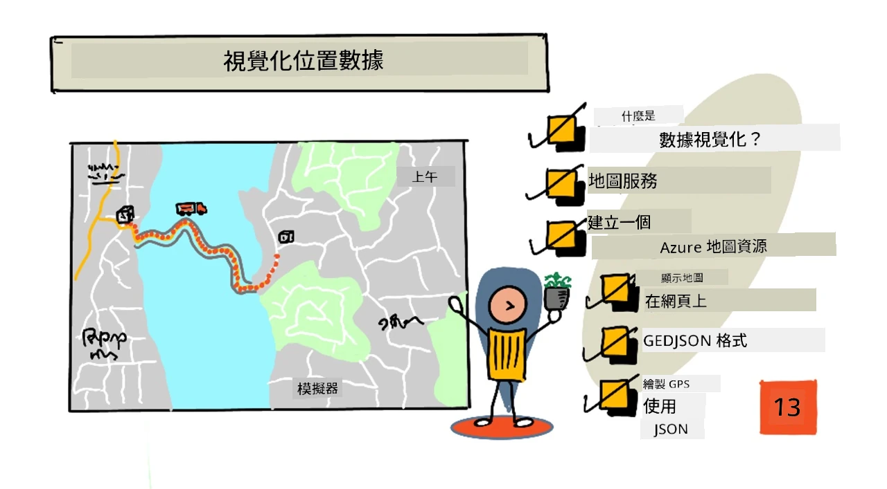
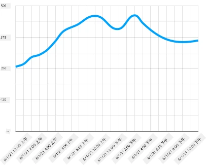
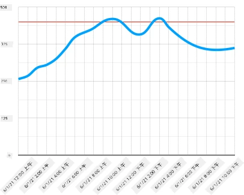
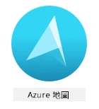
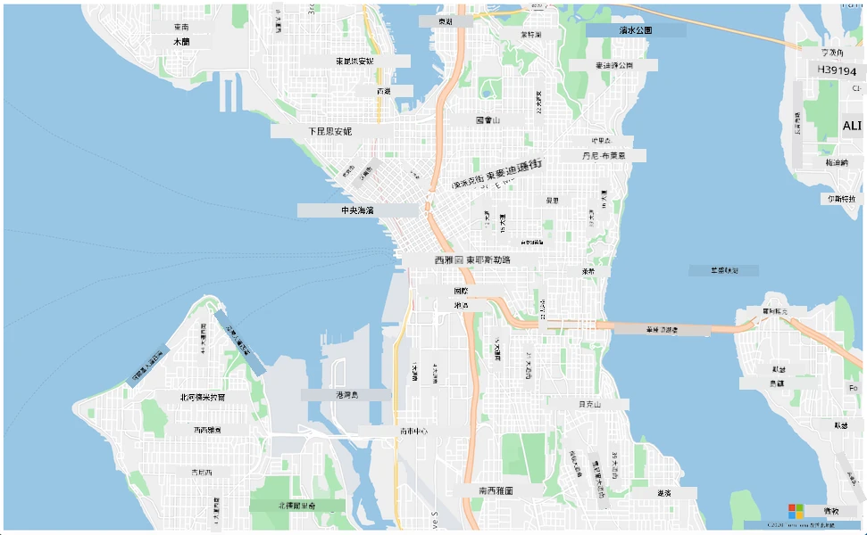
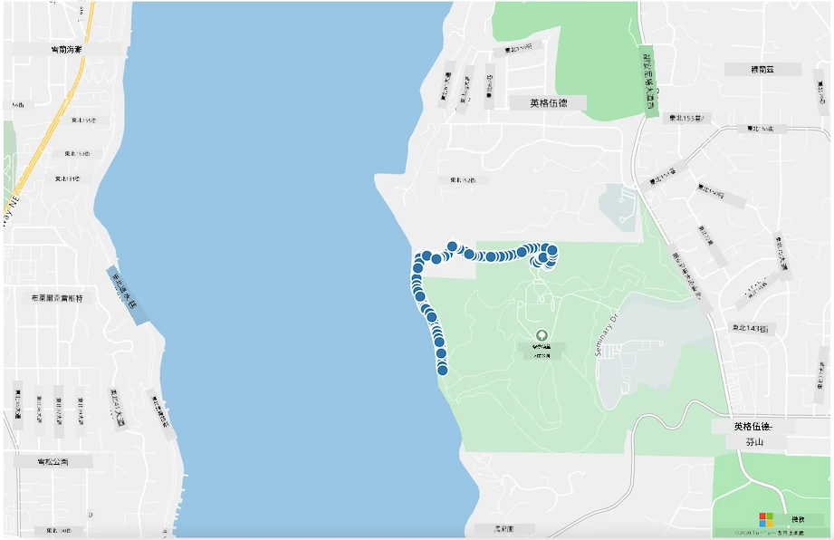

# 可視化位置數據



> 手繪筆記由 [Nitya Narasimhan](https://github.com/nitya) 提供。點擊圖片查看更大版本。

這段影片概述了 Azure Maps 與 IoT 的功能，這是本課程將涵蓋的內容。

[](https://www.youtube.com/watch?v=P5i2GFTtb2s)

> 🎥 點擊上方圖片觀看影片

## 課前測驗

[課前測驗](https://black-meadow-040d15503.1.azurestaticapps.net/quiz/25)

## 簡介

在上一課中，你學習了如何從感測器獲取 GPS 數據並使用無伺服器代碼將其保存到雲端的存儲容器中。現在，你將學習如何在 Azure 地圖上可視化這些點。你將學習如何在網頁上創建地圖，了解 GeoJSON 數據格式，以及如何使用它在地圖上繪製所有捕獲的 GPS 點。

在本課程中，我們將涵蓋：

* [什麼是數據可視化](../../../../../3-transport/lessons/3-visualize-location-data)
* [地圖服務](../../../../../3-transport/lessons/3-visualize-location-data)
* [創建 Azure Maps 資源](../../../../../3-transport/lessons/3-visualize-location-data)
* [在網頁上顯示地圖](../../../../../3-transport/lessons/3-visualize-location-data)
* [GeoJSON 格式](../../../../../3-transport/lessons/3-visualize-location-data)
* [使用 GeoJSON 在地圖上繪製 GPS 數據](../../../../../3-transport/lessons/3-visualize-location-data)

> 💁 本課程將涉及少量 HTML 和 JavaScript。如果你想了解更多關於使用 HTML 和 JavaScript 進行網頁開發的內容，請查看 [Web development for beginners](https://github.com/microsoft/Web-Dev-For-Beginners)。

## 什麼是數據可視化

數據可視化，顧名思義，是以更容易讓人類理解的方式來可視化數據。它通常與圖表和圖形相關，但任何以圖像方式呈現數據以幫助人類更好地理解數據並做出決策的方式都屬於數據可視化。

舉個簡單的例子——在農場項目中，你捕獲了土壤濕度的數據。以下是 2021 年 6 月 1 日每小時捕獲的土壤濕度數據表：

| 日期             | 讀數   |
| ---------------- | ------: |
| 01/06/2021 00:00 |     257 |
| 01/06/2021 01:00 |     268 |
| 01/06/2021 02:00 |     295 |
| 01/06/2021 03:00 |     305 |
| 01/06/2021 04:00 |     325 |
| 01/06/2021 05:00 |     359 |
| 01/06/2021 06:00 |     398 |
| 01/06/2021 07:00 |     410 |
| 01/06/2021 08:00 |     429 |
| 01/06/2021 09:00 |     451 |
| 01/06/2021 10:00 |     460 |
| 01/06/2021 11:00 |     452 |
| 01/06/2021 12:00 |     420 |
| 01/06/2021 13:00 |     408 |
| 01/06/2021 14:00 |     431 |
| 01/06/2021 15:00 |     462 |
| 01/06/2021 16:00 |     432 |
| 01/06/2021 17:00 |     402 |
| 01/06/2021 18:00 |     387 |
| 01/06/2021 19:00 |     360 |
| 01/06/2021 20:00 |     358 |
| 01/06/2021 21:00 |     354 |
| 01/06/2021 22:00 |     356 |
| 01/06/2021 23:00 |     362 |

對人類而言，理解這些數據可能很困難。這是一堆沒有意義的數字。作為可視化這些數據的第一步，可以將其繪製成折線圖：



這可以進一步增強，例如添加一條線來指示自動灌溉系統在土壤濕度讀數達到 450 時啟動：



這張圖表可以非常快速地顯示土壤濕度水平以及灌溉系統啟動的時間點。

圖表並不是唯一的數據可視化工具。追蹤天氣的 IoT 設備可以通過網頁應用或移動應用使用符號來可視化天氣條件，例如用雲朵符號表示多雲天氣，用雨雲符號表示下雨天氣等等。可視化數據的方法有很多，有些是嚴肅的，有些是有趣的。

✅ 想一想你曾經見過的數據可視化方式。哪些方式最清晰，能讓你最快做出決策？

最好的可視化方式能讓人類快速做出決策。例如，展示工業機器的各種讀數的儀表牆可能很難處理，但當某些事情出錯時，閃爍的紅燈可以讓人類迅速做出決策。有時候，最好的可視化方式就是一盞閃爍的燈！

在處理 GPS 數據時，最清晰的可視化方式是將數據繪製在地圖上。例如，一張顯示送貨卡車的地圖可以幫助加工廠的工人了解卡車何時到達。如果這張地圖不僅顯示卡車當前位置的圖片，還提供卡車內容的概念，那麼加工廠的工人就可以相應地進行計劃——如果他們看到一輛冷藏卡車接近，他們就知道要準備冷藏空間。

## 地圖服務

使用地圖是一項有趣的練習，有許多選擇，例如 Bing Maps、Leaflet、Open Street Maps 和 Google Maps。在本課程中，你將學習 [Azure Maps](https://azure.microsoft.com/services/azure-maps/?WT.mc_id=academic-17441-jabenn) 以及如何使用它們顯示你的 GPS 數據。



Azure Maps 是“一組地理空間服務和 SDK，使用最新的地圖數據為網頁和移動應用提供地理背景。”開發者可以使用這些工具創建美觀的交互式地圖，這些地圖可以執行例如提供推薦交通路線、提供交通事故信息、室內導航、搜索功能、海拔信息、天氣服務等功能。

✅ 試試一些 [地圖代碼範例](https://docs.microsoft.com/samples/browse?WT.mc_id=academic-17441-jabenn&products=azure-maps)

你可以將地圖顯示為空白畫布、瓦片、衛星圖像、帶有道路疊加的衛星圖像、各種類型的灰度地圖、帶有陰影地形的地圖、夜景地圖以及高對比度地圖。通過與 [Azure Event Grid](https://azure.microsoft.com/services/event-grid/?WT.mc_id=academic-17441-jabenn) 集成，你可以在地圖上獲得實時更新。你可以啟用各種控件來控制地圖的行為和外觀，使地圖能夠對事件（例如捏合、拖動和點擊）做出反應。為了控制地圖的外觀，你可以添加包括氣泡、線條、多邊形、熱圖等的圖層。你選擇的 SDK 決定了你實現的地圖樣式。

你可以通過使用其 [REST API](https://docs.microsoft.com/javascript/api/azure-maps-rest/?WT.mc_id=academic-17441-jabenn&view=azure-maps-typescript-latest)、其 [Web SDK](https://docs.microsoft.com/azure/azure-maps/how-to-use-map-control?WT.mc_id=academic-17441-jabenn)，或者如果你正在構建移動應用，可以使用其 [Android SDK](https://docs.microsoft.com/azure/azure-maps/how-to-use-android-map-control-library?WT.mc_id=academic-17441-jabenn&pivots=programming-language-java-android) 來訪問 Azure Maps API。

在本課程中，你將使用 Web SDK 繪製地圖並顯示感測器的 GPS 位置路徑。

## 創建 Azure Maps 資源

第一步是創建一個 Azure Maps 帳戶。

### 任務 - 創建 Azure Maps 資源

1. 從終端或命令提示符運行以下命令，在你的 `gps-sensor` 資源組中創建一個 Azure Maps 資源：

    ```sh
    az maps account create --name gps-sensor \
                           --resource-group gps-sensor \
                           --accept-tos \
                           --sku S1
    ```

    這將創建一個名為 `gps-sensor` 的 Azure Maps 資源。使用的層級是 `S1`，這是一個付費層級，包含一系列功能，但提供了大量免費的調用。

    > 💁 要查看使用 Azure Maps 的成本，請查看 [Azure Maps 價格頁面](https://azure.microsoft.com/pricing/details/azure-maps/?WT.mc_id=academic-17441-jabenn)。

1. 你需要獲取地圖資源的 API 密鑰。使用以下命令獲取此密鑰：

    ```sh
    az maps account keys list --name gps-sensor \
                              --resource-group gps-sensor \
                              --output table
    ```

    複製 `PrimaryKey` 的值。

## 在網頁上顯示地圖

現在你可以進行下一步，在網頁上顯示地圖。我們將僅使用一個 `html` 文件來構建你的小型網頁應用；請記住，在生產或團隊環境中，你的網頁應用可能會有更多的組件！

### 任務 - 在網頁上顯示地圖

1. 在本地電腦的某個文件夾中創建一個名為 index.html 的文件。添加 HTML 標記以容納地圖：

    ```html
    <html>
    <head>
        <style>
            #myMap {
                width:100%;
                height:100%;
            }
        </style>
    </head>
    
    <body onload="init()">
        <div id="myMap"></div>
    </body>
    </html>
    ```

    地圖將加載到 `myMap` 的 `div` 中。一些樣式允許它跨越頁面的寬度和高度。

    > 🎓 `div` 是網頁的一個部分，可以命名和設置樣式。

1. 在開頭的 `<head>` 標籤下，添加一個外部樣式表來控制地圖顯示，以及一個來自 Web SDK 的外部腳本來管理其行為：

    ```html
    <link rel="stylesheet" href="https://atlas.microsoft.com/sdk/javascript/mapcontrol/2/atlas.min.css" type="text/css" />
    <script src="https://atlas.microsoft.com/sdk/javascript/mapcontrol/2/atlas.min.js"></script>
    ```

    此樣式表包含地圖外觀的設置，腳本文件包含加載地圖的代碼。添加此代碼類似於包含 C++ 標頭文件或導入 Python 模塊。

1. 在該腳本下方，添加一個腳本塊以啟動地圖。

    ```javascript
    <script type='text/javascript'>
        function init() {
            var map = new atlas.Map('myMap', {
                center: [-122.26473, 47.73444],
                zoom: 12,
                authOptions: {
                    authType: "subscriptionKey",
                    subscriptionKey: "<subscription_key>",

                }
            });
        }
    </script>
    ```

    將 `<subscription_key>` 替換為你的 Azure Maps 帳戶的 API 密鑰。

    如果你在網頁瀏覽器中打開你的 `index.html` 文件，你應該會看到一張地圖加載並聚焦在西雅圖地區。

    

    ✅ 試試更改縮放和中心參數來改變地圖顯示。你可以添加與數據的緯度和經度相對應的不同坐標來重新定位地圖。

> 💁 在本地工作網頁應用的更好方式是安裝 [http-server](https://www.npmjs.com/package/http-server)。你需要先安裝 [node.js](https://nodejs.org/) 和 [npm](https://www.npmjs.com/) 才能使用此工具。安裝這些工具後，你可以導航到 `index.html` 文件所在的位置並輸入 `http-server`。網頁應用將在本地網頁伺服器上打開 [http://127.0.0.1:8080/](http://127.0.0.1:8080/)。

## GeoJSON 格式

現在你已經設置了顯示地圖的網頁應用，接下來需要從存儲帳戶中提取 GPS 數據並在地圖上顯示一層標記。在此之前，讓我們來看看 Azure Maps 所需的 [GeoJSON](https://wikipedia.org/wiki/GeoJSON) 格式。

[GeoJSON](https://geojson.org/) 是一種開放標準的 JSON 規範，具有專門設計用於處理地理數據的特殊格式。你可以通過測試示例數據來了解它，使用 [geojson.io](https://geojson.io) 也是一個調試 GeoJSON 文件的有用工具。

示例 GeoJSON 數據如下所示：

```json
{
  "type": "FeatureCollection",
  "features": [
    {
      "type": "Feature",
      "geometry": {
        "type": "Point",
        "coordinates": [
          -2.10237979888916,
          57.164918677004714
        ]
      }
    }
  ]
}
```

特別需要注意的是數據如何嵌套在 `FeatureCollection` 中的 `Feature`。在該對象中可以找到 `geometry`，其中的 `coordinates` 指示緯度和經度。

✅ 在構建你的 GeoJSON 時，請注意對象中 `緯度` 和 `經度` 的順序，否則你的點將不會出現在正確的位置！GeoJSON 期望點的數據順序為 `lon,lat`，而不是 `lat,lon`。

`Geometry` 可以有不同的類型，例如單個點或多邊形。在此示例中，它是一個點，指定了兩個坐標：經度和緯度。
✅ Azure Maps 支援標準的 GeoJSON，並且提供一些[增強功能](https://docs.microsoft.com/azure/azure-maps/extend-geojson?WT.mc_id=academic-17441-jabenn)，包括繪製圓形和其他幾何圖形的能力。

## 使用 GeoJSON 在地圖上繪製 GPS 數據

現在您已準備好使用上一課中建立的存儲中的數據。提醒一下，這些數據存儲為 blob 存儲中的多個文件，因此您需要檢索這些文件並解析它們，以便 Azure Maps 可以使用這些數據。

### 任務 - 配置存儲以便從網頁訪問

如果您嘗試調用存儲以獲取數據，可能會驚訝地發現瀏覽器的控制台中出現錯誤。這是因為您需要在此存儲上設置 [CORS](https://developer.mozilla.org/docs/Web/HTTP/CORS) 權限，以允許外部網頁應用程序讀取其數據。

> 🎓 CORS 代表 "跨來源資源共享"（Cross-Origin Resource Sharing），通常需要在 Azure 中明確設置以確保安全性。它可以防止您未預期的網站訪問您的數據。

1. 執行以下命令以啟用 CORS：

    ```sh
    az storage cors add --methods GET \
                        --origins "*" \
                        --services b \
                        --account-name <storage_name> \
                        --account-key <key1>
    ```

    將 `<storage_name>` 替換為您的存儲帳戶名稱。將 `<key1>` 替換為您的存儲帳戶的帳戶密鑰。

    此命令允許任何網站（通配符 `*` 表示任何網站）發出 *GET* 請求，即從您的存儲帳戶獲取數據。`--services b` 表示僅對 blob 應用此設置。

### 任務 - 從存儲中加載 GPS 數據

1. 將 `init` 函數的全部內容替換為以下代碼：

    ```javascript
    fetch("https://<storage_name>.blob.core.windows.net/gps-data/?restype=container&comp=list")
        .then(response => response.text())
        .then(str => new window.DOMParser().parseFromString(str, "text/xml"))
        .then(xml => {
            let blobList = Array.from(xml.querySelectorAll("Url"));
                blobList.forEach(async blobUrl => {
                    loadJSON(blobUrl.innerHTML)                
        });
    })
    .then( response => {
        map = new atlas.Map('myMap', {
            center: [-122.26473, 47.73444],
            zoom: 14,
            authOptions: {
                authType: "subscriptionKey",
                subscriptionKey: "<subscription_key>",
    
            }
        });
        map.events.add('ready', function () {
            var source = new atlas.source.DataSource();
            map.sources.add(source);
            map.layers.add(new atlas.layer.BubbleLayer(source));
            source.add(features);
        })
    })
    ```

    將 `<storage_name>` 替換為您的存儲帳戶名稱。將 `<subscription_key>` 替換為您的 Azure Maps 帳戶的 API 密鑰。

    這裡發生了幾件事。首先，代碼使用基於您的存儲帳戶名稱構建的 URL 端點從 blob 容器中獲取您的 GPS 數據。此 URL 從 `gps-data` 中檢索，表明資源類型是容器（`restype=container`），並列出所有 blob 的信息。此列表不會返回 blob 本身，但會返回每個 blob 的 URL，可用於加載 blob 數據。

    > 💁 您可以將此 URL 放入瀏覽器中查看容器中所有 blob 的詳細信息。每個項目都會有一個 `Url` 屬性，您也可以在瀏覽器中加載該屬性以查看 blob 的內容。

    然後，代碼加載每個 blob，調用 `loadJSON` 函數（稍後會創建）。接著，它創建地圖控件，並向 `ready` 事件添加代碼。此事件在地圖顯示於網頁上時被調用。

    `ready` 事件創建了一個 Azure Maps 數據源——一個包含 GeoJSON 數據的容器，稍後將填充此數據。此數據源隨後用於創建一個氣泡圖層——即地圖上的一組圓圈，圓心位於 GeoJSON 中的每個點。

1. 在 `init` 函數下方的腳本塊中添加 `loadJSON` 函數：

    ```javascript
    var map, features;

    function loadJSON(file) {
        var xhr = new XMLHttpRequest();
        features = [];
        xhr.onreadystatechange = function () {
            if (xhr.readyState === XMLHttpRequest.DONE) {
                if (xhr.status === 200) {
                    gps = JSON.parse(xhr.responseText)
                    features.push(
                        new atlas.data.Feature(new atlas.data.Point([parseFloat(gps.gps.lon), parseFloat(gps.gps.lat)]))
                    )
                }
            }
        };
        xhr.open("GET", file, true);
        xhr.send();
    }    
    ```

    此函數由 fetch 例程調用，用於解析 JSON 數據並將其轉換為經度和緯度坐標作為 geoJSON。
    解析完成後，數據被設置為 geoJSON 的 `Feature` 部分。地圖將被初始化，並且小圓圈將出現在您的數據所繪製的路徑周圍：

1. 在瀏覽器中加載 HTML 頁面。它將加載地圖，然後從存儲中加載所有 GPS 數據並將其繪製在地圖上。

    

> 💁 您可以在 [code](../../../../../3-transport/lessons/3-visualize-location-data/code) 文件夾中找到此代碼。

---

## 🚀 挑戰

能夠在地圖上顯示靜態數據作為標記非常不錯。您能否增強此網頁應用程序，添加動畫並顯示標記隨時間移動的路徑，使用帶有時間戳的 JSON 文件？這裡有一些[範例](https://azuremapscodesamples.azurewebsites.net/)展示如何在地圖中使用動畫。

## 課後測驗

[課後測驗](https://black-meadow-040d15503.1.azurestaticapps.net/quiz/26)

## 回顧與自學

Azure Maps 對於處理 IoT 設備特別有用。

* 在 [Microsoft Docs 的 Azure Maps 文件](https://docs.microsoft.com/azure/azure-maps/tutorial-iot-hub-maps?WT.mc_id=academic-17441-jabenn) 中研究一些用途。
* 通過 [Microsoft Learn 上的 Azure Maps 自學模組](https://docs.microsoft.com/learn/modules/create-your-first-app-with-azure-maps/?WT.mc_id=academic-17441-jabenn) 深入了解地圖製作和路徑點。

## 作業

[部署您的應用程序](assignment.md)

**免責聲明**：  
本文件使用 AI 翻譯服務 [Co-op Translator](https://github.com/Azure/co-op-translator) 進行翻譯。我們致力於提供準確的翻譯，但請注意，自動翻譯可能包含錯誤或不準確之處。應以原始語言的文件作為權威來源。對於關鍵資訊，建議尋求專業人工翻譯。我們對因使用此翻譯而引起的任何誤解或錯誤解釋概不負責。