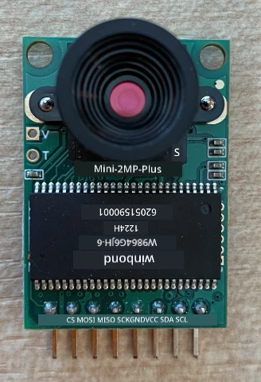
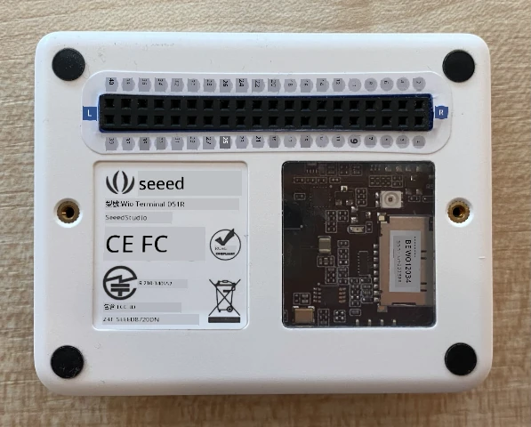
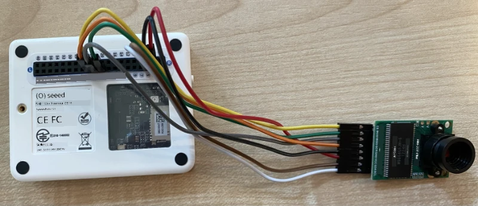

# 捕捉影像 - Wio Terminal

在本課程中，您將為 Wio Terminal 添加一個相機，並從中捕捉影像。

## 硬體

Wio Terminal 需要一個相機。

您將使用的相機是 [ArduCam Mini 2MP Plus](https://www.arducam.com/product/arducam-2mp-spi-camera-b0067-arduino/)。這是一款基於 OV2640 影像感測器的 2 百萬像素相機。它通過 SPI 介面進行影像捕捉，並使用 I2C 配置感測器。

## 連接相機

ArduCam 沒有 Grove 插座，而是通過 Wio Terminal 的 GPIO 引腳連接到 SPI 和 I2C 匯流排。

### 任務 - 連接相機

連接相機。



1. ArduCam 底部的引腳需要連接到 Wio Terminal 的 GPIO 引腳。為了更容易找到正確的引腳，將 Wio Terminal 附帶的 GPIO 引腳貼紙貼在引腳周圍：

    

1. 使用跳線，進行以下連接：

    | ArduCAM 引腳 | Wio Terminal 引腳 | 描述                                   |
    | ------------ | ----------------- | -------------------------------------- |
    | CS           | 24 (SPI_CS)       | SPI 芯片選擇                           |
    | MOSI         | 19 (SPI_MOSI)     | SPI 控制器輸出，外設輸入              |
    | MISO         | 21 (SPI_MISO)     | SPI 控制器輸入，外設輸出              |
    | SCK          | 23 (SPI_SCLK)     | SPI 串行時鐘                          |
    | GND          | 6 (GND)           | 地線 - 0V                             |
    | VCC          | 4 (5V)            | 5V 電源供應                           |
    | SDA          | 3 (I2C1_SDA)      | I2C 串行數據                          |
    | SCL          | 5 (I2C1_SCL)      | I2C 串行時鐘                          |

    

    GND 和 VCC 連接為 ArduCam 提供 5V 電源。它以 5V 運行，不同於以 3V 運行的 Grove 感測器。此電源直接來自為設備供電的 USB-C 連接。

    > 💁 對於 SPI 連接，ArduCam 上的引腳標籤和 Wio Terminal 引腳名稱在程式碼中仍使用舊命名規則。本課程中的指示將使用新命名規則，除非程式碼中使用了引腳名稱。

1. 現在可以將 Wio Terminal 連接到您的電腦。

## 程式設置以連接相機

現在可以為 Wio Terminal 編程以使用附加的 ArduCAM 相機。

### 任務 - 程式設置以連接相機

1. 使用 PlatformIO 創建一個全新的 Wio Terminal 專案。將此專案命名為 `fruit-quality-detector`。在 `setup` 函數中添加程式碼以配置串口。

1. 添加程式碼以連接 WiFi，並將您的 WiFi 憑據放在名為 `config.h` 的檔案中。不要忘記將所需的庫添加到 `platformio.ini` 檔案中。

1. ArduCam 庫並未作為 Arduino 庫提供，無法直接從 `platformio.ini` 檔案中安裝。相反，您需要從其 GitHub 頁面安裝源代碼。您可以通過以下方式獲取：

    * 從 [https://github.com/ArduCAM/Arduino.git](https://github.com/ArduCAM/Arduino.git) 克隆倉庫
    * 前往 GitHub 上的倉庫 [github.com/ArduCAM/Arduino](https://github.com/ArduCAM/Arduino) 並從 **Code** 按鈕下載代碼為 zip 檔案

1. 您只需要代碼中的 `ArduCAM` 資料夾。將整個資料夾複製到您的專案中的 `lib` 資料夾。

    > ⚠️ 必須複製整個資料夾，因此代碼位於 `lib/ArduCam` 中。不要僅僅將 `ArduCam` 資料夾的內容複製到 `lib` 資料夾中，而是將整個資料夾複製過去。

1. ArduCam 庫代碼適用於多種類型的相機。您想要使用的相機類型是通過編譯器標誌配置的——這使得構建的庫儘可能小，通過移除您未使用的相機的代碼。要將庫配置為 OV2640 相機，請在 `platformio.ini` 檔案的末尾添加以下內容：

    ```ini
    build_flags =
        -DARDUCAM_SHIELD_V2
        -DOV2640_CAM
    ```

    這設置了兩個編譯器標誌：

      * `ARDUCAM_SHIELD_V2` 告訴庫相機位於 Arduino 板上，稱為擴展板。
      * `OV2640_CAM` 告訴庫僅包含 OV2640 相機的代碼。

1. 在 `src` 資料夾中添加一個名為 `camera.h` 的標頭檔案。此檔案將包含與相機通信的代碼。將以下代碼添加到此檔案中：

    ```cpp
    #pragma once
    
    #include <ArduCAM.h>
    #include <Wire.h>
    
    class Camera
    {
    public:
        Camera(int format, int image_size) : _arducam(OV2640, PIN_SPI_SS)
        {
            _format = format;
            _image_size = image_size;
        }
    
        bool init()
        {
            // Reset the CPLD
            _arducam.write_reg(0x07, 0x80);
            delay(100);
    
            _arducam.write_reg(0x07, 0x00);
            delay(100);
    
            // Check if the ArduCAM SPI bus is OK
            _arducam.write_reg(ARDUCHIP_TEST1, 0x55);
            if (_arducam.read_reg(ARDUCHIP_TEST1) != 0x55)
            {
                return false;
            }
                
            // Change MCU mode
            _arducam.set_mode(MCU2LCD_MODE);
    
            uint8_t vid, pid;
    
            // Check if the camera module type is OV2640
            _arducam.wrSensorReg8_8(0xff, 0x01);
            _arducam.rdSensorReg8_8(OV2640_CHIPID_HIGH, &vid);
            _arducam.rdSensorReg8_8(OV2640_CHIPID_LOW, &pid);
            if ((vid != 0x26) && ((pid != 0x41) || (pid != 0x42)))
            {
                return false;
            }
            
            _arducam.set_format(_format);
            _arducam.InitCAM();
            _arducam.OV2640_set_JPEG_size(_image_size);
            _arducam.OV2640_set_Light_Mode(Auto);
            _arducam.OV2640_set_Special_effects(Normal);
            delay(1000);
    
            return true;
        }
    
        void startCapture()
        {
            _arducam.flush_fifo();
            _arducam.clear_fifo_flag();
            _arducam.start_capture();
        }
    
        bool captureReady()
        {
            return _arducam.get_bit(ARDUCHIP_TRIG, CAP_DONE_MASK);
        }
    
        bool readImageToBuffer(byte **buffer, uint32_t &buffer_length)
        {
            if (!captureReady()) return false;
    
            // Get the image file length
            uint32_t length = _arducam.read_fifo_length();
            buffer_length = length;
    
            if (length >= MAX_FIFO_SIZE)
            {
                return false;
            }
            if (length == 0)
            {
                return false;
            }
    
            // create the buffer
            byte *buf = new byte[length];
    
            uint8_t temp = 0, temp_last = 0;
            int i = 0;
            uint32_t buffer_pos = 0;
            bool is_header = false;
    
            _arducam.CS_LOW();
            _arducam.set_fifo_burst();
            
            while (length--)
            {
                temp_last = temp;
                temp = SPI.transfer(0x00);
                //Read JPEG data from FIFO
                if ((temp == 0xD9) && (temp_last == 0xFF)) //If find the end ,break while,
                {
                    buf[buffer_pos] = temp;
    
                    buffer_pos++;
                    i++;
                    
                    _arducam.CS_HIGH();
                }
                if (is_header == true)
                {
                    //Write image data to buffer if not full
                    if (i < 256)
                    {
                        buf[buffer_pos] = temp;
                        buffer_pos++;
                        i++;
                    }
                    else
                    {
                        _arducam.CS_HIGH();
    
                        i = 0;
                        buf[buffer_pos] = temp;
    
                        buffer_pos++;
                        i++;
    
                        _arducam.CS_LOW();
                        _arducam.set_fifo_burst();
                    }
                }
                else if ((temp == 0xD8) & (temp_last == 0xFF))
                {
                    is_header = true;
    
                    buf[buffer_pos] = temp_last;
                    buffer_pos++;
                    i++;
    
                    buf[buffer_pos] = temp;
                    buffer_pos++;
                    i++;
                }
            }
            
            _arducam.clear_fifo_flag();
    
            _arducam.set_format(_format);
            _arducam.InitCAM();
            _arducam.OV2640_set_JPEG_size(_image_size);
    
            // return the buffer
            *buffer = buf;
        }
    
    private:
        ArduCAM _arducam;
        int _format;
        int _image_size;
    };
    ```

    這是使用 ArduCam 庫配置相機並在需要時通過 SPI 匯流排提取影像的低階代碼。此代碼非常特定於 ArduCam，因此您目前不需要擔心其工作原理。

1. 在 `main.cpp` 中，在其他 `include` 語句下方添加以下代碼以包含此新檔案並創建相機類的實例：

    ```cpp
    #include "camera.h"

    Camera camera = Camera(JPEG, OV2640_640x480);
    ```

    這創建了一個 `Camera`，以 JPEG 格式保存影像，解析度為 640x480。雖然支持更高的解析度（最高 3280x2464），但影像分類器使用的影像尺寸要小得多（227x227），因此無需捕捉和傳送更大的影像。

1. 在此下方添加以下代碼以定義設置相機的函數：

    ```cpp
    void setupCamera()
    {
        pinMode(PIN_SPI_SS, OUTPUT);
        digitalWrite(PIN_SPI_SS, HIGH);
    
        Wire.begin();
        SPI.begin();
    
        if (!camera.init())
        {
            Serial.println("Error setting up the camera!");
        }
    }
    ```

    此 `setupCamera` 函數首先將 SPI 芯片選擇引腳 (`PIN_SPI_SS`) 配置為高電平，使 Wio Terminal 成為 SPI 控制器。然後啟動 I2C 和 SPI 匯流排。最後，它初始化相機類，配置相機感測器設置並確保所有連接正確。

1. 在 `setup` 函數的末尾調用此函數：

    ```cpp
    setupCamera();
    ```

1. 編譯並上傳此代碼，並檢查串口監視器的輸出。如果看到 `Error setting up the camera!`，請檢查接線以確保所有電纜正確連接 ArduCam 的引腳和 Wio Terminal 的 GPIO 引腳，並且所有跳線電纜都正確插入。

## 捕捉影像

現在可以為 Wio Terminal 編程以在按下按鈕時捕捉影像。

### 任務 - 捕捉影像

1. 微控制器會不斷運行您的代碼，因此很難在不響應感測器的情況下觸發某些操作，例如拍照。Wio Terminal 有按鈕，因此可以設置相機以由其中一個按鈕觸發。將以下代碼添加到 `setup` 函數的末尾，以配置 C 按鈕（頂部的三個按鈕之一，最靠近電源開關的按鈕）。

    

    ```cpp
    pinMode(WIO_KEY_C, INPUT_PULLUP);
    ```

    `INPUT_PULLUP` 模式本質上反轉了輸入。例如，通常按鈕在未按下時會發送低信號，按下時會發送高信號。設置為 `INPUT_PULLUP` 時，它們在未按下時發送高信號，按下時發送低信號。

1. 在 `loop` 函數之前添加一個空函數以響應按鈕按下：

    ```cpp
    void buttonPressed()
    {
        
    }
    ```

1. 在按鈕按下時在 `loop` 方法中調用此函數：

    ```cpp
    void loop()
    {
        if (digitalRead(WIO_KEY_C) == LOW)
        {
            buttonPressed();
            delay(2000);
        }
    
        delay(200);
    }
    ```

    此鍵檢查按鈕是否被按下。如果按下，則調用 `buttonPressed` 函數，並且循環延遲 2 秒。這是為了給按鈕釋放留出時間，以免長按被註冊兩次。

    > 💁 Wio Terminal 上的按鈕設置為 `INPUT_PULLUP`，因此在未按下時發送高信號，按下時發送低信號。

1. 將以下代碼添加到 `buttonPressed` 函數中：

    ```cpp
    camera.startCapture();
 
    while (!camera.captureReady())
        delay(100);

    Serial.println("Image captured");

    byte *buffer;
    uint32_t length;

    if (camera.readImageToBuffer(&buffer, length))
    {
        Serial.print("Image read to buffer with length ");
        Serial.println(length);

        delete(buffer);
    }
    ```

    此代碼通過調用 `startCapture` 開始相機捕捉。相機硬體不會在您請求時返回數據，而是您發送指令開始捕捉，相機會在背景中捕捉影像、轉換為 JPEG，並將其存儲在相機本地緩衝區中。然後，`captureReady` 調用檢查影像捕捉是否完成。

    捕捉完成後，影像數據通過 `readImageToBuffer` 調用從相機的緩衝區複製到本地緩衝區（字節數組）。然後將緩衝區的長度發送到串口監視器。

1. 編譯並上傳此代碼，並檢查串口監視器上的輸出。每次按下 C 按鈕時，將捕捉一張影像，並在串口監視器上看到影像大小。

    ```output
    Connecting to WiFi..
    Connected!
    Image captured
    Image read to buffer with length 9224
    Image captured
    Image read to buffer with length 11272
    ```

    不同的影像會有不同的大小。它們被壓縮為 JPEG，給定解析度的 JPEG 檔案大小取決於影像中的內容。

> 💁 您可以在 [code-camera/wio-terminal](../../../../../4-manufacturing/lessons/2-check-fruit-from-device/code-camera/wio-terminal) 資料夾中找到此代碼。

😀 您已成功使用 Wio Terminal 捕捉影像。

## 可選 - 使用 SD 卡驗證相機影像

查看相機捕捉的影像最簡單的方法是將它們寫入 Wio Terminal 中的 SD 卡，然後在您的電腦上查看。如果您有多餘的 microSD 卡以及電腦上的 microSD 卡插槽或適配器，請執行此步驟。

Wio Terminal 僅支持最大 16GB 的 microSD 卡。如果您有更大的 SD 卡，則無法使用。

### 任務 - 使用 SD 卡驗證相機影像

1. 使用電腦上的相關應用程式（macOS 上的 Disk Utility、Windows 上的 File Explorer 或 Linux 上的命令行工具）將 microSD 卡格式化為 FAT32 或 exFAT。

1. 將 microSD 卡插入電源開關下方的插槽。確保完全插入直到卡扣住並保持到位，您可能需要使用指甲或細工具推入。

1. 在 `main.cpp` 檔案的頂部添加以下 include 語句：

    ```cpp
    #include "SD/Seeed_SD.h"
    #include <Seeed_FS.h>
    ```

1. 在 `setup` 函數之前添加以下函數：

    ```cpp
    void setupSDCard()
    {
        while (!SD.begin(SDCARD_SS_PIN, SDCARD_SPI))
        {
            Serial.println("SD Card Error");
        }
    }
    ```

    此函數使用 SPI 匯流排配置 SD 卡。

1. 在 `setup` 函數中調用此函數：

    ```cpp
    setupSDCard();
    ```

1. 在 `buttonPressed` 函數之前添加以下代碼：

    ```cpp
    int fileNum = 1;

    void saveToSDCard(byte *buffer, uint32_t length)
    {
        char buff[16];
        sprintf(buff, "%d.jpg", fileNum);
        fileNum++;
    
        File outFile = SD.open(buff, FILE_WRITE );
        outFile.write(buffer, length);
        outFile.close();

        Serial.print("Image written to file ");
        Serial.println(buff);
    }
    ```

    這定義了一個用於檔案計數的全域變數。此變數用於影像檔案名稱，因此可以捕捉多個影像並使用遞增的檔案名稱 - `1.jpg`、`2.jpg` 等。

    然後定義了 `saveToSDCard` 函數，該函數接收一個字節數據緩衝區及其長度。使用檔案計數創建檔案名稱，並遞增檔案計數以準備下一個檔案。然後將緩衝區中的二進制數據寫入檔案。

1. 在 `buttonPressed` 函數中調用 `saveToSDCard` 函數。此調用應位於刪除緩衝區之前：

    ```cpp
    Serial.print("Image read to buffer with length ");
    Serial.println(length);

    saveToSDCard(buffer, length);
    
    delete(buffer);
    ```

1. 編譯並上傳此代碼，並檢查串口監視器上的輸出。每次按下 C 按鈕時，將捕捉一張影像並保存到 SD 卡。

    ```output
    Connecting to WiFi..
    Connected!
    Image captured
    Image read to buffer with length 16392
    Image written to file 1.jpg
    Image captured
    Image read to buffer with length 14344
    Image written to file 2.jpg
    ```

1. 關閉 microSD 卡並通過稍微推入並釋放來彈出，卡片會彈出。您可能需要使用細工具執行此操作。將 microSD 卡插入您的電腦以查看影像。

    
💁 相機的白平衡可能需要幾張圖片來進行自我調整。您會根據拍攝的圖片顏色注意到這一點，前幾張可能會顯得顏色不準。您可以通過修改程式碼，在 `setup` 函數中拍攝幾張被忽略的圖片來解決這個問題。


**免責聲明**：  
本文件使用 AI 翻譯服務 [Co-op Translator](https://github.com/Azure/co-op-translator) 進行翻譯。儘管我們努力確保翻譯的準確性，但請注意，自動翻譯可能包含錯誤或不準確之處。原始文件的母語版本應被視為權威來源。對於關鍵資訊，建議使用專業人工翻譯。我們對因使用此翻譯而引起的任何誤解或錯誤解釋不承擔責任。