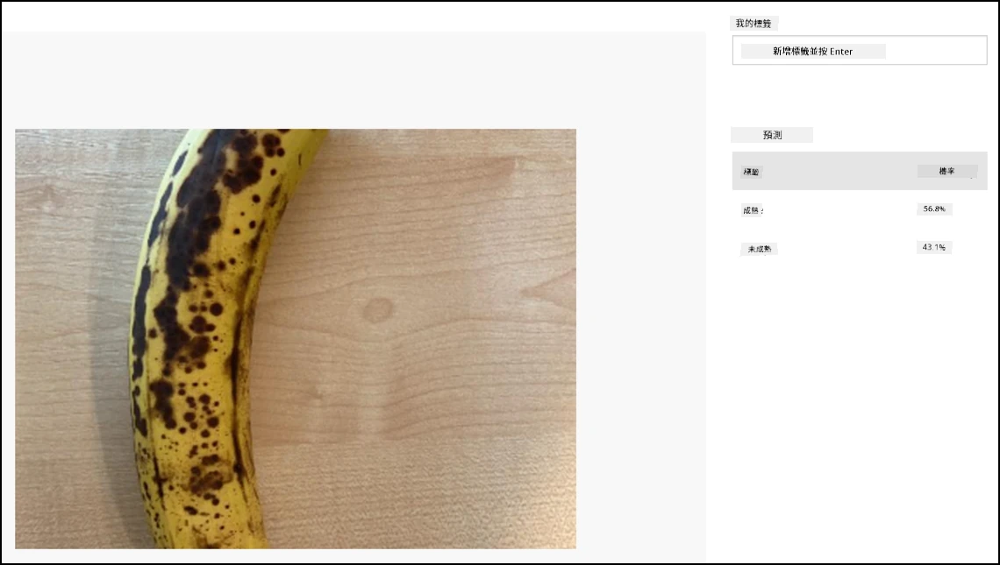

# 分類圖片 - Wio Terminal

在本課程的這部分，您將把相機拍攝的圖片發送到 Custom Vision 服務進行分類。

## 分類圖片

Custom Vision 服務提供了一個 REST API，您可以從 Wio Terminal 調用該 API 來分類圖片。這個 REST API 通過 HTTPS 連接（安全的 HTTP 連接）進行訪問。

在與 HTTPS 端點交互時，客戶端代碼需要從被訪問的服務器請求公鑰證書，並使用該證書加密傳輸的數據。您的網頁瀏覽器會自動完成這一過程，但微控制器不會。您需要手動請求該證書，並使用它來創建與 REST API 的安全連接。這些證書是固定的，因此一旦獲取證書，您可以將其硬編碼到應用程序中。

這些證書包含公鑰，無需保密。您可以在源代碼中使用它們，並在 GitHub 等公共平台上分享。

### 任務 - 設置 SSL 客戶端

1. 如果尚未打開，請打開 `fruit-quality-detector` 應用程序項目。

1. 打開 `config.h` 標頭文件，並添加以下內容：

    ```cpp
    const char *CERTIFICATE =
        "-----BEGIN CERTIFICATE-----\r\n"
        "MIIF8zCCBNugAwIBAgIQAueRcfuAIek/4tmDg0xQwDANBgkqhkiG9w0BAQwFADBh\r\n"
        "MQswCQYDVQQGEwJVUzEVMBMGA1UEChMMRGlnaUNlcnQgSW5jMRkwFwYDVQQLExB3\r\n"
        "d3cuZGlnaWNlcnQuY29tMSAwHgYDVQQDExdEaWdpQ2VydCBHbG9iYWwgUm9vdCBH\r\n"
        "MjAeFw0yMDA3MjkxMjMwMDBaFw0yNDA2MjcyMzU5NTlaMFkxCzAJBgNVBAYTAlVT\r\n"
        "MR4wHAYDVQQKExVNaWNyb3NvZnQgQ29ycG9yYXRpb24xKjAoBgNVBAMTIU1pY3Jv\r\n"
        "c29mdCBBenVyZSBUTFMgSXNzdWluZyBDQSAwNjCCAiIwDQYJKoZIhvcNAQEBBQAD\r\n"
        "ggIPADCCAgoCggIBALVGARl56bx3KBUSGuPc4H5uoNFkFH4e7pvTCxRi4j/+z+Xb\r\n"
        "wjEz+5CipDOqjx9/jWjskL5dk7PaQkzItidsAAnDCW1leZBOIi68Lff1bjTeZgMY\r\n"
        "iwdRd3Y39b/lcGpiuP2d23W95YHkMMT8IlWosYIX0f4kYb62rphyfnAjYb/4Od99\r\n"
        "ThnhlAxGtfvSbXcBVIKCYfZgqRvV+5lReUnd1aNjRYVzPOoifgSx2fRyy1+pO1Uz\r\n"
        "aMMNnIOE71bVYW0A1hr19w7kOb0KkJXoALTDDj1ukUEDqQuBfBxReL5mXiu1O7WG\r\n"
        "0vltg0VZ/SZzctBsdBlx1BkmWYBW261KZgBivrql5ELTKKd8qgtHcLQA5fl6JB0Q\r\n"
        "gs5XDaWehN86Gps5JW8ArjGtjcWAIP+X8CQaWfaCnuRm6Bk/03PQWhgdi84qwA0s\r\n"
        "sRfFJwHUPTNSnE8EiGVk2frt0u8PG1pwSQsFuNJfcYIHEv1vOzP7uEOuDydsmCjh\r\n"
        "lxuoK2n5/2aVR3BMTu+p4+gl8alXoBycyLmj3J/PUgqD8SL5fTCUegGsdia/Sa60\r\n"
        "N2oV7vQ17wjMN+LXa2rjj/b4ZlZgXVojDmAjDwIRdDUujQu0RVsJqFLMzSIHpp2C\r\n"
        "Zp7mIoLrySay2YYBu7SiNwL95X6He2kS8eefBBHjzwW/9FxGqry57i71c2cDAgMB\r\n"
        "AAGjggGtMIIBqTAdBgNVHQ4EFgQU1cFnOsKjnfR3UltZEjgp5lVou6UwHwYDVR0j\r\n"
        "BBgwFoAUTiJUIBiV5uNu5g/6+rkS7QYXjzkwDgYDVR0PAQH/BAQDAgGGMB0GA1Ud\r\n"
        "JQQWMBQGCCsGAQUFBwMBBggrBgEFBQcDAjASBgNVHRMBAf8ECDAGAQH/AgEAMHYG\r\n"
        "CCsGAQUFBwEBBGowaDAkBggrBgEFBQcwAYYYaHR0cDovL29jc3AuZGlnaWNlcnQu\r\n"
        "Y29tMEAGCCsGAQUFBzAChjRodHRwOi8vY2FjZXJ0cy5kaWdpY2VydC5jb20vRGln\r\n"
        "aUNlcnRHbG9iYWxSb290RzIuY3J0MHsGA1UdHwR0MHIwN6A1oDOGMWh0dHA6Ly9j\r\n"
        "cmwzLmRpZ2ljZXJ0LmNvbS9EaWdpQ2VydEdsb2JhbFJvb3RHMi5jcmwwN6A1oDOG\r\n"
        "MWh0dHA6Ly9jcmw0LmRpZ2ljZXJ0LmNvbS9EaWdpQ2VydEdsb2JhbFJvb3RHMi5j\r\n"
        "cmwwHQYDVR0gBBYwFDAIBgZngQwBAgEwCAYGZ4EMAQICMBAGCSsGAQQBgjcVAQQD\r\n"
        "AgEAMA0GCSqGSIb3DQEBDAUAA4IBAQB2oWc93fB8esci/8esixj++N22meiGDjgF\r\n"
        "+rA2LUK5IOQOgcUSTGKSqF9lYfAxPjrqPjDCUPHCURv+26ad5P/BYtXtbmtxJWu+\r\n"
        "cS5BhMDPPeG3oPZwXRHBJFAkY4O4AF7RIAAUW6EzDflUoDHKv83zOiPfYGcpHc9s\r\n"
        "kxAInCedk7QSgXvMARjjOqdakor21DTmNIUotxo8kHv5hwRlGhBJwps6fEVi1Bt0\r\n"
        "trpM/3wYxlr473WSPUFZPgP1j519kLpWOJ8z09wxay+Br29irPcBYv0GMXlHqThy\r\n"
        "8y4m/HyTQeI2IMvMrQnwqPpY+rLIXyviI2vLoI+4xKE4Rn38ZZ8m\r\n"
        "-----END CERTIFICATE-----\r\n";
    ```

    這是 *Microsoft Azure DigiCert Global Root G2 證書*，它是許多 Azure 服務全球使用的證書之一。

    > 💁 要查看這是否是要使用的證書，請在 macOS 或 Linux 上運行以下命令。如果您使用的是 Windows，可以通過 [Windows Subsystem for Linux (WSL)](https://docs.microsoft.com/windows/wsl/?WT.mc_id=academic-17441-jabenn) 運行此命令：
    >
    > ```sh
    > openssl s_client -showcerts -verify 5 -connect api.cognitive.microsoft.com:443
    > ```
    >
    > 輸出將列出 DigiCert Global Root G2 證書。

1. 打開 `main.cpp` 並添加以下 include 指令：

    ```cpp
    #include <WiFiClientSecure.h>
    ```

1. 在 include 指令下方，聲明一個 `WifiClientSecure` 的實例：

    ```cpp
    WiFiClientSecure client;
    ```

    此類包含與 HTTPS 網絡端點通信的代碼。

1. 在 `connectWiFi` 方法中，設置 WiFiClientSecure 使用 DigiCert Global Root G2 證書：

    ```cpp
    client.setCACert(CERTIFICATE);
    ```

### 任務 - 分類圖片

1. 在 `platformio.ini` 文件的 `lib_deps` 列表中添加以下額外行：

    ```ini
    bblanchon/ArduinoJson @ 6.17.3
    ```

    這將導入 [ArduinoJson](https://arduinojson.org)，一個 Arduino 的 JSON 庫，用於解碼來自 REST API 的 JSON 響應。

1. 在 `config.h` 中，為 Custom Vision 服務的預測 URL 和 Key 添加常量：

    ```cpp
    const char *PREDICTION_URL = "<PREDICTION_URL>";
    const char *PREDICTION_KEY = "<PREDICTION_KEY>";
    ```

    將 `<PREDICTION_URL>` 替換為 Custom Vision 的預測 URL。將 `<PREDICTION_KEY>` 替換為預測金鑰。

1. 在 `main.cpp` 中，添加 ArduinoJson 庫的 include 指令：

    ```cpp
    #include <ArduinoJSON.h>
    ```

1. 在 `main.cpp` 中，將以下函數添加到 `buttonPressed` 函數上方。

    ```cpp
    void classifyImage(byte *buffer, uint32_t length)
    {
        HTTPClient httpClient;
        httpClient.begin(client, PREDICTION_URL);
        httpClient.addHeader("Content-Type", "application/octet-stream");
        httpClient.addHeader("Prediction-Key", PREDICTION_KEY);
    
        int httpResponseCode = httpClient.POST(buffer, length);
    
        if (httpResponseCode == 200)
        {
            String result = httpClient.getString();
    
            DynamicJsonDocument doc(1024);
            deserializeJson(doc, result.c_str());
    
            JsonObject obj = doc.as<JsonObject>();
            JsonArray predictions = obj["predictions"].as<JsonArray>();
    
            for(JsonVariant prediction : predictions) 
            {
                String tag = prediction["tagName"].as<String>();
                float probability = prediction["probability"].as<float>();
    
                char buff[32];
                sprintf(buff, "%s:\t%.2f%%", tag.c_str(), probability * 100.0);
                Serial.println(buff);
            }
        }
    
        httpClient.end();
    }
    ```

    此代碼首先聲明一個 `HTTPClient`，該類包含與 REST API 交互的方法。然後，它使用之前設置的 Azure 公鑰通過 `WiFiClientSecure` 實例連接到預測 URL。

    一旦連接成功，它會發送標頭——這些標頭包含即將對 REST API 發出的請求的信息。`Content-Type` 標頭表示 API 調用將發送原始二進制數據，`Prediction-Key` 標頭則傳遞 Custom Vision 的預測金鑰。

    接著，對 HTTP 客戶端發送一個 POST 請求，並上傳一個字節數組。這個數組包含了當函數被調用時從相機捕獲的 JPEG 圖片。

    > 💁 POST 請求用於發送數據並獲取響應。還有其他請求類型，例如 GET 請求，用於檢索數據。您的網頁瀏覽器使用 GET 請求加載網頁。

    POST 請求返回一個響應狀態碼。這些狀態碼是定義良好的值，其中 200 表示 **OK**——POST 請求成功。

    > 💁 您可以在 [維基百科的 HTTP 狀態碼列表頁面](https://wikipedia.org/wiki/List_of_HTTP_status_codes) 中查看所有響應狀態碼。

    如果返回 200，則從 HTTP 客戶端讀取結果。這是一個來自 REST API 的文本響應，包含預測結果的 JSON 文檔。JSON 的格式如下：

    ```jSON
    {
        "id":"45d614d3-7d6f-47e9-8fa2-04f237366a16",
        "project":"135607e5-efac-4855-8afb-c93af3380531",
        "iteration":"04f1c1fa-11ec-4e59-bb23-4c7aca353665",
        "created":"2021-06-10T17:58:58.959Z",
        "predictions":[
            {
                "probability":0.5582016,
                "tagId":"05a432ea-9718-4098-b14f-5f0688149d64",
                "tagName":"ripe"
            },
            {
                "probability":0.44179836,
                "tagId":"bb091037-16e5-418e-a9ea-31c6a2920f17",
                "tagName":"unripe"
            }
        ]
    }
    ```

    這裡重要的部分是 `predictions` 數組。該數組包含預測結果，每個標籤都有一個條目，包含標籤名稱和概率。返回的概率是 0-1 的浮點數，其中 0 表示與該標籤匹配的概率為 0%，1 表示 100%。

    > 💁 圖片分類器會返回所有使用過的標籤的百分比。每個標籤都會有一個圖片與該標籤匹配的概率。

    JSON 被解碼後，每個標籤的概率會被發送到串口監視器。

1. 在 `buttonPressed` 函數中，將保存到 SD 卡的代碼替換為對 `classifyImage` 的調用，或者在圖片寫入後但 **在** 刪除緩衝區之前添加該調用：

    ```cpp
    classifyImage(buffer, length);
    ```

    > 💁 如果您替換了保存到 SD 卡的代碼，可以清理代碼，刪除 `setupSDCard` 和 `saveToSDCard` 函數。

1. 上傳並運行您的代碼。將相機對準一些水果並按下 C 按鈕。您將在串口監視器中看到輸出：

    ```output
    Connecting to WiFi..
    Connected!
    Image captured
    Image read to buffer with length 8200
    ripe:   56.84%
    unripe: 43.16%
    ```

    您將能夠看到拍攝的圖片，並在 Custom Vision 的 **Predictions** 標籤中看到這些值。

    

> 💁 您可以在 [code-classify/wio-terminal](../../../../../4-manufacturing/lessons/2-check-fruit-from-device/code-classify/wio-terminal) 文件夾中找到此代碼。

😀 您的水果品質分類器程序成功了！

**免責聲明**：  
本文件使用 AI 翻譯服務 [Co-op Translator](https://github.com/Azure/co-op-translator) 進行翻譯。雖然我們致力於提供準確的翻譯，但請注意，自動翻譯可能包含錯誤或不準確之處。原始文件的母語版本應被視為權威來源。對於關鍵資訊，建議使用專業人工翻譯。我們對因使用此翻譯而引起的任何誤解或錯誤解釋不承擔責任。