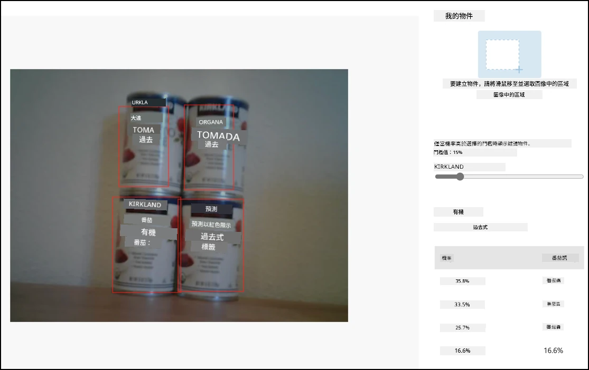

# 從物聯網設備呼叫物件檢測器 - Wio Terminal

當你的物件檢測器已發布後，就可以從你的物聯網設備使用它。

## 複製影像分類器專案

你的庫存檢測器大部分內容與你在之前課程中建立的影像分類器相同。

### 任務 - 複製影像分類器專案

1. 按照[製造專案第2課](../../../4-manufacturing/lessons/2-check-fruit-from-device/wio-terminal-camera.md#task---connect-the-camera)中的步驟，將你的 ArduCam 連接到 Wio Terminal。

    你可能還需要將相機固定在一個位置，例如，將電纜懸掛在盒子或罐子上，或者用雙面膠將相機固定在盒子上。

1. 使用 PlatformIO 建立一個全新的 Wio Terminal 專案。將此專案命名為 `stock-counter`。

1. 按照[製造專案第2課](../../../4-manufacturing/lessons/2-check-fruit-from-device/README.md#task---capture-an-image-using-an-iot-device)中的步驟，從相機捕捉影像。

1. 按照[製造專案第2課](../../../4-manufacturing/lessons/2-check-fruit-from-device/README.md#task---classify-images-from-your-iot-device)中的步驟，呼叫影像分類器。大部分的程式碼將被重複使用來檢測物件。

## 將程式碼從分類器改為影像檢測器

你用來分類影像的程式碼與用來檢測物件的程式碼非常相似。主要的差異在於你從 Custom Vision 獲得的 URL，以及呼叫的結果。

### 任務 - 將程式碼從分類器改為影像檢測器

1. 在 `main.cpp` 文件的頂部添加以下 include 指令：

    ```cpp
    #include <vector>
    ```

1. 將 `classifyImage` 函數重新命名為 `detectStock`，包括函數名稱以及在 `buttonPressed` 函數中的呼叫。

1. 在 `detectStock` 函數上方，宣告一個閾值，用於過濾掉任何低概率的檢測：

    ```cpp
    const float threshold = 0.3f;
    ```

    與影像分類器只為每個標籤返回一個結果不同，物件檢測器會返回多個結果，因此需要過濾掉任何低概率的結果。

1. 在 `detectStock` 函數上方，宣告一個函數來處理預測結果：

    ```cpp
    void processPredictions(std::vector<JsonVariant> &predictions)
    {
        for(JsonVariant prediction : predictions)
        {
            String tag = prediction["tagName"].as<String>();
            float probability = prediction["probability"].as<float>();
    
            char buff[32];
            sprintf(buff, "%s:\t%.2f%%", tag.c_str(), probability * 100.0);
            Serial.println(buff);
        }
    }
    ```

    此函數接收一個預測列表並將其打印到序列監視器。

1. 在 `detectStock` 函數中，替換掉迴圈中處理預測的內容，使用以下程式碼：

    ```cpp
    std::vector<JsonVariant> passed_predictions;

    for(JsonVariant prediction : predictions) 
    {
        float probability = prediction["probability"].as<float>();
        if (probability > threshold)
        {
            passed_predictions.push_back(prediction);
        }
    }

    processPredictions(passed_predictions);
    ```

    此程式碼迴圈遍歷預測結果，將概率與閾值進行比較。所有概率高於閾值的預測都會被添加到 `list` 中，並傳遞給 `processPredictions` 函數。

1. 上傳並運行你的程式碼。將相機對準架子上的物件並按下 C 按鈕。你會在序列監視器中看到輸出：

    ```output
    Connecting to WiFi..
    Connected!
    Image captured
    Image read to buffer with length 17416
    tomato paste:   35.84%
    tomato paste:   35.87%
    tomato paste:   34.11%
    tomato paste:   35.16%
    ```

    > 💁 你可能需要根據你的影像調整 `threshold` 到適當的值。

    你將能看到拍攝的影像，以及這些值在 Custom Vision 的 **Predictions** 標籤中。

    

> 💁 你可以在 [code-detect/wio-terminal](../../../../../5-retail/lessons/2-check-stock-device/code-detect/wio-terminal) 資料夾中找到此程式碼。

😀 你的庫存計數程式大功告成！

**免責聲明**：  
本文件使用 AI 翻譯服務 [Co-op Translator](https://github.com/Azure/co-op-translator) 進行翻譯。我們致力於提供準確的翻譯，但請注意，自動翻譯可能包含錯誤或不準確之處。應以原文文件作為權威來源。對於關鍵資訊，建議尋求專業人工翻譯。我們對因使用此翻譯而引起的任何誤解或錯誤解釋概不負責。