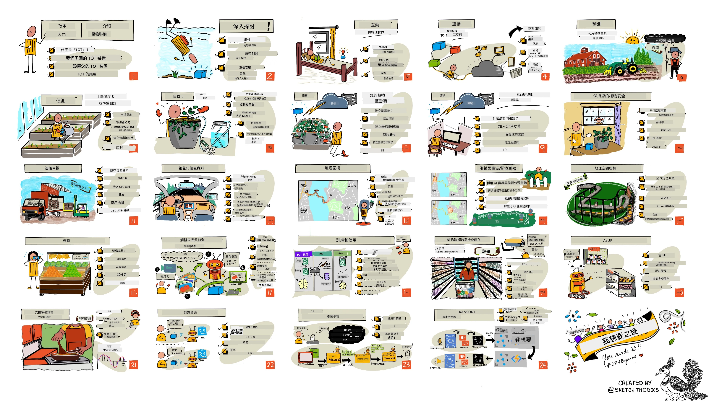

[](https://github.com/microsoft/IoT-For-Beginners/blob/master/LICENSE)
[](https://GitHub.com/microsoft/IoT-For-Beginners/graphs/contributors/)
[](https://GitHub.com/microsoft/IoT-For-Beginners/issues/)
[](https://GitHub.com/microsoft/IoT-For-Beginners/pulls/)
[](http://makeapullrequest.com)

[](https://GitHub.com/microsoft/IoT-For-Beginners/watchers/)
[](https://GitHub.com/microsoft/IoT-For-Beginners/network/)
[](https://GitHub.com/microsoft/IoT-For-Beginners/stargazers/)

### 加入 Azure AI Foundry 社群

如果您在建置 AI 應用程式時遇到困難或有任何問題，歡迎加入其他學習者及經驗豐富的開發者，一起參與 MCP 的討論。這是一個支持性的社群，歡迎提出問題並自由分享知識。

[](https://discord.gg/nTYy5BXMWG)

若您在建置過程中有產品回饋或遇到錯誤，請造訪：

[](https://aka.ms/foundry/forum)

請依照以下步驟開始使用這些資源：
1. **Fork 此儲存庫**：點擊 [](https://GitHub.com/microsoft/IoT-For-Beginners/fork)
2. **克隆儲存庫**： `git clone https://github.com/microsoft/IoT-For-Beginners.git`
3. [**加入 Microsoft Foundry Discord，與專家及其他開發者交流**](https://discord.com/invite/ByRwuEEgH4)


### 🌐 多語言支援

#### 透過 GitHub Action 支援（自動且持續更新）

<!-- CO-OP TRANSLATOR LANGUAGES TABLE START -->
[阿拉伯語](../ar/README.md) | [孟加拉語](../bn/README.md) | [保加利亞語](../bg/README.md) | [緬甸語（Myanamar）](../my/README.md) | [中文（簡體）](../zh-CN/README.md) | [中文（繁體，香港）](../zh-HK/README.md) | [中文（繁體，澳門）](../zh-MO/README.md) | [中文（繁體，台灣）](./README.md) | [克羅埃西亞語](../hr/README.md) | [捷克語](../cs/README.md) | [丹麥語](../da/README.md) | [荷蘭語](../nl/README.md) | [愛沙尼亞語](../et/README.md) | [芬蘭語](../fi/README.md) | [法語](../fr/README.md) | [德語](../de/README.md) | [希臘語](../el/README.md) | [希伯來語](../he/README.md) | [印度印地語](../hi/README.md) | [匈牙利語](../hu/README.md) | [印尼語](../id/README.md) | [義大利語](../it/README.md) | [日語](../ja/README.md) | [坎那達語](../kn/README.md) | [韓語](../ko/README.md) | [立陶宛語](../lt/README.md) | [馬來語](../ms/README.md) | [馬拉雅拉姆語](../ml/README.md) | [馬拉地語](../mr/README.md) | [尼泊爾語](../ne/README.md) | [尼日利亞乍語](../pcm/README.md) | [挪威語](../no/README.md) | [波斯語（法爾西語）](../fa/README.md) | [波蘭語](../pl/README.md) | [葡萄牙語（巴西）](../pt-BR/README.md) | [葡萄牙語（葡萄牙）](../pt-PT/README.md) | [旁遮普語（古爾穆奇文）](../pa/README.md) | [羅馬尼亞語](../ro/README.md) | [俄語](../ru/README.md) | [塞爾維亞語（西里爾字母）](../sr/README.md) | [斯洛伐克語](../sk/README.md) | [斯洛文尼亞語](../sl/README.md) | [西班牙語](../es/README.md) | [斯瓦希里語](../sw/README.md) | [瑞典語](../sv/README.md) | [他加祿語（菲律賓語）](../tl/README.md) | [泰米爾語](../ta/README.md) | [泰盧固語](../te/README.md) | [泰語](../th/README.md) | [土耳其語](../tr/README.md) | [烏克蘭語](../uk/README.md) | [烏爾都語](../ur/README.md) | [越南語](../vi/README.md)

> **偏好本機克隆？**

> 本儲存庫包含 50 多種語言翻譯，會顯著增加下載大小。若要在不下載翻譯內容情況下克隆，請使用稀疏簽出：
> ```bash
> git clone --filter=blob:none --sparse https://github.com/microsoft/IoT-For-Beginners.git
> cd IoT-For-Beginners
> git sparse-checkout set --no-cone '/*' '!translations' '!translated_images'
> ```
> 這樣可以讓您以更快的速度取得完成課程所需的所有內容。
<!-- CO-OP TRANSLATOR LANGUAGES TABLE END -->

# IoT 初學者課程大綱

微軟 Azure 雲端推廣大使很高興提供一個為期 12 週，共 24 課的 IoT 基礎課程。每堂課包含課前與課後測驗、文字指示完成課程、解答、作業等。我們的專案式教學法讓您透過實作學習，是讓新技能深入記憶的有效方式。

這些專案涵蓋食物從農場到餐桌的過程，包括農業、物流、製造、零售與消費端，都是物聯網設備廣泛應用的產業領域。



> 速寫筆記由 [Nitya Narasimhan](https://github.com/nitya) 繪製。點擊圖片查看大圖。

**衷心感謝本課程作者 [Jen Fox](https://github.com/jenfoxbot)、[Jen Looper](https://github.com/jlooper)、[Jim Bennett](https://github.com/jimbobbennett)，以及速寫筆記藝術家 [Nitya Narasimhan](https://github.com/nitya)。**

**同時感謝負責審閱與翻譯本課程的 [Microsoft Learn 學生大使團隊](https://studentambassadors.microsoft.com?WT.mc_id=academic-17441-jabenn) — [Aditya Garg](https://github.com/AdityaGarg00)、[Anurag Sharma](https://github.com/Anurag-0-1-A)、[Arpita Das](https://github.com/Arpiiitaaa)、[Aryan Jain](https://www.linkedin.com/in/aryan-jain-47a4a1145/)、[Bhavesh Suneja](https://github.com/EliteWarrior315)、[Faith Hunja](https://faithhunja.github.io/)、[Lateefah Bello](https://www.linkedin.com/in/lateefah-bello/)、[Manvi Jha](https://github.com/Severus-Matthew)、[Mireille Tan](https://www.linkedin.com/in/mireille-tan-a4834819a/)、[Mohammad Iftekher (Iftu) Ebne Jalal](https://github.com/Iftu119)、[Mohammad Zulfikar](https://github.com/mohzulfikar)、[Priyanshu Srivastav](https://www.linkedin.com/in/priyanshu-srivastav-b067241ba)、[Thanmai Gowducheruvu](https://github.com/innovation-platform)、及 [Zina Kamel](https://www.linkedin.com/in/zina-kamel/)。**

認識團隊！

[](https://youtu.be/-wippUJRi5k)

**Gif 由** [Mohit Jaisal](https://linkedin.com/in/mohitjaisal) 製作

> 🎥 點擊上方圖片觀看專案介紹影片！

> **教師們，** 我們已為您[提供一些建議](for-teachers.md)關於如何使用本課程。若您想自訂課程，我們亦提供[課程範本](lesson-template/README.md)。

> **[學生](https://aka.ms/student-page)，** 若想自行使用本課程，請先 fork 儲存庫，自行完成各項練習，從課前小測開始，再閱讀講義並完成其它練習。請嘗試用自己理解的方式製作專案，而非複製範例程式碼；但各專案導向課程的 /solutions 資料夾中仍有解答參考。另一方案是與朋友組成讀書會，一起討論學習內容。欲深入學習，我們建議參考 [Microsoft Learn](https://docs.microsoft.com/users/jimbobbennett/collections/ke2ehd351jopwr?WT.mc_id=academic-17441-jabenn)。

想觀看本課程視頻總覽嗎？請看此影片：

[](https://youtube.com/watch?v=bccEMm8gRuc "推廣影片")

> 🎥 點擊上方圖片觀看專案介紹影片！

## 教學法

我們建立本課程時，秉持兩個教學原則：確保為專案導向，以及搭配頻繁的小測。完成此系列課程後，學生將擁有植物監測與灌溉系統、車輛追蹤、智慧工廠食品追蹤檢測、語音控制烹飪定時器等專案，並學會物聯網基礎，如撰寫裝置程式碼、連接雲端、分析遙測資料，及在邊緣端執行人工智慧。

專案導向能使學習過程更有趣，助於提升學生的概念記憶。

此外，課前的小測可設定學生的學習意圖，課後再以另一份小測鞏固記憶。此課程設計彈性且有趣，可全部修讀，也可部分學習。專案先由簡單開始，至12週結束逐步複雜。

每個專案皆基於學生和業餘愛好者可取得的真實硬體，並針對專案領域提供相關背景知識。成功的開發者需了解解決問題的領域，此背景知識可協助學生針對實際物聯網問題思考解決方案與學習內容。學生了解所建置解決方案的目的，更加體認最終使用者需求。

## 硬體

我們為專案準備了兩種 IoT 硬體方案，依個人喜好、程式語言熟悉度、學習目標及取得便利度而定。並提供「虛擬硬體」方案，給沒有硬體或想先學習再購買者。更多資訊及購物清單請參閱[硬體頁面](./hardware.md)，亦包含由友站 Seeed Studio 提供完整開發套件的購買連結。
> 💁 查閱我們的[行為守則](CODE_OF_CONDUCT.md)、[貢獻指南](CONTRIBUTING.md)與[翻譯指南](TRANSLATIONS.md)。歡迎您提出建設性的反饋！
>
> 🔧 有遇到問題嗎？請參考我們的[故障排除指南](TROUBLESHOOTING.md)以尋找常見問題的解決方案。

## 每堂課包含：

- 手繪筆記
- 可選補充影片
- 課前熱身測驗
- 書面課程內容
- 針對專案導向課程，提供逐步專案建置指南
- 知識檢核
- 挑戰題
- 補充閱讀
- 作業
- [課後測驗](https://ff-quizzes.netlify.app/en/)

> **關於測驗的說明**：所有測驗均位於 quiz-app 資料夾中，總共包含 48 個測驗，每個測驗有三題。測驗皆從課程中連結，但測驗應用程式也可以在本機執行或部署至 Azure；請依照 quiz-app 資料夾中的說明操作。測驗正在逐步本地化中。

## 課程

|       |              專案名稱              |                       授課概念                       | 學習目標                                                                                                                                                     |                                                        連結課程                                                         |
| :---: | :------------------------------: | :-------------------------------------------------: | ----------------------------------------------------------------------------------------------------------------------------------------------------------- | :--------------------------------------------------------------------------------------------------------------------------: |
|  01   | [入門](./1-getting-started/README.md) |                     物聯網簡介                     | 學習物聯網基本原理及物聯網解決方案的基礎組成，如感測器與雲端服務，同時設定您的第一個物聯網裝置                                                             |                      [物聯網簡介](./1-getting-started/lessons/1-introduction-to-iot/README.md)                      |
|  02   | [入門](./1-getting-started/README.md) |                   物聯網深入探討                   | 進一步了解物聯網系統的組成，微控制器與單板電腦                                                                                                            |                        [物聯網深入探討](./1-getting-started/lessons/2-deeper-dive/README.md)                         |
|  03   | [入門](./1-getting-started/README.md) | 使用感測器與致動器與實體世界互動                   | 學習利用感測器蒐集實體世界的資料，並使用致動器進行回饋，同時打造一盞夜燈                                                                                 | [使用感測器與致動器與實體世界互動](./1-getting-started/lessons/3-sensors-and-actuators/README.md)                   |
|  04   | [入門](./1-getting-started/README.md) |             將裝置連接到網際網路                   | 學習如何將物聯網裝置連接到網際網路，透過 MQTT 中介者傳送及接收訊息，並讓您的夜燈接入 MQTT 服務                                                             |               [將裝置連接到網際網路](./1-getting-started/lessons/4-connect-internet/README.md)                      |
|  05   |            [農場](./2-farm/README.md)            |                    預測植物生長                     | 學習如何利用物聯網裝置捕捉的溫度資料來預測植物生長                                                                                                        |                          [預測植物生長](./2-farm/lessons/1-predict-plant-growth/README.md)                           |
|  06   |            [農場](./2-farm/README.md)            |                    偵測土壤濕度                     | 學習如何偵測土壤濕度並校準土壤濕度感測器                                                                                                                  |                          [偵測土壤濕度](./2-farm/lessons/2-detect-soil-moisture/README.md)                           |
|  07   |            [農場](./2-farm/README.md)            |                  自動化植物灌溉                     | 學習如何使用繼電器和 MQTT 來自動化與定時澆水                                                                                                              |                      [自動化植物灌溉](./2-farm/lessons/3-automated-plant-watering/README.md)                           |
|  08   |            [農場](./2-farm/README.md)            |                將植物資料遷移至雲端                 | 學習雲端及雲端物聯網服務，了解如何將植物資料連接到這些雲端服務，而非公共 MQTT 中介者                                                                        |               [將植物資料遷移至雲端](./2-farm/lessons/4-migrate-your-plant-to-the-cloud/README.md)                   |
|  09   |            [農場](./2-farm/README.md)            |         將應用程式邏輯遷移至雲端                     | 學習如何在雲端撰寫回應物聯網訊息的應用程式邏輯                                                                                                            |         [將應用程式邏輯遷移至雲端](./2-farm/lessons/5-migrate-application-to-the-cloud/README.md)                     |
|  10   |            [農場](./2-farm/README.md)            |                   保護您的植物資安                   | 學習物聯網安全並瞭解如何使用金鑰與憑證保障植物資料安全                                                                                                    |                        [保護您的植物資安](./2-farm/lessons/6-keep-your-plant-secure/README.md)                         |
|  11   |       [運輸](./3-transport/README.md)       |                      位置追蹤                      | 了解物聯網裝置的 GPS 位置追蹤                                                                                                                               |                           [位置追蹤](./3-transport/lessons/1-location-tracking/README.md)                             |
|  12   |       [運輸](./3-transport/README.md)       |                     儲存位置資料                     | 學習如何儲存物聯網資料以供日後視覺化或分析                                                                                                                |                         [儲存位置資料](./3-transport/lessons/2-store-location-data/README.md)                         |
|  13   |       [運輸](./3-transport/README.md)       |                   視覺化位置資料                   | 了解如何在地圖上視覺化位置資料，並瞭解地圖如何將真實三維世界以二維方式呈現                                                                                |                     [視覺化位置資料](./3-transport/lessons/3-visualize-location-data/README.md)                       |
|  14   |       [運輸](./3-transport/README.md)       |                          地理圍欄                          | 了解地理圍欄的概念，及其如何用來提示供應鏈中的車輛是否接近目的地                                                                                          |                                   [地理圍欄](./3-transport/lessons/4-geofences/README.md)                            |
|  15   |   [製造](./4-manufacturing/README.md)   |               訓練水果品質偵測器                | 學習如何在雲端訓練影像分類器，以偵測水果品質                                                                                                              |                 [訓練水果品質偵測器](./4-manufacturing/lessons/1-train-fruit-detector/README.md)                      |
|  16   |   [製造](./4-manufacturing/README.md)   |           從物聯網裝置檢查水果品質            | 學習如何從物聯網裝置使用水果品質偵測器                                                                                                                    |           [從物聯網裝置檢查水果品質](./4-manufacturing/lessons/2-check-fruit-from-device/README.md)                   |
|  17   |   [製造](./4-manufacturing/README.md)   |             在邊緣裝置上執行水果偵測器             | 了解如何在物聯網裝置的邊緣運算環境執行水果偵測器                                                                                                        |             [在邊緣裝置上執行水果偵測器](./4-manufacturing/lessons/3-run-fruit-detector-edge/README.md)               |
|  18   |   [製造](./4-manufacturing/README.md)   |        從感測器觸發水果品質偵測        | 學習如何從感測器觸發水果品質偵測                                                                                                                        |        [從感測器觸發水果品質偵測](./4-manufacturing/lessons/4-trigger-fruit-detector/README.md)                       |
|  19   |          [零售](./5-retail/README.md)          |                   訓練庫存偵測器                    | 學習如何利用物件偵測技術訓練庫存偵測器以統計商店中的庫存                                                                                                |                        [訓練庫存偵測器](./5-retail/lessons/1-train-stock-detector/README.md)                           |
|  20   |          [零售](./5-retail/README.md)          |               從物聯網裝置檢查庫存                | 學習如何使用物件偵測模型從物聯網裝置檢查庫存                                                                                                            |                     [從物聯網裝置檢查庫存](./5-retail/lessons/2-check-stock-device/README.md)                         |
|  21   |        [消費](./6-consumer/README.md)        |             使用物聯網裝置進行語音辨識             | 學習如何使用物聯網裝置辨識語音，打造智慧計時器                                                                                                          |                  [使用物聯網裝置進行語音辨識](./6-consumer/lessons/1-speech-recognition/README.md)                    |
|  22   |        [消費](./6-consumer/README.md)        |                     語言理解                     | 學習如何理解對物聯網裝置說出的句子                                                                                                                      |                        [語言理解](./6-consumer/lessons/2-language-understanding/README.md)                             |
|  23   |        [消費](./6-consumer/README.md)        |           設定計時器並提供語音回饋           | 學習如何在物聯網裝置設定計時器並以語音回饋設定與結束時間                                                                                                |                 [設定計時器並提供語音回饋](./6-consumer/lessons/3-spoken-feedback/README.md)                          |
|  24   |        [消費](./6-consumer/README.md)        |                 支援多種語言                  | 學習如何支援多種語言，包括接收多語言指令與智慧計時器的回應                                                                                                |                   [支援多種語言](./6-consumer/lessons/4-multiple-language-support/README.md)                          |

## 離線存取

您可以使用 [Docsify](https://docsify.js.org/#/) 離線執行本文件。Fork 此資料庫，在本地機器安裝 [Docsify](https://docsify.js.org/#/quickstart)，並在此資料庫的根目錄輸入 `docsify serve`，網站將在本地主機的 3000 端口啟動：`localhost:3000`。

## 測驗

感謝社群提供的互動式測驗，讓您能檢驗各章節的知識。您可在[此處](https://ff-quizzes.netlify.app/en/)測驗您的知識。

### PDF

如有需要，您可以產生本內容的 PDF 以供離線使用。請確定已安裝 [npm](https://docs.npmjs.com/downloading-and-installing-node-js-and-npm)，並在本資料庫根目錄執行以下指令：

```sh
npm i
npm run convert
```

### 投影片

部分課程備有投影片，放置於 [slides](../../slides) 資料夾。

## 其他課程

我們的團隊亦製作其他課程！請參考：

<!-- CO-OP TRANSLATOR OTHER COURSES START -->
### LangChain
[](https://aka.ms/langchain4j-for-beginners)
[](https://aka.ms/langchainjs-for-beginners?WT.mc_id=m365-94501-dwahlin)

---

### Azure / Edge / MCP / Agents
[](https://github.com/microsoft/AZD-for-beginners?WT.mc_id=academic-105485-koreyst)
[](https://github.com/microsoft/edgeai-for-beginners?WT.mc_id=academic-105485-koreyst)
[](https://github.com/microsoft/mcp-for-beginners?WT.mc_id=academic-105485-koreyst)
[](https://github.com/microsoft/ai-agents-for-beginners?WT.mc_id=academic-105485-koreyst)

---
 
### 生成式 AI 系列
[](https://github.com/microsoft/generative-ai-for-beginners?WT.mc_id=academic-105485-koreyst)
[-9333EA?style=for-the-badge&labelColor=E5E7EB&color=9333EA)](https://github.com/microsoft/Generative-AI-for-beginners-dotnet?WT.mc_id=academic-105485-koreyst)
[-C084FC?style=for-the-badge&labelColor=E5E7EB&color=C084FC)](https://github.com/microsoft/generative-ai-for-beginners-java?WT.mc_id=academic-105485-koreyst)
[-E879F9?style=for-the-badge&labelColor=E5E7EB&color=E879F9)](https://github.com/microsoft/generative-ai-with-javascript?WT.mc_id=academic-105485-koreyst)

---
 
### 核心學習
[](https://aka.ms/ml-beginners?WT.mc_id=academic-105485-koreyst)
[](https://aka.ms/datascience-beginners?WT.mc_id=academic-105485-koreyst)
[](https://aka.ms/ai-beginners?WT.mc_id=academic-105485-koreyst)
[](https://github.com/microsoft/Security-101?WT.mc_id=academic-96948-sayoung)
[](https://aka.ms/webdev-beginners?WT.mc_id=academic-105485-koreyst)
[](https://aka.ms/iot-beginners?WT.mc_id=academic-105485-koreyst)
[](https://github.com/microsoft/xr-development-for-beginners?WT.mc_id=academic-105485-koreyst)

---
 
### Copilot 系列
[](https://aka.ms/GitHubCopilotAI?WT.mc_id=academic-105485-koreyst)
[](https://github.com/microsoft/mastering-github-copilot-for-dotnet-csharp-developers?WT.mc_id=academic-105485-koreyst)
[](https://github.com/microsoft/CopilotAdventures?WT.mc_id=academic-105485-koreyst)
<!-- CO-OP TRANSLATOR OTHER COURSES END -->

## 圖像來源說明

您可以在本課程所需的[來源說明](./attributions.md)中找到所有使用圖像的來源說明。

---

<!-- CO-OP TRANSLATOR DISCLAIMER START -->
**免責聲明**：  
本文件係使用 AI 翻譯服務 [Co-op Translator](https://github.com/Azure/co-op-translator) 進行翻譯。雖然我們力求準確，但請注意自動翻譯結果仍可能包含錯誤或不準確之處。原文文件為權威版本，應以原始語言文件為準。對於關鍵資訊，建議採用專業人工翻譯。我們不對因使用本翻譯而產生之任何誤解或誤譯負責。
<!-- CO-OP TRANSLATOR DISCLAIMER END -->