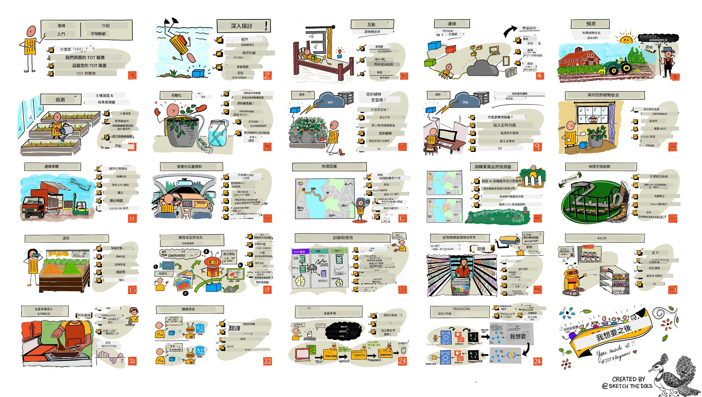

[](https://github.com/microsoft/IoT-For-Beginners/blob/master/LICENSE)
[](https://GitHub.com/microsoft/IoT-For-Beginners/graphs/contributors/)
[](https://GitHub.com/microsoft/IoT-For-Beginners/issues/)
[](https://GitHub.com/microsoft/IoT-For-Beginners/pulls/)
[](http://makeapullrequest.com)

[](https://GitHub.com/microsoft/IoT-For-Beginners/watchers/)
[](https://GitHub.com/microsoft/IoT-For-Beginners/network/)
[](https://GitHub.com/microsoft/IoT-For-Beginners/stargazers/)

### 加入 Azure AI Foundry 社群

如果您在建立 AI 應用程式時遇到困難或有任何問題，歡迎加入學習者和有經驗開發者的討論，共同交流 MCP 的相關話題。這是一個支持性強大的社群，歡迎提出問題並自由分享知識。

[](https://discord.gg/nTYy5BXMWG)

如果您有產品回饋或建置中遇到錯誤，請造訪：

[](https://aka.ms/foundry/forum)

請依照下列步驟開始使用這些資源：
1. **Fork 此倉庫**：點選 [](https://GitHub.com/microsoft/IoT-For-Beginners/fork)
2. **Clone 此倉庫**：`git clone https://github.com/microsoft/IoT-For-Beginners.git`
3. [**加入 Microsot Foundry Discord，認識專家與其他開發者**](https://discord.com/invite/ByRwuEEgH4)


### 🌐 多語言支援

#### 透過 GitHub Action 支援（自動且持續更新）

<!-- CO-OP TRANSLATOR LANGUAGES TABLE START -->
[阿拉伯語](../ar/README.md) | [孟加拉語](../bn/README.md) | [保加利亞語](../bg/README.md) | [緬甸語 (Myanmar)](../my/README.md) | [中文（簡體）](../zh-CN/README.md) | [中文（繁體，香港）](../zh-HK/README.md) | [中文（繁體，澳門）](../zh-MO/README.md) | [中文（繁體，台灣）](./README.md) | [克羅埃西亞語](../hr/README.md) | [捷克語](../cs/README.md) | [丹麥語](../da/README.md) | [荷蘭語](../nl/README.md) | [愛沙尼亞語](../et/README.md) | [芬蘭語](../fi/README.md) | [法語](../fr/README.md) | [德語](../de/README.md) | [希臘語](../el/README.md) | [希伯來語](../he/README.md) | [印地語](../hi/README.md) | [匈牙利語](../hu/README.md) | [印尼語](../id/README.md) | [義大利語](../it/README.md) | [日語](../ja/README.md) | [坎納達語](../kn/README.md) | [高棉語](../km/README.md) | [韓語](../ko/README.md) | [立陶宛語](../lt/README.md) | [馬來語](../ms/README.md) | [馬拉雅拉姆語](../ml/README.md) | [馬拉地語](../mr/README.md) | [尼泊爾語](../ne/README.md) | [奈及利亞皮欽語](../pcm/README.md) | [挪威語](../no/README.md) | [波斯語（法西語）](../fa/README.md) | [波蘭語](../pl/README.md) | [葡萄牙語（巴西）](../pt-BR/README.md) | [葡萄牙語（葡萄牙）](../pt-PT/README.md) | [旁遮普語（Gurmukhi）](../pa/README.md) | [羅馬尼亞語](../ro/README.md) | [俄語](../ru/README.md) | [塞爾維亞語（西里爾）](../sr/README.md) | [斯洛伐克語](../sk/README.md) | [斯洛維尼亞語](../sl/README.md) | [西班牙語](../es/README.md) | [斯瓦希里語](../sw/README.md) | [瑞典語](../sv/README.md) | [他加祿語（菲律賓語）](../tl/README.md) | [坦米爾語](../ta/README.md) | [泰盧固語](../te/README.md) | [泰語](../th/README.md) | [土耳其語](../tr/README.md) | [烏克蘭語](../uk/README.md) | [烏爾都語](../ur/README.md) | [越南語](../vi/README.md)

> **想要在本地端 clone？**
>
> 此倉庫包含 50 多種語言的翻譯版本，會大幅增加下載大小。若只想 clone 原始資料庫，不包含翻譯，可使用 sparse checkout：
>
> **Bash / macOS / Linux:**
> ```bash
> git clone --filter=blob:none --sparse https://github.com/microsoft/IoT-For-Beginners.git
> cd IoT-For-Beginners
> git sparse-checkout set --no-cone '/*' '!translations' '!translated_images'
> ```
>
> **CMD (Windows):**
> ```cmd
> git clone --filter=blob:none --sparse https://github.com/microsoft/IoT-For-Beginners.git
> cd IoT-For-Beginners
> git sparse-checkout set --no-cone "/*" "!translations" "!translated_images"
> ```
>
> 這樣即可快速取得完成課程所需的所有資料。
<!-- CO-OP TRANSLATOR LANGUAGES TABLE END -->

# IoT 入門教學課程

微軟 Azure Cloud Advocates 很高興推出這套 12 週、共 24 課的 IoT 基本教學課程。每堂課包括課前與課後測驗、完成課程的書面說明、解決方案、作業等。採用專案式教學法讓您邊學邊做，這是新技能快速「紮根」的有效方式。

這些專案涵蓋食物由農場到餐桌的完整旅程，包含農業、物流、製造、零售及消費端—都是物聯網裝置常見應用的產業領域。



> 速寫圖由 [Nitya Narasimhan](https://github.com/nitya) 繪製。點擊圖片可查看大圖。

**特別感謝本課程作者 [Jen Fox](https://github.com/jenfoxbot)、[Jen Looper](https://github.com/jlooper)、[Jim Bennett](https://github.com/jimbobbennett)，以及速寫圖繪製者 [Nitya Narasimhan](https://github.com/nitya)。**

**感謝我們的 [Microsoft Learn Student Ambassadors](https://studentambassadors.microsoft.com?WT.mc_id=academic-17441-jabenn) 團隊協助審核與翻譯此教學課程，團隊成員有 [Aditya Garg](https://github.com/AdityaGarg00), [Anurag Sharma](https://github.com/Anurag-0-1-A), [Arpita Das](https://github.com/Arpiiitaaa), [Aryan Jain](https://www.linkedin.com/in/aryan-jain-47a4a1145/), [Bhavesh Suneja](https://github.com/EliteWarrior315), [Faith Hunja](https://faithhunja.github.io/), [Lateefah Bello](https://www.linkedin.com/in/lateefah-bello/), [Manvi Jha](https://github.com/Severus-Matthew), [Mireille Tan](https://www.linkedin.com/in/mireille-tan-a4834819a/), [Mohammad Iftekher (Iftu) Ebne Jalal](https://github.com/Iftu119), [Mohammad Zulfikar](https://github.com/mohzulfikar), [Priyanshu Srivastav](https://www.linkedin.com/in/priyanshu-srivastav-b067241ba), [Thanmai Gowducheruvu](https://github.com/innovation-platform), 以及 [Zina Kamel](https://www.linkedin.com/in/zina-kamel/)。**

認識我們的團隊！

[](https://youtu.be/-wippUJRi5k)

<strong>動圖由</strong> [Mohit Jaisal](https://linkedin.com/in/mohitjaisal) <strong>製作</strong>

> 🎥 點擊上方圖像觀看專案相關影片！

> <strong>老師們</strong>，我們提供了[使用本課程的建議](for-teachers.md)。若想自訂課程內容，也附上了[課程模板](lesson-template/README.md)。

> **[學生們](https://aka.ms/student-page)**，若您想自行使用本課程，請 fork 整個倉庫並自行完成練習，從課前測驗開始，閱讀課程內容並完成其餘活動。建議透過理解課程內容來建立專案，而非直接複製解決方案代碼；當然，每個專案導向的課程資料夾下都有 /solutions 解決方案代碼。也可以組成讀書會，和朋友一起學習。想要進一步學習，推薦使用 [Microsoft Learn](https://docs.microsoft.com/users/jimbobbennett/collections/ke2ehd351jopwr?WT.mc_id=academic-17441-jabenn)。

本課程的影片介紹可參考此影片：

[](https://youtube.com/watch?v=bccEMm8gRuc "宣傳影片")

> 🎥 點擊上方圖像觀看專案相關影片！

## 教學理念

我們在設計此課程時，選擇了兩大教學原則：確保課程以專案為核心，並且包含頻繁的測驗。透過這個系列課程結束時，學生將能完成植物監控與灌溉系統、車輛追蹤器、智慧工廠食品追蹤檢測系統及聲控烹飪計時器，並學會物聯網基礎，包括如何撰寫裝置程式碼、連接雲端、分析遙測數據和以邊緣運算執行 AI。

課程內容以專案為導向，能使學生更投入學習，記憶效果更佳。

此外，課前的低壓力測驗幫助學生設定學習意向，課後測驗則促進進一步的記憶鞏固。這套課程設計靈活且有趣，可整體或部分修習。專案由淺入深，12 週結束時達到複雜程度的提升。

每個專案均基於學生與業餘愛好者能取得的實體硬體。專案探討所屬領域，提供相關背景知識。要成為成功的開發者，理解解決問題的領域很重要。本課程提供的背景知識讓學生從物聯網開發者角度，思考其解決方案及學習內容，理解所建構解決方案背後的「為什麼」，並體會最終使用者的需求。

## 硬體
我們有兩種物聯網硬體可供專案使用，依個人喜好、程式語言知識或偏好、學習目標以及可取得性來選擇。我們也提供了「虛擬硬體」版本，給沒有硬體設備者或希望在購買前多了解的人。您可以在[硬體頁面](./hardware.md)了解更多，並找到「購物清單」，其中包含我們的夥伴 Seeed Studio 提供的完整套件購買連結。

> 💁 請參考我們的[行為準則](CODE_OF_CONDUCT.md)、[貢獻指南](CONTRIBUTING.md)與[翻譯指南](TRANSLATIONS.md)。我們歡迎您的建設性回饋！
>
> 🔧 有問題嗎？查看我們的[疑難排解指南](TROUBLESHOOTING.md)，尋找常見問題的解決方案。

## 每堂課包含：

- 草圖筆記
- 選用補充影片
- 上課前暖身小測驗
- 書面課程內容
- 對於專案式課程，有逐步的專案製作指南
- 知識檢測
- 挑戰題
- 補充閱讀
- 作業
- [課後測驗](https://ff-quizzes.netlify.app/en/)

> <strong>關於測驗的說明</strong>：所有測驗均收錄於 quiz-app 資料夾中，共 48 組測驗，每組有三個問題。它們在課程中有連結，且可在本地執行或部署至 Azure；請參照 quiz-app 資料夾中的說明。測驗正陸續本地化中。

## 課程列表

|       |              專案名稱               |                        教授概念                       | 學習目標                                                                                                                                                          |                                                        連結課程                                                         |
| :---: | :--------------------------------: | :---------------------------------------------------: | ---------------------------------------------------------------------------------------------------------------------------------------------------------------- | :--------------------------------------------------------------------------------------------------------------------------: |
|  01   | [入門](./1-getting-started/README.md)      |                     物聯網簡介                     | 學習物聯網的基本原理與物聯網解決方案的基礎構成，如感測器與雲端服務，並設定您的第一台物聯網裝置                                                                       |                      [物聯網簡介](./1-getting-started/lessons/1-introduction-to-iot/README.md)                      |
|  02   | [入門](./1-getting-started/README.md)      |                   深入認識物聯網                   | 進一步了解物聯網系統的元件、微控制器與單板電腦                                                                                                                      |                        [深入認識物聯網](./1-getting-started/lessons/2-deeper-dive/README.md)                         |
|  03   | [入門](./1-getting-started/README.md)      | 使用感測器與執行器與物理世界互動                   | 認識用於蒐集物理世界資料的感測器與用以回饋的執行器，並製作一盞夜燈                                                                                                   | [使用感測器與執行器與物理世界互動](./1-getting-started/lessons/3-sensors-and-actuators/README.md) |
|  04   | [入門](./1-getting-started/README.md)      |              將裝置連網到網際網路                   | 了解如何將物聯網裝置連接上網際網路以發送與接收訊息，示範為夜燈連接到 MQTT 代理伺服器                                                                                  |               [將裝置連網到網際網路](./1-getting-started/lessons/4-connect-internet/README.md)                |
|  05   |            [農場](./2-farm/README.md)            |                   預測植物生長                      | 使用物聯網裝置收集的溫度資料學習如何預測植物生長                                                                                                                 |                          [預測植物生長](./2-farm/lessons/1-predict-plant-growth/README.md)                           |
|  06   |            [農場](./2-farm/README.md)            |                   偵測土壤濕度                      | 學習如何偵測土壤濕度並校正土壤濕度感測器                                                                                                                          |                          [偵測土壤濕度](./2-farm/lessons/2-detect-soil-moisture/README.md)                           |
|  07   |            [農場](./2-farm/README.md)            |               自動化植物澆灌                        | 學習使用繼電器與 MQTT 自動化及定時澆水                                                                                                                            |                      [自動化植物澆灌](./2-farm/lessons/3-automated-plant-watering/README.md)                       |
|  08   |            [農場](./2-farm/README.md)            |               將植物資料轉移到雲端                   | 了解雲端與雲端物聯網服務，以及如何將植物資料連接到這些雲端服務，替代公眾 MQTT 代理伺服器                                                                            |               [將植物資料轉移到雲端](./2-farm/lessons/4-migrate-your-plant-to-the-cloud/README.md)                |
|  09   |            [農場](./2-farm/README.md)            |                將應用程式邏輯遷移至雲端               | 了解如何在雲端撰寫回應物聯網訊息的應用程式邏輯                                                                                                                     |         [將應用程式邏輯遷移至雲端](./2-farm/lessons/5-migrate-application-to-the-cloud/README.md)         |
|  10   |            [農場](./2-farm/README.md)            |                  保護您的植物安全                    | 瞭解物聯網安全，以及如何使用金鑰與憑證來保護您的植物                                                                                                               |                        [保護您的植物安全](./2-farm/lessons/6-keep-your-plant-secure/README.md)                         |
|  11   |       [運輸](./3-transport/README.md)       |                      位置追蹤                        | 了解物聯網裝置的 GPS 定位追蹤                                                                                                                                    |                           [位置追蹤](./3-transport/lessons/1-location-tracking/README.md)                           |
|  12   |       [運輸](./3-transport/README.md)       |                     儲存位置資料                      | 學習如何儲存物聯網資料以便後續視覺化或分析                                                                                                                         |                         [儲存位置資料](./3-transport/lessons/2-store-location-data/README.md)                         |
|  13   |       [運輸](./3-transport/README.md)       |                   視覺化位置資料                      | 了解如何在地圖上視覺化位置資料，及地圖如何將現實三維世界以二維呈現                                                                                                  |                     [視覺化位置資料](./3-transport/lessons/3-visualize-location-data/README.md)                     |
|  14   |       [運輸](./3-transport/README.md)       |                          地理圍欄                      | 了解地理圍欄的概念，以及如何用來通知供應鏈中運輸車輛接近目的地                                                                                                     |                                   [地理圍欄](./3-transport/lessons/4-geofences/README.md)                                   |
|  15   |   [製造](./4-manufacturing/README.md)   |               訓練水果品質檢測器                     | 了解如何在雲端訓練影像分類器以檢測水果品質                                                                                                                        |                 [訓練水果品質檢測器](./4-manufacturing/lessons/1-train-fruit-detector/README.md)                 |
|  16   |   [製造](./4-manufacturing/README.md)   |           使用物聯網裝置檢測水果品質                | 了解如何使用物聯網裝置來偵測水果品質                                                                                                                               |           [使用物聯網裝置檢測水果品質](./4-manufacturing/lessons/2-check-fruit-from-device/README.md)            |
|  17   |   [製造](./4-manufacturing/README.md)   |               在邊緣端運行水果檢測器                 | 了解如何在物聯網裝置邊緣端運行水果檢測器                                                                                                                          |             [在邊緣端運行水果檢測器](./4-manufacturing/lessons/3-run-fruit-detector-edge/README.md)             |
|  18   |   [製造](./4-manufacturing/README.md)   |          由感測器觸發水果品質檢測                   | 了解如何由感測器觸發水果品質檢測                                                                                                                                    |        [由感測器觸發水果品質檢測](./4-manufacturing/lessons/4-trigger-fruit-detector/README.md)         |
|  19   |          [零售](./5-retail/README.md)          |                   訓練庫存偵測器                     | 了解如何利用物件偵測訓練庫存偵測器來計算商店中的庫存量                                                                                                            |                        [訓練庫存偵測器](./5-retail/lessons/1-train-stock-detector/README.md)                         |
|  20   |          [零售](./5-retail/README.md)          |               從物聯網裝置檢查庫存                   | 學習如何用物聯網裝置，透過物件偵測模型來檢查庫存                                                                                                                  |                     [從物聯網裝置檢查庫存](./5-retail/lessons/2-check-stock-device/README.md)                      |
|  21   |        [消費者](./6-consumer/README.md)        |             使用物聯網裝置進行語音識別               | 了解如何利用物聯網裝置進行語音識別，以打造智慧計時器                                                                                                              |                  [使用物聯網裝置進行語音識別](./6-consumer/lessons/1-speech-recognition/README.md)                  |
|  22   |        [消費者](./6-consumer/README.md)        |                    理解語言                           | 了解如何理解對物聯網裝置所說的語句                                                                                                                               |                        [理解語言](./6-consumer/lessons/2-language-understanding/README.md)                        |
|  23   |        [消費者](./6-consumer/README.md)        |          設定計時並提供語音回饋                       | 學習如何在物聯網裝置上設定計時器，並在設定與結束時提供語音回饋                                                                                                  |                 [設定計時並提供語音回饋](./6-consumer/lessons/3-spoken-feedback/README.md)                  |
|  24   |        [消費者](./6-consumer/README.md)        |                 支援多種語言                          | 學習如何支援多語言，包括被說話語言與智慧計時器答覆語言                                                                                                          |                   [支援多種語言](./6-consumer/lessons/4-multiple-language-support/README.md)                   |

## 離線存取

您可以使用 [Docsify](https://docsify.js.org/#/) 將此文件離線運行。請 fork 此倉庫，並在本機安裝 [Docsify](https://docsify.js.org/#/quickstart)，接著在此倉庫根目錄輸入 `docsify serve`。網站將在本機的 3000 埠口運行：`localhost:3000`。

## 測驗

感謝社群提供互動式測驗，透過測驗來測試您對各章節的知識。您可以在[這裡](https://ff-quizzes.netlify.app/en/)測試您的能力。

### PDF

若需要離線存取，您也可產生此內容的 PDF。請確認您已安裝 [npm](https://docs.npmjs.com/downloading-and-installing-node-js-and-npm)，並於此倉庫根目錄執行下列指令：

```sh
npm i
npm run convert
```

### 投影片

部分課程有投影片，請見[slides](../../slides)資料夾。

## 其他課程

我們團隊還製作其他課程！請查看：

<!-- CO-OP TRANSLATOR OTHER COURSES START -->
### LangChain
[](https://aka.ms/langchain4j-for-beginners)
[](https://aka.ms/langchainjs-for-beginners?WT.mc_id=m365-94501-dwahlin)
[](https://github.com/microsoft/langchain-for-beginners?WT.mc_id=m365-94501-dwahlin)
---

### Azure / Edge / MCP / Agents
[](https://github.com/microsoft/AZD-for-beginners?WT.mc_id=academic-105485-koreyst)
[](https://github.com/microsoft/edgeai-for-beginners?WT.mc_id=academic-105485-koreyst)
[](https://github.com/microsoft/mcp-for-beginners?WT.mc_id=academic-105485-koreyst)
[](https://github.com/microsoft/ai-agents-for-beginners?WT.mc_id=academic-105485-koreyst)

---
 
### 生成式 AI 系列
[](https://github.com/microsoft/generative-ai-for-beginners?WT.mc_id=academic-105485-koreyst)
[-9333EA?style=for-the-badge&labelColor=E5E7EB&color=9333EA)](https://github.com/microsoft/Generative-AI-for-beginners-dotnet?WT.mc_id=academic-105485-koreyst)
[-C084FC?style=for-the-badge&labelColor=E5E7EB&color=C084FC)](https://github.com/microsoft/generative-ai-for-beginners-java?WT.mc_id=academic-105485-koreyst)
[-E879F9?style=for-the-badge&labelColor=E5E7EB&color=E879F9)](https://github.com/microsoft/generative-ai-with-javascript?WT.mc_id=academic-105485-koreyst)

---
 
### 核心學習
[](https://aka.ms/ml-beginners?WT.mc_id=academic-105485-koreyst)
[](https://aka.ms/datascience-beginners?WT.mc_id=academic-105485-koreyst)
[](https://aka.ms/ai-beginners?WT.mc_id=academic-105485-koreyst)
[](https://github.com/microsoft/Security-101?WT.mc_id=academic-96948-sayoung)
[](https://aka.ms/webdev-beginners?WT.mc_id=academic-105485-koreyst)
[](https://aka.ms/iot-beginners?WT.mc_id=academic-105485-koreyst)
[](https://github.com/microsoft/xr-development-for-beginners?WT.mc_id=academic-105485-koreyst)

---
 
### Copilot 系列
[](https://aka.ms/GitHubCopilotAI?WT.mc_id=academic-105485-koreyst)
[](https://github.com/microsoft/mastering-github-copilot-for-dotnet-csharp-developers?WT.mc_id=academic-105485-koreyst)
[](https://github.com/microsoft/CopilotAdventures?WT.mc_id=academic-105485-koreyst)
<!-- CO-OP TRANSLATOR OTHER COURSES END -->

## 圖像來源說明

您可以在 [Attributions](./attributions.md) 找到本課程所使用圖像的所有來源說明。

---

<!-- CO-OP TRANSLATOR DISCLAIMER START -->
**免責聲明**：  
本文件使用 AI 翻譯服務 [Co-op Translator](https://github.com/Azure/co-op-translator) 進行翻譯。雖我們致力於準確性，但請注意，自動翻譯可能包含錯誤或不準確之處。原文文件的母語版本應被視為權威來源。對於關鍵資訊，建議使用專業人工翻譯。我們不對因使用本翻譯而產生的任何誤解或曲解承擔責任。
<!-- CO-OP TRANSLATOR DISCLAIMER END -->